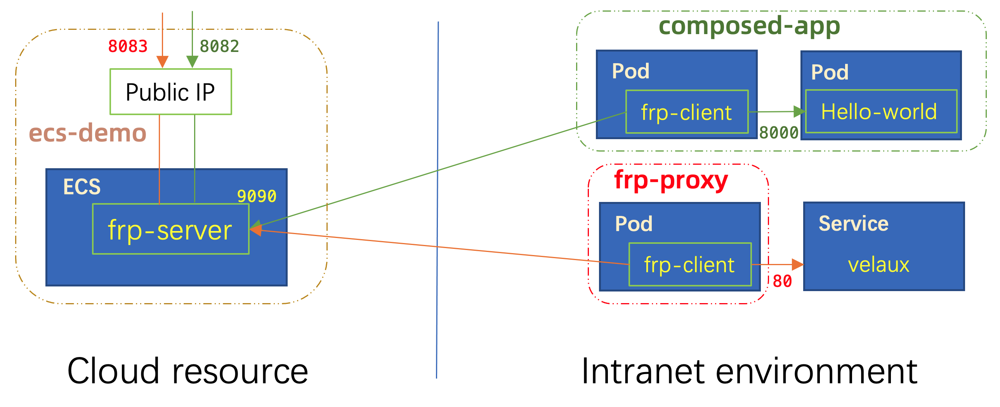

If you're looking for something to glue Terraform ecosystem with the Kubernetes world, congratulations! You're getting exactly what you want in this blog.

We will introduce how to integrate terraform modules into KubeVela by fixing a real world problem -- "Fixing the Developer Experience of Kubernetes Port Forwarding" inspired by [article](https://inlets.dev/blog/2022/06/24/fixing-kubectl-port-forward.html) from Alex Ellis.

In general, this article will be divided into two parts:

* Part.1 will introduce how to glue Terraform with KubeVela, it needs some basic knowledge of both Terraform and KubeVela. You can just skip this part if you don't want to extend KubeVela as a Developer.
* Part.2 will introduce how KubeVela can 1) provision a Cloud ECS instance by KubeVela with public IP; 2) Use the ECS instance as a tunnel sever to provide public access for any container service within an intranet environment.

OK, let's go!

<!--truncate-->

## Part 1. Glue Terraform Module as KubeVela Capability

In general, [KubeVela](https://kubevela.net/docs/) is a modern software delivery control plane, you may ask: "What benefit from doing this":

1. The power of gluing Terraform with Kubernetes ecosystem including Helm Charts in one unified solution, that helps you to do GitOps, CI/CD integration and application lifecycle management.
    - Thinking of deploy a product that includes Cloud Database, Container Service and several helm charts, now you can manage and deploy them together without switching to different tools.
2. Declarative model for all the resources, KubeVela will run the reconcile loop until succeed.
    - You won't be blocked by the network issues from terraform CLI.
3. A powerful CUE based workflow that you can define any preferred steps in the application delivery process.
    - You can compose the way you like, such as canary rollout, multi-clusters/multi-env promotion, notification.

If you're already a good hand of terraform, it's pretty easy for this integration.

### Build your terraform module

> This part can usually be skipped, if you already have a well-tested terraform module, 

Before start, make sure you have:

- Installed [terraform CLI](https://www.terraform.io/downloads).
- Have a Cloud Service credentials, in this article, we will use Alibaba Cloud as example.
- Learn the basic knowledge of [how to use terraform](https://www.terraform.io/language).

Here's my terraform module( https://github.com/wonderflow/terraform-alicloud-ecs-instance ) for this demo.

* Clone this module:

```
git clone https://github.com/wonderflow/terraform-alicloud-ecs-instance.git
cd terraform-alicloud-ecs-instance
```

* Initialize and download the latest stable version of the Alibaba Cloud provider:
```shell
terraform init
```

* Configure the Alibaba Cloud provider credentials:

```shell
export ALICLOUD_ACCESS_KEY="your-accesskey-id"
export ALICLOUD_SECRET_KEY="your-accesskey-secret"
export ALICLOUD_REGION="your-region-id"
```

You can also create an `provider.tf` including the credentials instead:

```hcl
provider "alicloud" {
    access_key  = "your-accesskey-id"
    secret_key   = "your-accesskey-secret"
    region           = "cn-hangzhou"
}
```

* Test creating the resources:
```shell
terraform apply -var-file=test/test.tfvars
```

* Destroy all resources of tests:

```shell
terraform destroy  -var-file=test/test.tfvars
```

You can customize this module per your needs and push to github of your own.


### Make the Terraform module as KubeVela Capability

Before start, make sure you have [installed kubevela control plane](https://kubevela.net/docs/install#1-install-velad), don't worry if you don't have Kubernetes cluster, velad is enough for the quick demo.

We'll use the terraform module we have already prepared just now.

* Generate Component Definition

```
vela def init ecs --type component --provider alibaba --desc "Terraform configuration for Alibaba Cloud Elastic Compute Service" --git https://github.com/wonderflow/terraform-alicloud-ecs-instance.git > alibaba-ecs-def.yaml
```

> Change the git url with your own if you have customized.

* Apply it to the vela control plane

```
vela kube apply -f alibaba-ecs-def.yaml
```

> `vela kube apply` works the same with `kubectl apply`.

Then the extension of ECS module has been added, you can learn more details from [here](https://kubevela.net/docs/platform-engineers/components/component-terraform).

We have finished the integration, the end user can discover the capability immediately after the apply.

The end user can use following commands to check the parameters:

```
vela show alibaba-ecs
```

They can also view it from website by launching:

```
vela show alibaba-ecs --web
```

That's all of the integration needed.

## Part 2. Fixing the Developer Experience of Kubernetes Port Forwarding

In this part, we will introduce a solution that you can expose any of your Kubernetes service to public with a specific port. The solution is composed by:

1. KubeVela environment, you already have if you have practiced in part 1.
2. Alibaba Cloud ECS, KubeVela will create a tiny ecs(`1u1g`) automatically by access key.
3. [frp](https://github.com/fatedier/frp), KubeVela will launch this proxy both at server-side and client-side.

### Prepare KubeVela environment

* Install KubeVela

```
curl -fsSl https://static.kubevela.net/script/install-velad.sh | bash
velad install
```

Check [this doc](https://kubevela.net/docs/install#1-install-velad) to learn more details of installation.

* Enable Terraform Addon and Alibaba Provider

```
vela addon enable terraform
vela addon enable terraform-alibaba
```

* Add credentials as provider

```
vela provider add terraform-alibaba --ALICLOUD_ACCESS_KEY <"your-accesskey-id"> --ALICLOUD_SECRET_KEY "your-accesskey-secret" --ALICLOUD_REGION <your-region> --name terraform-alibaba-default
```

Check [this doc](https://kubevela.net/docs/reference/addons/terraform) for more details about other clouds.

### Launch a ECS with Public IP and Deploy the `frp` server 

After the environment prepared well, you can create an application as below.

```yaml
cat <<EOF | vela up -f -
# YAML begins
apiVersion: core.oam.dev/v1beta1
kind: Application
metadata:
  name: ecs-demo
spec:
  components:
    - name: ecs-demo
      type: alibaba-ecs
      properties:
        providerRef:
          name: terraform-alibaba-default
        writeConnectionSecretToRef:
          name: outputs-ecs          
        name: "test-terraform-vela-123"
        instance_type: "ecs.n1.tiny"
        host_name: "test-terraform-vela"
        password: "Test-123456!"
        internet_max_bandwidth_out: "10"
        associate_public_ip_address: "true"
        instance_charge_type: "PostPaid"
        user_data_url: "https://raw.githubusercontent.com/wonderflow/terraform-alicloud-ecs-instance/master/frp.sh"
        ports:
        - 8080
        - 8081
        - 8082
        - 8083
        - 9090
        - 9091
        - 9092
        tags:
          created_by: "Terraform-of-KubeVela"
          created_from: "module-tf-alicloud-ecs-instance"
# YAML ends
EOF
```

This application will deploy an ECS instance with a public ip, explanation of some useful fields:

| Field | Usage  |
|:----:|:---:|
| providerRef | reference to the provider credentials we added |
| writeConnectionSecretToRef | the outputs of terraform module will be written into the secret |
| name | name of the ecs instance |
| instance_type | ecs instance type |
| host_name | hostname of the ecs |
| password | password of the ecs instance, you can connect by `ssh` |
| internet_max_bandwidth_out | internet bandwidth of the ecs instance |
| associate_public_ip_address | create public IP or not |
| instance_charge_type | the charge way of the resource |
| user_data_url | the installation script after the ecs instance created, we have installed the frp server in the script |
| ports | ports that will be allowd in the VPC and security group, 9090/9091 is must for frp server while others are preserved for client usage |
| tags | tags of the ECS instance |

You can learn more fields by:

```
vela show alibaba-ecs
```

After applied, you can check the status and logs of the application by:

```
vela status ecs-demo
vela logs ecs-demo
```

You can get the secret from the terraform resource contains the output values.

You may already see the result in `vela logs`, you can also check the output information from Terraform by:

```shell
$ kubectl get secret outputs-ecs --template={{.data.this_public_ip}} | base64 --decode
["121.196.106.174"]
```

> KubeVela will soon support query resource like this https://github.com/kubevela/kubevela/issues/4268.

As a result, you can visit the frp server admin page on port `:9091`, the `admin` password is `vela123` in the script.

By now, we have finished the server part here.

### Use frp client in KubeVela

The usage of frp client is very straight-forward, we can provide public IP for any of the service inside the cluster.



1. Deploy as standalone to proxy for any [Kubernetes Service](https://kubernetes.io/docs/concepts/services-networking/service/).

```yaml
cat <<EOF | vela up -f -
apiVersion: core.oam.dev/v1beta1
kind: Application
metadata:
  name: frp-proxy
spec:
  components:
    - name: frp-proxy
      type: worker
      properties:
        image: oamdev/frpc:0.43.0
        env:
          - name: server_addr
            value: "121.196.106.174"
          - name: server_port
            value: "9090"
          - name: local_port
            value: "80"
          - name: connect_name
            value: "velaux-service"
          - name: local_ip
            value: "velaux.vela-system"
          - name: remote_port
            value: "8083"
EOF
```

In this case, we specify the `local_ip` by `velaux.vela-system`, which means we're visiting the Kubernetes Service with name `velaux` in the namespace `vela-system`.

As a result, you can visit [velaux](https://kubevela.io/docs/reference/addons/velaux) service from the public IP `121.196.106.174:8083`.

2. Compose two components together for the same lifecycle.

```yaml
cat <<EOF | vela up -f -
# YAML begins
apiVersion: core.oam.dev/v1beta1
kind: Application
metadata:
  name: composed-app
spec:
  components:
    - name: web-new
      type: webservice
      properties:
        image: oamdev/hello-world:v2
        ports:
          - port: 8000
            expose: true
    - name: frp-web
      type: worker
      properties:
        image: oamdev/frpc:0.43.0
        env:
          - name: server_addr
            value: "121.196.106.174"
          - name: server_port
            value: "9090"
          - name: local_port
            value: "8000"
          - name: connect_name
            value: "composed-app"
          - name: local_ip
            value: "web-new.default"
          - name: remote_port
            value: "8082"
EOF
```

Wow! Then you can visiting the `hello-world` by:

```
curl 121.196.106.174:8082
```

The `webservice` type component will generate a service with the name of the component automatically. The `frp-web` component will proxy the traffic to the service `web-new` in the `default` namespace which is exactly the service generated.

When the application deleted, all of the resources defined in the same app are deleted together.

You can also compose the database together with them, then you can deliver all components needed in one time.

### Clean Up

You can clean up all the applications in the demo by `vela delete`:

```
vela delete composed-app -y
vela delete frp-proxy -y
vela delete ecs-demo -y
```

I think you've learned how to use KubeVela in this scenario now, just try it in your environment!

## What's more

In this blog, we have introduced the way to integrate Terraform module with KubeVela. It provides interesting use case that allow you to expose any of inner service to public.

While KubeVela can do more things than that, go and discover it at [kubevela.io](https://kubevela.io/)!


