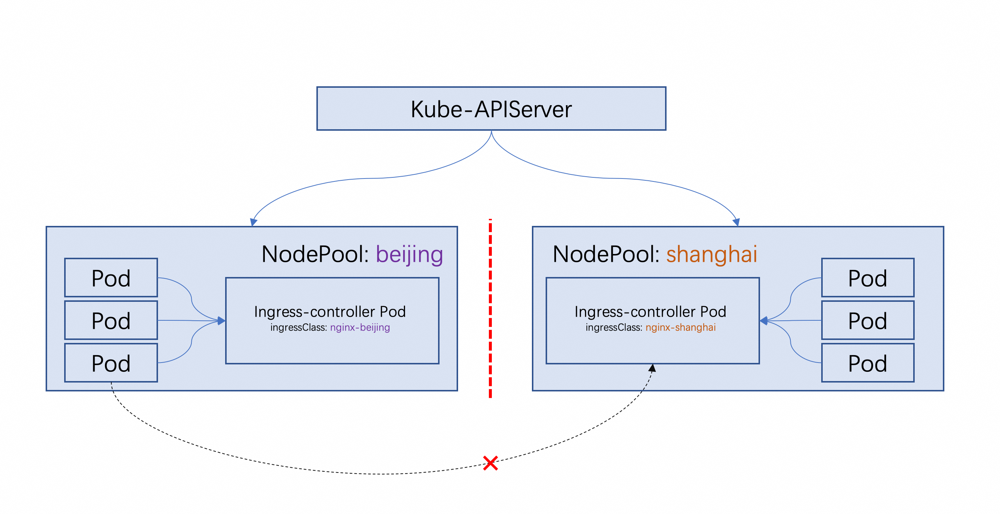
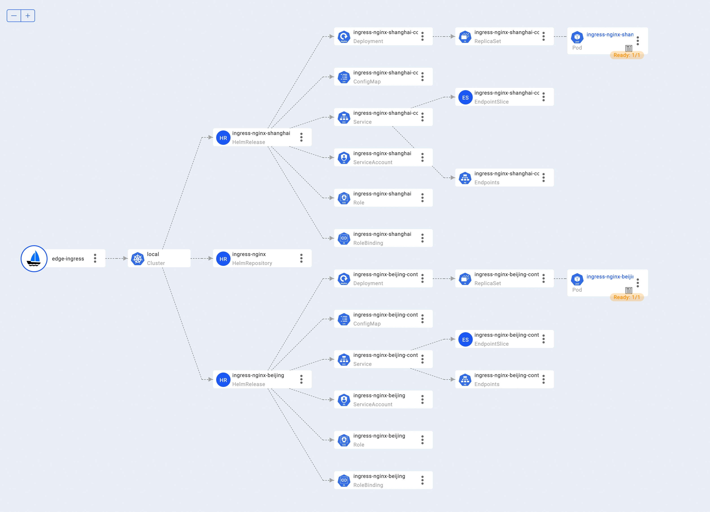

In this section, we will introduce how to deploy applications in edge scenario. We will use some concepts provided by [OpenYurt](https://openyurt.io) to 
describe what is the key problem we are trying to solve and how KubeVela play a role in this scenario.

:::note
In this section, we'll use some new features. Make sure your KubeVela version is `>=1.6.0`.
:::

## Key Problem

The `NodePool` is a CRD defined by OpenYurt. Generally, the `NodePool` is used to describe a group of nodes with the same features.
A Kubernetes cluster can have multiple `NodePool`s. How to deploy edge applications to different node pools is a key problem in edge scenario.

<details>
<summary>How OpenYurt define node pool</summary>

> In edge scenario, the edge nodes can usually be grouped by their locations, or other logical characteristics, such as their CPU architecture, telecom carriers or cloud providers.
The nodes among different groups could also be isolated from each other by various obvious reasons, such as network unreachablility, resource unsharability, and application independence.
This is the origin of the edge Node Pool.
> -- [OpenYurt NodePool](https://openyurt.io/docs/core-concepts/yurt-app-manager/#components-introduction)
 
</details>

There are some problems when deploy application to node pools:

1. **Unified Configuration**: We don't want to copy manifests for many times and do some changes for every app in each node pool.
   Instead, the better choice is use a unified configuration with some parameters to describe the differences.
2. **Properties differences**: Workloads deploy to different node pools will be similar in common properties.
   The difference is how to use `NodeSelector`, `Toleration` and `NodeAffinity` to schedule workloads to different node pools.
3. **Scalability**: The kinds of application is increasing. We don't need to change too much code to support a new kind of application.

See how KubeVela helps to solve these problem.

## Deploy to Edge with KubeVela

We will take a ingress controller example to show how to deploy applications to edge with KubeVela. In this case, we want to deploy a nginx 
ingress controller to two node pools to implement the traffic in environment with network isolation. Nodes in one node 
pool will access the ingress in the same node pool and then access the service in the same node pool. 



### Environment

We will simulate edge scenario with a Kubernetes cluster. The cluster has 3 nodes and their roles are:

- node1: master, cloud node
- node2: worker, edge node, in node pool `beijing`
- node3: worker, edge node, in node pool `shanghai`

### Preparation

1. Install YurtAppManager

:::note
YurtAppManager is a core component of OpenYurt. It provide NodePool CRD and controller. There are other components in OpenYurt,
but we only need YurtAppManager in this tutorial.
:::

```shell
git clone https://github.com/openyurtio/yurt-app-manager
cd yurt-app-manager && helm install yurt-app-manager -n kube-system ./charts/yurt-app-manager/
```

2. Install KubeVela, enable FluxCD addon

To install KubeVela, see [Install KubeVela](../installation/kubernetes).

FluxCD addon provides `helm` type ComponentDefinition. To enable FluxCD addon.
```shell
vela addon enable fluxcd
```

For more information about FluxCD addon, see [FluxCD addon](../reference/addons/fluxcd).

3. Prepare node pools

<details>
<summary>Configuration Process</summary>

Create two node pools: beijing and shanghai

```shell
kubectl apply -f - <<EOF
apiVersion: apps.openyurt.io/v1beta1
kind: NodePool
metadata:
  name: beijing
spec:
  type: Edge
  annotations:
    apps.openyurt.io/example: test-beijing
  taints:
    - key: apps.openyurt.io/example
      value: beijing
      effect: NoSchedule

---
apiVersion: apps.openyurt.io/v1beta1
kind: NodePool
metadata:
  name: shanghai
spec:
  type: Edge
  annotations:
    apps.openyurt.io/example: test-shanghai
  taints:
    - key: apps.openyurt.io/example
      value: shanghai
      effect: NoSchedule
EOF
```

Add node to perspective node pool

```shell
kubectl label node <node1> apps.openyurt.io/desired-nodepool=beijing
kubectl label node <node2> apps.openyurt.io/desired-nodepool=shanghai
```

</details>

```shell
kubectl get nodepool
```
expected output
```shell
NAME       TYPE   READYNODES   NOTREADYNODES   AGE
beijing    Edge   1            0               6m2s
shanghai   Edge   1            0               6m1s
```

### Deploy Application

Before we dive into the details, let's have a look how KubeVela describe app that deploy to edge.

```yaml title="app.yaml"
apiVersion: core.oam.dev/v1beta1
kind: Application
metadata:
  name: edge-ingress
spec:
  components:
    - name: ingress-nginx
      type: helm
      properties:
        chart: ingress-nginx
        url: https://kubernetes.github.io/ingress-nginx
        repoType: helm
        version: 4.3.0
        values:
          controller:
            service:
              type: NodePort
            admissionWebhooks:
              enabled: false
      # highlight-start
      traits:
        - type: edge-nginx
      # highlight-end
  policies:
    - name: replication
      type: replication
      properties:
      # highlight-start
        selector: [ "ingress-nginx" ]
        keys: [ "beijing","shanghai" ]
      # highlight-end
  workflow:
    steps:
      - name: deploy
        type: deploy
        # highlight-start
        properties:
          policies: ["replication"]
        # highlight-end
```

The `Application` has 3 parts:
1. A normal `helm` type component. It describes a helm release we want to install to cluster. Because we want to  Besides, we attach a trait 
`edge-nginx` to it. We will look into that later, now you can think it as a patch contains properties that different between node pools.
2. A `replication` policy. It describes how to replicate the component to different node pools. The `selector` field is used to select 
components that need to be replicated. The `keys` field represent it will turn one component into two components with different key.("beijing" and "shanghai")
3. A `deploy` workflow step. It describes how to deploy the application. It specifies `replication` policy to do the replication work.

:::note
If you want this app to work, please apply the `edge-ingress` trait in the next section first.
:::

:::tip
`deploy` is a built-in workflow step. It can also be used with `topology`, `override` policy in [multi-cluster scenario](../case-studies/multi-cluster). 
:::

Now we can apply the app to cluster.

```shell
vela up -f app.yaml
```

Check the status and the resources created by KubeVela.

```shell
vela status edge-ingress --tree --detail                                                                                                              1 ↵
```
```shell
CLUSTER       NAMESPACE     RESOURCE                           STATUS    APPLY_TIME          DETAIL
local  ─── default─┬─ HelmRelease/ingress-nginx-beijing  updated   2022-11-02 12:00:24 Ready: True  Status: Release reconciliation succeeded  Age: 153m
                   ├─ HelmRelease/ingress-nginx-shanghai updated   2022-11-02 12:00:24 Ready: True  Status: Release reconciliation succeeded  Age: 153m
                   └─ HelmRepository/ingress-nginx       updated   2022-11-02 12:00:24 URL: https://kubernetes.github.io/ingress-nginx  Age: 153m
                                                                                         Ready: True
                                                                                         Status: stored artifact for revision '7bce426c58aee962d479ca84e5c
                                                                                         fc6931c19c8995e31638668cb958d4a3486c2'
```

If you have enabled VelaUX, you can check the more detailed resources topology:



As you can see, KubeVela has created two `HelmRelease` resources. To check if the resources are created in the right node pool.

```shell
$ kubectl get node -l  apps.openyurt.io/nodepool=beijing                               
NAME                      STATUS   ROLES    AGE   VERSION
iz0xi0r2pe51he3z8pz1ekz   Ready    <none>   23h   v1.24.7+k3s1
$ kubectl get pod ingress-nginx-beijing-controller-c4c7cbf64-xthlp -oyaml|grep iz0xi0r2pe51he3z8pz1ekz
  nodeName: iz0xi0r2pe51he3z8pz1ekz
```

### Under the hood: Trait and Policy

How we can achieve the replication? Let's take a look at the trait and policy.

```cue title="edge-ingress.cue"
"edge-nginx": {
	type: "trait"
	annotations: {}
	attributes: {
		podDisruptive: true
		appliesToWorkloads: ["helm"]
	}
}

template: {
	patch: {
	    // highlight-start
		// +patchStrategy=retainKeys
		// highlight-end
		metadata: {
			name: "\(context.name)-\(context.replicaKey)"
		}
	    // highlight-start
		// +patchStrategy=jsonMergePatch
		// highlight-end
		spec: values: {
			ingressClassByName: true
			controller: {
				ingressClassResource: {
					name:            "nginx-" + context.replicaKey
					controllerValue: "openyurt.io/" + context.replicaKey
				}
				_selector
			}
			defaultBackend: {
				_selector
			}
		}
	}
	_selector: {
		tolerations: [
			{
				key:      "apps.openyurt.io/example"
				operator: "Equal"
				value:    context.replicaKey
			},
		]
		nodeSelector: {
			"apps.openyurt.io/nodepool": context.replicaKey
		}
	}
	parameter: null
}
```

The trait will patch the `HelmRelease` resource. It do three things:
1. Patch `metadata.name` to add the replica key to the name. So the name will be `ingress-nginx-beijing`. This is to avoid name conflict.
2. Patch `spec.values` to add the replica key to the `ingressClassResource.name` and `ingressClassResource.controllerValue`. This is to
make the ingress controller only handle the ingress with specified ingressClass, that is the ingress in the same node pool.
3. Patch `nodeSelector`, `tolerations` to make the ingress controller only run on nodes in specified node pool. 

:::note
This `apps.openyurt.io/example:beijing` taint is added by NodePool controller after we add node to the node pool.
Label `apps.openyurt.io/nodepool=beijing` is also added by NodePool controller.
:::

This trait use two kinds of patch strategy: `retainKeys` and `jsonMergePatch`. It tells KubeVela how to patch the fields.
You can find more information about patch strategy in [Patch and Override](../platform-engineers/traits/patch-trait).

The `context.replicaKey` is provided by the `replication` policy. It will be set to `beijing` and `shanghai` respectively.

In this case, the component will be replicated to two node pools. For each replicated component, the trait will be applied with different `context.replicaKey`.

## How KubeVela solve the problem

Looking back now how KubeVela solve the aforementioned problems.
1. **Unified Configuration**: We use one component to describe the common properties for ingress-nginx helm chart and its
   common properties like helm repository, chart name, version, etc.
2. **Properties differences**: KubeVela use a self-defined trait definition to describe the differences between workloads
   deployed to different node pools. The trait can be re-use for deploying the same helm chart.
3. **Scalability**: KubeVela allow user to define similar traits for other workload, like `Deployment` or `StatefulSet`. 
   Lines of code enables you to deliver a different kind of application to edge.
 

