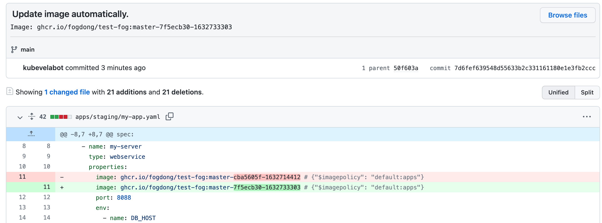

This section will introduce how to use KubeVela in GitOps environment and why.

## Introduction

GitOps is a continuous delivery method that allows developers to automatically deploy applications by changing code and declarative configurations in a Git repository, with Git-centric operations such as PR and commit. For detailed benefits of GitOps, please check [this article](https://www.weave.works/blog/what-is-gitops-really).

KubeVela as an declarative application delivery control plane can be naturally used in GitOps approach, and this will provide below extra bonus to end users alongside with GitOps benefits:
- application delivery workflow (CD pipeline)
  - i.e. KubeVela supports pipeline style application delivery process in GitOps, instead of simply declaring final status;
- handling deployment dependencies and designing typologies (DAG);
- unified higher level abstraction atop various GitOps tools' primitives;
- declare, provision and consume cloud resources in unified application definition;
- various out-of-box deployment strategies (Canary, Blue-Green ...);
- various out-of-box hybrid/multi-cloud deployment policies (placement rule, cluster selectors etc.);
- Kustomize-style patch for multi-env deployment without the need to learn Kustomize at all;
- ... and much more.


In this section, we will introduce steps of using KubeVela directly in GitOps approach.

> Note: you can also use it with existing tools such as ArgoCD with similar steps, detailed guides will be added in following releases.

## Setup

First, setup a Git Repository with `Application` files, some source code and a Dockerfile.

The code is very simple, starting a service and displaying the version in the code. In `Application`, we'll start a `webservice` for the code and add an `Ingress` trait to access.

```yaml
apiVersion: core.oam.dev/v1beta1
kind: Application
metadata:
  name: first-vela-workflow
  namespace: default
spec:
  components:
    - name: test-server
      type: webservice
      properties:
        # replace the imagepolicy `default:gitops` with your policy later
        image: <your image> # {"$imagepolicy": "default:gitops"}
        port: 8088
      traits:
        - type: ingress
          properties:
            domain: testsvc.example.com
            http:
              /: 8088
```

We want users to build the image and push it to the image registry after changing the code, so we need to integrate with a CI tool like GitHub Actions or Jenkins to do it. In this example, we use GitHub Actions to build the image. For the code and configuration file, please refer to [Example Repo](https://github.com/oam-dev/samples/tree/master/9.GitOps_Demo).

## Create the Git secret

After the new image is pushed to the image registry, KubeVela will recognize the new image and update the `Application` file in the Git repository and cluster. Therefore, we need a secret with Git information for KubeVela to commit to the Git repository.

```yaml
apiVersion: v1
kind: Secret
metadata:
  name: my-secret
type: kubernetes.io/basic-auth
stringData:
  username: <your username>
  password: <your password>
```

## Create the Application that sync with Git

After completing the basic configuration above, we can create an Application file that syncs with the corresponding Git repository and image registry information:

```yaml
apiVersion: core.oam.dev/v1beta1
kind: Application
metadata:
  name: git-app
spec:
  components:
  - name: gitops
    type: kustomize
    properties:
      repoType: git
      url: <your github repo address>
      # your git secret
      secretRef: my-secret
      # the interval time to pull from git repo and image registry
      pullInterval: 1m
      git:
        # the specific branch
        branch: master
      # the path that you want to listen
      path: .
      imageRepository:
        image: <your image>
        # if it's a private image registry, use `kubectl create secret docker-registry` to create the secret
        # secretRef: imagesecret
        filterTags:
          # filter the image tag
          pattern: '^master-[a-f0-9]+-(?P<ts>[0-9]+)'
          extract: '$ts'
        # use the policy to sort the latest image tag and update
        policy:
          numerical:
            order: asc
        # add more commit message
        commitMessage: "Image: {{range .Updated.Images}}{{println .}}{{end}}"
```

Apply the file to the cluster and check the `Application` in clusters, we can see that the `git-app` automatically pulls the config from Git Repository and apply the application to the cluster:

```shell
$ vela ls

APP                	COMPONENT     	TYPE      	TRAITS 	PHASE  	HEALTHY	STATUS	CREATED-TIME
first-vela-workflow	test-server	    webservice	ingress	running	healthy	      	2021-09-10 11:23:34 +0800 CST
git-app            	gitops        	kustomize 	       	running	healthy	      	2021-09-10 11:23:32 +0800 CST
```

We can `curl` the `Ingress` to see the current version in code:

```shell 
$ curl -H "Host:testsvc.example.com" http://<your-ip>
Version: 0.1.5
```

## Modify the code to trigger automatic deployment

After the first applying, we can modify the code in Git Repository to apply automatically.

Change the `Version` to `0.1.6` in code:

```go
const VERSION = "0.1.6"

func main() {
	http.HandleFunc("/", func(w http.ResponseWriter, r *http.Request) {
		_, _ = fmt.Fprintf(w, "Version: %s\n", VERSION)
	})
	if err := http.ListenAndServe(":8088", nil); err != nil {
		println(err.Error())
	}
}
```

Commit the change to the Git Repository, we can see that our CI pipelines has built the image and push it to the image registry.

KubeVela will then listening to the image registry and update the `Application` in Git Repository with the latest image tag. We can see that there is a commit form `kubevelabot`, the commit message is always with a prefix `Update image automatically.` You can use format like `{{range .Updated.Images}}{{println .}}{{end}}` to specify the image name in the `commitMessage` field.



> Note that the commit from `kubevelabot` will not trigger the pipeline again and since we filter out the commit from KubeVela in CI configuration.
> 
> ```shell
> jobs:
>  publish:
>    if: "!contains(github.event.head_commit.message, 'Update image automatically')"
> ```

Re-check the `Application` in cluster, we can see that the image of the `Application` has been updated after a while. We can `curl` to `Ingress` to see the current version:

```shell 
$ curl -H "Host:testsvc.example.com" http://<your-ip>
Version: 0.1.6
```

The `Version` has been updated successfully! Now we're done with everything from changing the code to automatically applying to the cluster.

KubeVela polls the latest information from the code and image repo periodically (at an interval that can be customized):
* When the `Application` file in the Git repository is updated, KubeVela will update the `Application` in the cluster based on the latest configuration.
* When a new tag is added to the image registry, KubeVela will filter out the latest tag based on your policy and update it to Git repository. When the files in the repository are updated, KubeVela repeats the first step and updates the files in the cluster, thus achieving automatic deployment.

By integrating with GitOps, KubeVela helps users speed up deployment and simplify continuous deployment.