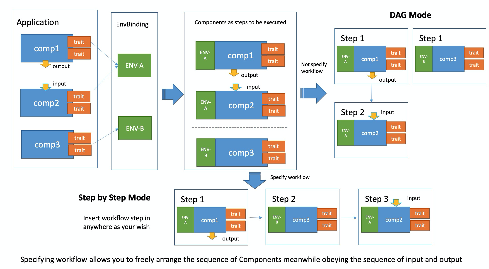

This section will introduce how to use KubeVela for multi-cluster application delivery and why.

## Introduction

There are more and more situations come out that organizations need multi-cluster technology for application delivery:

* For scalability, a single Kubernetes cluster has its limit around 5K nodes or less, it is unable to handle the large scale application load.
* For stability/availability, application can deploy in multi-cluster for backup which provides more stability and availability.
* For security, you may need to deploy in different zones/areas as government policy requires.

The following guide will the multi-cluster that helps you easily deploy an application to different environments.

## Preparation

You can simply join an existing cluster into KubeVela by specify its KubeConfig like below.

```shell script
vela cluster join <your kubeconfig path>
```

It will use field `context.cluster` in KubeConfig as the cluster name automatically,
you can also specify the name by `--name` parameter. For example:

```shell
vela cluster join stage-cluster.kubeconfig --name cluster-staging
vela cluster join prod-cluster.kubeconfig --name cluster-prod
```

After clusters joined, you could list all clusters managed by KubeVela currently.

```bash
$ vela cluster list
CLUSTER         TYPE    ENDPOINT                
cluster-prod    tls     https://47.88.4.97:6443 
cluster-staging tls     https://47.88.7.230:6443
```

You can also detach a cluster if you're not using it any more.

```shell script
$ vela cluster detach cluster-prod
```

If there's still any application running in the cluster, the command will be rejected.

## Deploy Application to multi cluster

KubeVela regards a Kubernetes cluster as an environment, so you can deploy an application into
one or more environments.

Below is an example, deploy to a staging environment first, check the application running well,
and finally promote to production environment.

For different environments, the deployment configuration can also have some nuance. In the staging environment, we only need one replica for the webservice and do not need the worker. In the production environment, we setup 3 replicas for the webservice and enable the worker.


```yaml
apiVersion: core.oam.dev/v1beta1
kind: Application
metadata:
  name: example-app
  namespace: default
spec:
  components:
    - name: hello-world-server
      type: webservice
      properties:
        image: crccheck/hello-world
        port: 8000
      traits:
        - type: scaler
          properties:
            replicas: 1
    - name: data-worker
      type: worker
      properties:
        image: busybox
        cmd:
          - sleep
          - '1000000'
  policies:
    - name: example-multi-env-policy
      type: env-binding
      properties:
        envs:
          - name: staging
            placement: # selecting the cluster to deploy to
              clusterSelector:
                name: cluster-staging
            selector: # selecting which component to use
              components:
                - hello-world-server

          - name: prod
            placement:
              clusterSelector:
                name: cluster-prod
            patch: # overlay patch on above components
              components:
                - name: hello-world-server
                  type: webservice
                  traits:
                    - type: scaler
                      properties:
                        replicas: 3

    - name: health-policy-demo
      type: health
      properties:
        probeInterval: 5
        probeTimeout: 10

  workflow:
    steps:
      # deploy to staging env
      - name: deploy-staging
        type: deploy2env
        properties:
          policy: example-multi-env-policy
          env: staging

      # manual check
      - name: manual-approval
        type: suspend

      # deploy to prod env
      - name: deploy-prod
        type: deploy2env
        properties:
          policy: example-multi-env-policy
          env: prod
```

After the application deployed, it will run as the workflow steps.

> You can refer to [Env Binding](../end-user/policies/envbinding) and [Health Check](../end-user/policies/health) policy user guide for parameter details.

It will deploy application to staging environment first, you can check the `Application` status by:

```shell
> kubectl get application example-app
NAME          COMPONENT            TYPE         PHASE                HEALTHY   STATUS       AGE
example-app   hello-world-server   webservice   workflowSuspending   true      Ready:1/1    10s
```

We can see that the workflow is suspended at `manual-approval`:

```yaml
...
  status:
    workflow:
      appRevision: example-app-v1:44a6447e3653bcc2
      contextBackend:
        apiVersion: v1
        kind: ConfigMap
        name: workflow-example-app-context
        uid: 56ddcde6-8a83-4ac3-bf94-d19f8f55eb3d
      mode: StepByStep
      steps:
      - id: wek2b31nai
        name: deploy-staging
        phase: succeeded
        type: deploy2env
      - id: 7j5eb764mk
        name: manual-approval
        phase: succeeded
        type: suspend
      suspend: true
      terminated: false
      waitCount: 0
```

You can also check the health status in the `status.service` field below.

```yaml
...
  status:
    services:
    - env: staging
      healthy: true
      message: 'Ready:1/1 '
      name: hello-world-server
      scopes:
      - apiVersion: core.oam.dev/v1alpha2
        kind: HealthScope
        name: health-policy-demo
        namespace: test
        uid: 6e6230a3-93f3-4dba-ba09-dd863b6c4a88
      traits:
      - healthy: true
        type: scaler
      workloadDefinition:
        apiVersion: apps/v1
        kind: Deployment
```

You can use `resume` command after everything verified in statging cluster:

```shell
> vela workflow resume example-app
Successfully resume workflow: example-app
```

Recheck the `Application` status:

```shell
> kubectl get application example-app
NAME          COMPONENT            TYPE         PHASE     HEALTHY   STATUS       AGE
example-app   hello-world-server   webservice   running   true      Ready:1/1    62s
```

```yaml
  status:
    services:
    - env: staging
      healthy: true
      message: 'Ready:1/1 '
      name: hello-world-server
      scopes:
      - apiVersion: core.oam.dev/v1alpha2
        kind: HealthScope
        name: health-policy-demo
        namespace: default
        uid: 9174ac61-d262-444b-bb6c-e5f0caee706a
      traits:
      - healthy: true
        type: scaler
      workloadDefinition:
        apiVersion: apps/v1
        kind: Deployment
    - env: prod
      healthy: true
      message: 'Ready:3/3 '
      name: hello-world-server
      scopes:
      - apiVersion: core.oam.dev/v1alpha2
        kind: HealthScope
        name: health-policy-demo
        namespace: default
        uid: 9174ac61-d262-444b-bb6c-e5f0caee706a
      traits:
      - healthy: true
        type: scaler
      workloadDefinition:
        apiVersion: apps/v1
        kind: Deployment
    - env: prod
      healthy: true
      message: 'Ready:1/1 '
      name: data-worker
      scopes:
      - apiVersion: core.oam.dev/v1alpha2
        kind: HealthScope
        name: health-policy-demo
        namespace: default
        uid: 9174ac61-d262-444b-bb6c-e5f0caee706a
      workloadDefinition:
        apiVersion: apps/v1
        kind: Deployment
```

All the step status in workflow is succeeded:

```yaml
...
  status:
    workflow:
      appRevision: example-app-v1:44a6447e3653bcc2
      contextBackend:
        apiVersion: v1
        kind: ConfigMap
        name: workflow-example-app-context
        uid: e1e7bd2d-8743-4239-9de7-55a0dd76e5d3
      mode: StepByStep
      steps:
      - id: q8yx7pr8wb
        name: deploy-staging
        phase: succeeded
        type: deploy2env
      - id: 6oxrtvki9o
        name: manual-approval
        phase: succeeded
        type: suspend
      - id: uk287p8c31
        name: deploy-prod
        phase: succeeded
        type: deploy2env
      suspend: false
      terminated: false
      waitCount: 0
```

## More use cases

KubeVela can provide many strategies to deploy an application to multiple clusters by composing env-binding policy and workflow steps.

You can have a glimpse of how does it work as below:



More use cases about the multi cluster application deployment are coming soon.