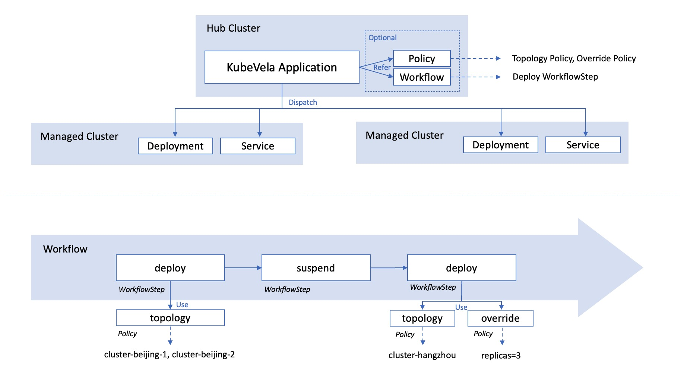

KubeVela is by design a full functional Continuous Delivery (CD) platform with fine grained support for hybrid/multi-cloud/multi-cluster deployment.
This section will introduce how to deliver multi-cluster application with KubeVela policies and workflow.

## Introduction

There are many scenarios that developers or system operators need to deploy and manage applications across multiple clusters.

* For scalability, a single Kubernetes cluster has its limit around 5K nodes or less, it is unable to handle the large scale application load.
* For stability/availability, one single application can be deployed in multiple clusters for backup, which provides more stability and availability.
* For security, application might need to be deployed in different zones/areas as government policy requires.

The following guide will introduce how to manage applications across clusters on KubeVela.

## Preparation

You can simply join an existing cluster into KubeVela by specifying its KubeConfig as below

```shell script
vela cluster join <your kubeconfig path>
```

It will use the field `context.cluster` in KubeConfig as the cluster name automatically,
you can also specify the name by `--name` parameter. For example:

```shell
$ vela cluster join beijing.kubeconfig --name beijing
$ vela cluster join hangzhou-1.kubeconfig --name hangzhou-1
$ vela cluster join hangzhou-2.kubeconfig --name hangzhou-2
```

After clusters joined, you could list all clusters managed by KubeVela.

```bash
$ vela cluster list
CLUSTER                 TYPE            ENDPOINT                ACCEPTED        LABELS
local                   Internal        -                       true                  
cluster-beijing         X509Certificate <ENDPOINT_BEIJING>      true                  
cluster-hangzhou-1      X509Certificate <ENDPOINT_HANGZHOU_1>   true                  
cluster-hangzhou-2      X509Certificate <ENDPOINT_HANGZHOU_2>   true                  
```

> By default, the hub cluster where KubeVela locates is registered as the `local` cluster. You can use it like a managed cluster in spite that you cannot detach it or modify it.

You can also detach a cluster if you do not want to use it anymore.

```shell script
$ vela cluster detach beijing
```

> It is dangerous to detach a cluster that is still in-use. But if you want to do modifications to the held cluster credential, like rotating certificates, it is possible to do so. 

You can also give labels to your clusters, which helps you select clusters for deploying applications.

```bash
$ vela cluster labels add cluster-hangzhou-1 region=hangzhou
$ vela cluster labels add cluster-hangzhou-2 region=hangzhou
$ vela cluster list
CLUSTER                 TYPE            ENDPOINT                ACCEPTED        LABELS
local                   Internal        -                       true                  
cluster-beijing         X509Certificate <ENDPOINT_BEIJING>      true                  
cluster-hangzhou-1      X509Certificate <ENDPOINT_HANGZHOU_1>   true            region=hangzhou
cluster-hangzhou-2      X509Certificate <ENDPOINT_HANGZHOU_2>   true            region=hangzhou
```

## Deliver Application to Clusters

To deliver your application into multiple clusters, you simply need to configure which clusters you want to deploy through the `topology` policy. For example, you can deploy an nginx webservice in hangzhou clusters by running the following commands

```bash
$ cat <<EOF | vela up -f -
apiVersion: core.oam.dev/v1beta1
kind: Application
metadata:
  name: basic-topology
  namespace: examples
spec:
  components:
    - name: nginx-basic
      type: webservice
      properties:
        image: nginx
      traits:
        - type: expose
          properties:
            port: [80]
  policies:
    - name: topology-hangzhou-clusters
      type: topology
      properties:
        clusters: ["cluster-hangzhou-1", "cluster-hangzhou-2"]
EOF
```

You can check the deploy result by running `vela status`

```bash
$ vela status basic-topology -n examples
About:

  Name:         basic-topology               
  Namespace:    examples                     
  Created at:   2022-04-08 14:37:54 +0800 CST
  Status:       workflowFinished             

Workflow:

  mode: DAG
  finished: true
  Suspend: false
  Terminated: false
  Steps
  - id:3mvz5i8elj
    name:deploy-topology-hangzhou-clusters
    type:deploy
    phase:succeeded 
    message:

Services:

  - Name: nginx-basic  
    Cluster: cluster-hangzhou-1  Namespace: examples
    Type: webservice
    Healthy Ready:1/1
    Traits:
      ✅ expose
  - Name: nginx-basic  
    Cluster: cluster-hangzhou-2  Namespace: examples
    Type: webservice
    Healthy Ready:1/1
    Traits:
      ✅ expose
```

### Debugging Multi-cluster Application

You can debugging the above deployed nginx webservice by running the following vela CLI commands. You can play with your pods in managed clusters directly on the hub cluster, without switching KubeConfig context. If you have multiple clusters in on application, the CLI command will ask you to choose one interactively.
- `vela status` as shown above can give you an overview of your deployed multi-cluster application. Example usage is shown above.
- `vela logs` shows pod logs in managed clusters.

```bash
$ vela logs basic-topology -n examples 
? You have 2 deployed resources in your app. Please choose one: Cluster: cluster-hangzhou-1 | Namespace: examples | Kind: Deployment | Name: nginx-basic
+ nginx-basic-dfb6dcf8d-km5vk › nginx-basic
nginx-basic-dfb6dcf8d-km5vk nginx-basic 2022-04-08T06:38:10.540430392Z /docker-entrypoint.sh: /docker-entrypoint.d/ is not empty, will attempt to perform configuration
nginx-basic-dfb6dcf8d-km5vk nginx-basic 2022-04-08T06:38:10.540742240Z /docker-entrypoint.sh: Looking for shell scripts in /docker-entrypoint.d/
```

- `vela exec` helps you execute commands in pods in managed clusters.

```bash
$ vela exec basic-topology -n examples -it -- ls 
? You have 2 deployed resources in your app. Please choose one: Cluster: cluster-hangzhou-1 | Namespace: examples | Kind: Deployment | Name: nginx-basic
bin   docker-entrypoint.d   home   media  proc  sbin  tmp
boot  docker-entrypoint.sh  lib    mnt    root  srv   usr
dev   etc                   lib64  opt    run   sys   var
```

- `vela port-forward` forward ports of pods or services in managed clusters to your local endpoint.

```bash
$ vela port-forward basic-topology -n examples 8080:80
? You have 4 deployed resources in your app. Please choose one: Cluster: cluster-hangzhou-1 | Namespace: examples | Kind: Deployment | Name: nginx-basic
Forwarding from 127.0.0.1:8080 -> 80
Forwarding from [::1]:8080 -> 80

Forward successfully! Opening browser ...
Handling connection for 8080
```

## Advanced Usage


### Understanding the Multi-cluster Application

The following figure displays the architecture of a multi-cluster application. All the configurations (including Application, Policy and Workflow) lives in the hub cluster. Only the resources (like deployment or service) will be dispatched in to managed clusters.

The policies mainly takes charge of describing the destination of the resources and how they should be overrided. The real executor of the resource dispatch is the workflow. In each `deploy` workflow step, it will refer to some policies, override the default configuration, and dispatch the resources.



### Configure the deploy destination

The most straightforward way to configure the deploy destination is to write cluster names inside the `topology` policy. Sometimes, it will be more easy to select clusters by labels, like filtering all clusters in hangzhou:

```yaml
apiVersion: core.oam.dev/v1beta1
kind: Application
metadata:
  name: label-selector-topology
  namespace: examples
spec:
  components:
    - name: nginx-label-selector
      type: webservice
      properties:
        image: nginx
  policies:
    - name: topology-hangzhou-clusters
      type: topology
      properties:
        clusterLabelSelector:
          region: hangzhou
```

If you want to deploy application components into the control plane cluster, you can use the `local` cluster.
Besides, you can also deploy your application components in another namespace other than the application's original namespace.

```yaml
apiVersion: core.oam.dev/v1beta1
kind: Application
metadata:
  name: local-ns-topology
  namespace: examples
spec:
  components:
    - name: nginx-local-ns
      type: webservice
      properties:
        image: nginx
  policies:
    - name: topology-local
      type: topology
      properties:
        clusters: ["local"]
        namespace: examples-alternative
```

> Sometimes, for security issues, you might want to disable this behavior and retrict the resources to be deployed within the same namespace of the application. This can be done by setting `--allow-cross-namespace-resource=false` in the bootstrap parameter of the KubeVela controller.


### Control the deploy workflow

By default, if you declare multiple topology policies in the application, the application components will be deployed in all destinations following the order of the policies.

If you want to control the deploy process, like changing the order or adding manual approval, you can use the `deploy` workflow step explicitly in the workflow to achieve that.

```yaml
apiVersion: core.oam.dev/v1beta1
kind: Application
metadata:
  name: deploy-workflowstep
  namespace: examples
spec:
  components:
    - name: nginx-deploy-workflowstep
      type: webservice
      properties:
        image: nginx
  policies:
    - name: topology-hangzhou-clusters
      type: topology
      properties:
        clusterLabelSelector:
          region: hangzhou
    - name: topology-local
      type: topology
      properties:
        clusters: ["local"]
        namespace: examples-alternative
  workflow:
    steps:
      - type: deploy
        name: deploy-local
        properties:
          policies: ["topology-local"]
      - type: deploy
        name: deploy-hangzhou
        properties:
          # require manual approval before running this step
          auto: false
          policies: ["topology-hangzhou-clusters"]
```

You can also deploy application components with different topology policies concurrently, by filling these topology policies in one `deploy` step.

```yaml
apiVersion: core.oam.dev/v1beta1
kind: Application
metadata:
  name: deploy-concurrently
  namespace: examples
spec:
  components:
    - name: nginx-deploy-concurrently
      type: webservice
      properties:
        image: nginx
  policies:
    - name: topology-hangzhou-clusters
      type: topology
      properties:
        clusterLabelSelector:
          region: hangzhou
    - name: topology-local
      type: topology
      properties:
        clusters: ["local"]
        namespace: examples-alternative
  workflow:
    steps:
      - type: deploy
        name: deploy-all
        properties:
          policies: ["topology-local", "topology-hangzhou-clusters"]
```


### Override default configurations in clusters

There are times that you want to make changes to the configuration in some clusters, rather than use the default configuration declared in the application's components field. For example, using a different container image or changing the default number of replicas.

The override policy is able to help you make customizations in different clusters. You can use it together with the topology policy in the `deploy` workflow step.

In the following example, the application will deploy a default nginx webservice in the `local` cluster. Then it will deploy a high-available nginx webservice with the legacy image `nginx:1.20` and 3 replicas in hangzhou clusters.

```yaml
apiVersion: core.oam.dev/v1beta1
kind: Application
metadata:
  name: deploy-with-override
  namespace: examples
spec:
  components:
    - name: nginx-with-override
      type: webservice
      properties:
        image: nginx
  policies:
    - name: topology-hangzhou-clusters
      type: topology
      properties:
        clusterLabelSelector:
          region: hangzhou
    - name: topology-local
      type: topology
      properties:
        clusters: ["local"]
        namespace: examples-alternative
    - name: override-nginx-legacy-image
      type: override
      properties:
        components:
          - name: nginx-with-override
            properties:
              image: nginx:1.20
    - name: override-high-availability
      type: override
      properties:
        components:
          - type: webservice
            traits:
              - type: scaler
                properties:
                  replicas: 3
  workflow:
    steps:
      - type: deploy
        name: deploy-local
        properties:
          policies: ["topology-local"]
      - type: deploy
        name: deploy-hangzhou
        properties:
          policies: ["topology-hangzhou-clusters", "override-nginx-legacy-image", "override-high-availability"]
```

> NOTE: The override policy is used to modify the basic configuration. Therefore, **it is designed to be used together with topology policy**. If you do not want to use topology policy, you can directly write configurations in the component part instead of using the override policy. *If you misuse the override policy in the deploy workflow step without topology policy, no error will be reported but you will find nothing is deployed.*

The override policy has many advanced capabilities, such as adding new component or selecting components to use.
The following example will first deploy an nginx webservice with `nginx:1.20` image to local cluster. Then two nginx webservices with `nginx` and `nginx:stable` images will be deployed to hangzhou clusters respectively.

```yaml
apiVersion: core.oam.dev/v1beta1
kind: Application
metadata:
  name: advance-override
  namespace: examples
spec:
  components:
    - name: nginx-advance-override-legacy
      type: webservice
      properties:
        image: nginx:1.20
    - name: nginx-advance-override-latest
      type: webservice
      properties:
        image: nginx
  policies:
    - name: topology-hangzhou-clusters
      type: topology
      properties:
        clusterLabelSelector:
          region: hangzhou
    - name: topology-local
      type: topology
      properties:
        clusters: ["local"]
        namespace: examples-alternative
    - name: override-nginx-legacy
      type: override
      properties:
        selector: ["nginx-advance-override-legacy"]
    - name: override-nginx-latest
      type: override
      properties:
        selector: ["nginx-advance-override-latest", "nginx-advance-override-stable"]
        components:
          - name: nginx-advance-override-stable
            type: webservice
            properties:
              image: nginx:stable
  workflow:
    steps:
      - type: deploy
        name: deploy-local
        properties:
          policies: ["topology-local", "override-nginx-legacy"]
      - type: deploy
        name: deploy-hangzhou
        properties:
          policies: ["topology-hangzhou-clusters", "override-nginx-latest"]
```


### Use policies and workflow outside the application

Sometimes, you may want to use the same policy across multiple applications or reuse previous workflow to deploy different resources.
To reduce the repeated code, you can leverage the external policies and workflow and refer to them in your applications.

> NOTE: you can only refer to Policy and Workflow within your application's namespace.

```yaml
apiVersion: core.oam.dev/v1alpha1
kind: Policy
metadata:
  name: topology-hangzhou-clusters
  namespace: examples
type: topology
properties:
  clusterLabelSelector:
    region: hangzhou
---
apiVersion: core.oam.dev/v1alpha1
kind: Policy
metadata:
  name: override-high-availability-webservice
  namespace: examples
type: override
properties:
  components:
    - type: webservice
      traits:
        - type: scaler
          properties:
            replicas: 3
---
apiVersion: core.oam.dev/v1alpha1
kind: Workflow
metadata:
  name: make-release-in-hangzhou
  namespace: examples
steps:
  - type: deploy
    name: deploy-hangzhou
    properties:
      auto: false
      policies: ["override-high-availability-webservice", "topology-hangzhou-clusters"]
```

```yaml
apiVersion: core.oam.dev/v1beta1
kind: Application
metadata:
  name: external-policies-and-workflow
  namespace: examples
spec:
  components:
    - name: nginx-external-policies-and-workflow
      type: webservice
      properties:
        image: nginx
  workflow:
    ref: make-release-in-hangzhou
```

> NOTE: The internal policies will be loaded first. External policies will only be used when there is no corresponding policy inside the application. In the following example, we can reuse `topology-hangzhou-clusters` policy and `make-release-in-hangzhou` workflow but modify the `override-high-availability-webservice` policy by injecting the same-named policy inside the new application.

```yaml
apiVersion: core.oam.dev/v1beta1
kind: Application
metadata:
  name: nginx-stable-ultra
  namespace: examples
spec:
  components:
    - name: nginx-stable-ultra
      type: webservice
      properties:
        image: nginx:stable
  policies:
    - name: override-high-availability-webservice
      type: override
      properties:
        components:
          - type: webservice
            traits:
              - type: scaler
                properties:
                  replicas: 5
  workflow:
    ref: make-release-in-hangzhou
```

## Backward Compatibility

KubeVela Application v1.3 uses different policies and workflow steps to configure and managing multi-cluster applications.

The outdated `env-binding` policy and `deploy2env` workflow step in old versions are kept now and might be deprecated in the future.

The new policies and workflow steps can cover all the use-cases in old versions so it is possible to upgrade all your applications while maintaining the same capabilities. Upgrade tools are not available now but will come out before deprecation happens.

If you already have applications running in production environment and do not want to change them, KubeVela v1.3 is also compatible for it. It is **NOT** necessary to migrate old multi-cluster applications to new ones.

## Conclusion

In this section, we introduced how KubeVela delivering micro services in multiple clusters, the whole process can be easily modeled as a declarative deployment plan.

No more add-hoc scripts or glue code, KubeVela will get the application delivery workflow done with full automation and determinism. Most importantly, KubeVela expects you keep using the CI solutions you are already familiar with and KubeVela is fully complementary to them as the CD control plane.

## Next Step

* Refer to more examples about [integrating with Jenkins](../tutorials/jenkins).