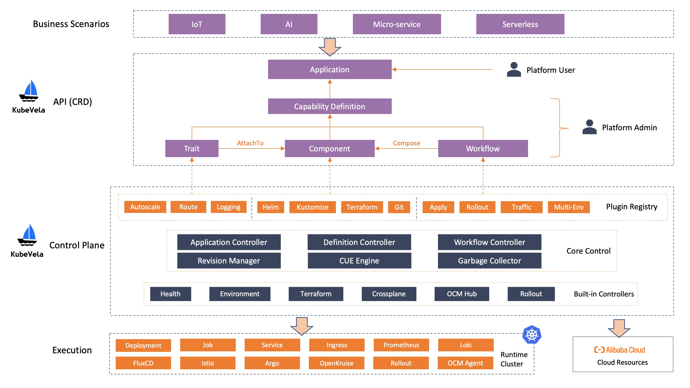

The overall architecture of KubeVela is shown as below:

## API

The API layer provides KubeVela APIs exposed to users for building application delivery platform and solutions.
KubeVela APIs are declarative and application centric.
It is based on Kubernetes CRDs to natively fit into the Kubernetes ecosystem.

The APIs can be categorized for two purposes:

- For **platform users** to compose final application manifest to deploy.
  - Usually this contains only user-concerned config and hides infrastructure details.
  - Users will normally write the manifest in yaml format.
  - This currently includes Application only. But we may add more user-facing APIs, e.g. ApplicationSet to define multiple Applications.
- For **platform admins** to define capability definitions to handle actual operations.
  - Each definition glues operational tasks using CUE and exposes user-concerned config only.
  - Admins will normally write the manifest in yaml + CUE format.
  - This currently includes Component, Trait, Policy, and Workflow definition types.

The APIs are served by the control plane.
Because it is so important that we put a separate section to talk about it.

## Control Plane

The control plane layers is where KubeVela puts the components central to the entire system.
It is the first entry to handle user API requests, the central place to register plugins,
and central processor to manage global states and dispatches tasks/resources.

The control plane contains three major parts:

- **Plugin registry** stores and manages X-Definitions.
  X-Definitions are CRDs that users can apply and get via kubectl.
  There are additional backend functions to store and manage multiple versions of X-Definitions.
- **Core Control** provides the core control logic to the entire system.
  It consists of the core components that are hanlding Application, X-Definition API requests,
  orchestrating Workflows, storing revisions of Applications and Components,
  parsing and executing CUE fields, garbage collecting unused resources.
- **Builtin Controllers** registers builtin plugins and provides the backing controllers for the resources
  created by X-Definitions. These are core to the KubeVela ecosystem that we believe everyone will use.

The control plane (including API layer) is KubeVela per se.
Technically speaking, KubeVela is a control plane to manage applications over multiple clusters, hybrid environments.

## Execution

The execution layer is where the applications are actually running on.
KubeVela allows you to deploy and manage application resources in a consistent workflow onto both
Kubernetes cluster (e.g. local, managed offerings, IoT/edge, on-prem)
and non-Kubernetes environments on clouds.
KubeVela itself does not run on the execution infrastructures, but manage them instead.
