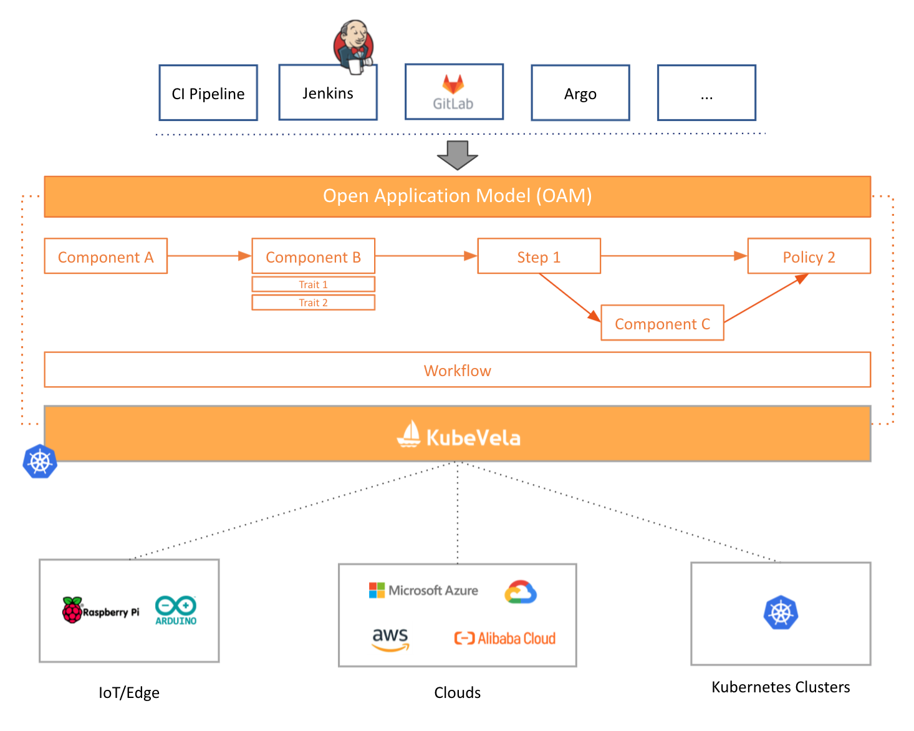
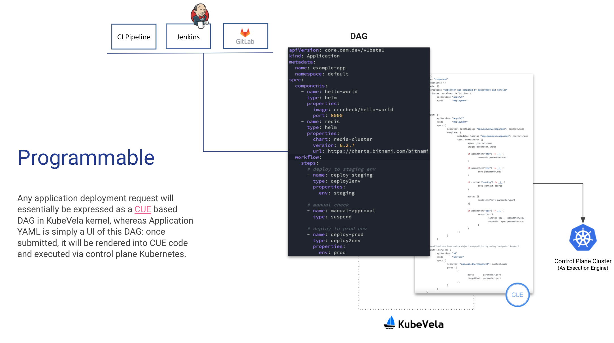

The overall architecture of KubeVela is shown as below:

## KubeVela is a Control Plane System

KubeVela orchestrates application components, cloud resources and pipeline over multiple clusters and hybrid environments. It is designed to be an application delivery and management control plane instead of a runtime plugin.

For easy integration with upstream CI pipelines and GitOps tools, KubeVela API (i.e. Open Application Model) are designed as declarative and application-centric, including:

`Application` for designing application deployment plan.

`X-Definitions` for managing the abstraction and capabilities of KubeVela with CUE.
  - e.g. `ComponentDefinition`, `TraitDefinition`, etc.

In implementation, KubeVela relies on a dedicated Kubernetes cluster to achieve above goals. We chose to rely on Kubernetes as the control plane implementation because this approach is battle tested and brings determinism, convergence and automation to application management at scale. In detail, KubeVela is composed by several parts:

- *Plugin Registry* that registers and manages `X-Definitions`.
- *Core Controller* that provides the core control logic of the entire system. For example, handling KubeVela API resources, orchestrating workflow, storing revisions, parsing and executing CUE code, garbage collecting, etc.
- *Addon Controllers* that register and manage built-in addons that KubeVela needed to work. For example, Flux and Terraform controller.

This control plane Kubernetes cluster will be referenced as the "control plane cluster" in the following documentation. 

### Runtime Infrastructure

The runtime infrastructure is where the applications are actually running on.
KubeVela itself is fully runtime infrastructure agnostic and hence allows you to deploy application to both Kubernetes based infrastructure and non-Kubernetes environments such as cloud platforms and edge devices.

## KubeVela is Programmable

In real world, application deployment tends to be complex and varies from teams, environments and scenarios. Hence, KubeVela introduced a fully programmable approach to implement its deployment model so it can adapt to every need of your application delivery use case in-place.

For learning how to program KubeVela in detail, please check the `Administrator Manuals` in the documentation site.
