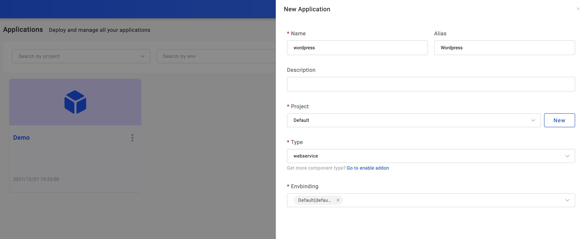
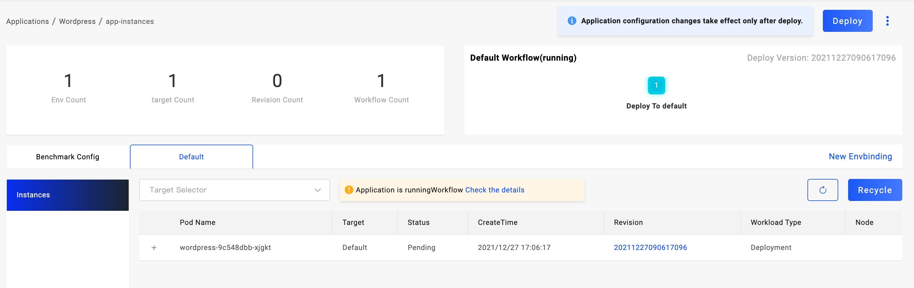
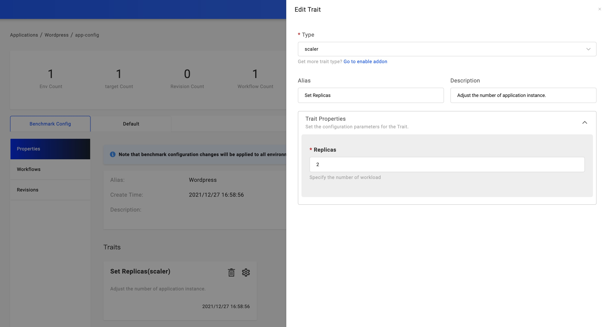

This article introduces how companies deliver business applications based on KubeVela. It does not require you to know much about Kubernetes.

## Before starting

- Containerize your business. No matter what language you're using, first to build an image via CI or locally.

  > In the future, KubeVela plans to provide the image-build-up solution for multi-langs

- Place your business image at a hub that KubeVela can access to
- Make it clear what environment variables your business needs to set, and whether there are other middleware dependencies (such as databases, caches, etc.). If so, please deploy the middleware service first.

## Creating an application

Enter the page of Application on the left, click `New Application` to create. Pick your name, alias, and description; Select type of `webservice`; Decide your environment, Default ENV is already available in the first place. You could also enter the page of Envs to set up new.

Click `Next Step` so to the configuration page. We need to set up the Image address. If you want to set up a command for the image, open up the row `CMD`. Also, set up Environment Variable in `ENV`.

As the screenshot shows, we're deploying a `Wordpress` app, filling in the name and setting up four Environment Variables. Ensure to have the right address of your database.

Done by clicking `Create` and then we enter the management page.

## Deploying the application

Click the `Deploy` button on the upper right, it executes the default Workflow. Note that each Environment of the application has its workflow. On the right of the `Baseline Config` tab is the environments. Check out the status of the environment and its instance information as you wish.

When it has several Targets in this ENV, you may find them all in the `Instances` list. If you want to look at the process of application deployment, click `Check the details` to reveal.

In the `Instances` list, you may find some of them are in pending status. Click `+` in the beginning to figure out the reason in more detail.

## Update image

After the first deployment, our business keeps evolving and the following updates come along.

Click `Baseline Config` and you can see the button `Edit Properties` on the right. Then again we're on the configuration page to update your latest requirements for image, version, and environment variable.

## Update replicas

If your business requires more than one replicas, enter the `Properties` page. By default, you have a `Set Replicas` trait. Click the gear so that you can update the replicas.

## Upgrading the application

By twos steps as above, it is still in a draft state, we need to click the deployment button again to complete the upgrade of the application.

## Application recycling and deletion

If you need to delete the application after testing, you need to recycle all the deployed environments first. Click the environment name to enter the environment instance list, and click the `Recycle` button to recycle the deployment of the application in that environment. After it's done, the application in this environment rolls back as an undeployed one.

After all of the environments have been recycled, the application can be deleted. Currently, the entry for application deletion is on the application list page. Back to the application list page, mouse on the menu icon on the right side of the application name, and click the `Remove` option.

At this point, you have basically mastered the deployment method of Docker image.

## Next Step

[Learn to deploy Helm Chart](./helm)
