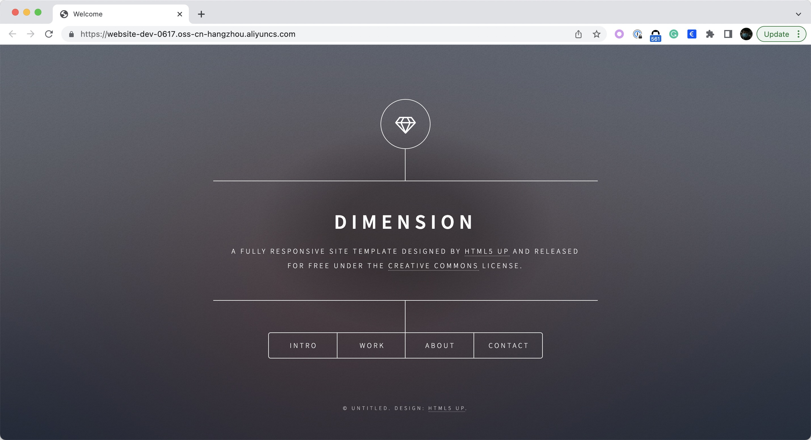
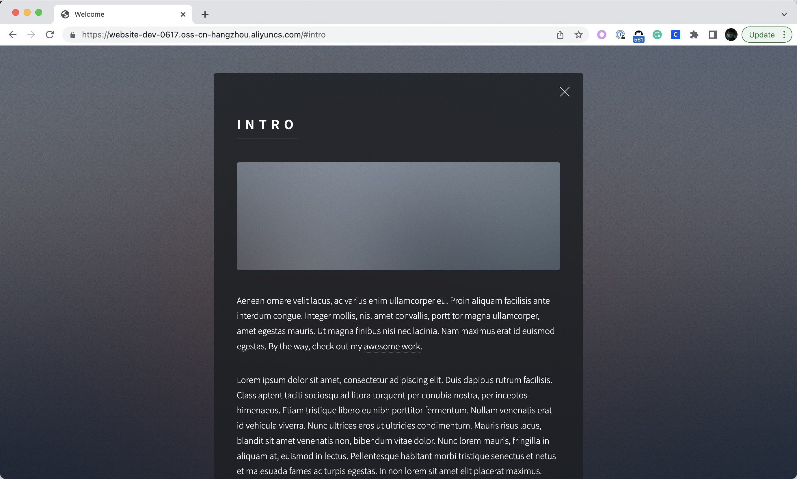

Imaging you are starting up your business and would you like host your static website.
Host the site in a cloud instance? You need to buy an instance and an elastic IP address, install a Nginx server, upload your static
website files, and access it.  
No! It's complicated and expensive, and you will have to maintain everything yourself.

Here is another solution -- deploy your static website in a bucket of Object Storage service in just one step.

The object storage service can be AWS S3, Alibaba OSS and so on. In the example below, let's take Alibaba OSS as an example.

## Prerequisites

Please enable addon `terraform` and `terraform-alibaba`, and authenticate Terraform Provider Alibaba per the [instruction](../../../reference/addons/terraform).

## Host the static website

Here is the ComponentDefinition usage of hosting a static website in OSS bucket.

```shell
$ vela show deploy-website
### Properties
+----------------------------+-------------------------------------------------------------------+-----------------------------------------------------------+----------+---------+
|            NAME            |                            DESCRIPTION                            |                           TYPE                            | REQUIRED | DEFAULT |
+----------------------------+-------------------------------------------------------------------+-----------------------------------------------------------+----------+---------+
| bucket                     | OSS bucket name                                                   | string                                                    | false    |         |
| endpoint                   | OSS bucket endpoint                                               | string                                                    | true     |         |
| static_web_url             | The URL of the static website                                     | string                                                    | false    |         |
+----------------------------+-------------------------------------------------------------------+-----------------------------------------------------------+----------+---------+
```

If you have created a bucket `website-dev-0617` with endpoint `oss-cn-hangzhou.aliyuncs.com`. And your static website is
https://github.com/cloudacademy/static-website-example.git. Apply the application below.

```yaml
apiVersion: core.oam.dev/v1beta1
kind: Application
metadata:
  name: business-website
spec:
  components:
    - name: website
      type: deploy-website
      properties:
        bucket: website-dev-0617
        endpoint: oss-cn-hangzhou.aliyuncs.com
        static_web_url: https://github.com/cloudacademy/static-website-example.git

```

Once the application got running, your website is up at [https://website-dev-0617.oss-cn-hangzhou.aliyuncs.com](https://website-dev-0617.oss-cn-hangzhou.aliyuncs.com)!

```shell
$ vela ls
APP             	COMPONENT	TYPE          	TRAITS	PHASE  	HEALTHY	STATUS                                       	CREATED-TIME
business-website	website  	deploy-website	      	running	healthy	Cloud resources are deployed and ready to use	2022-06-17 15:48:01 +0800 CST

```




