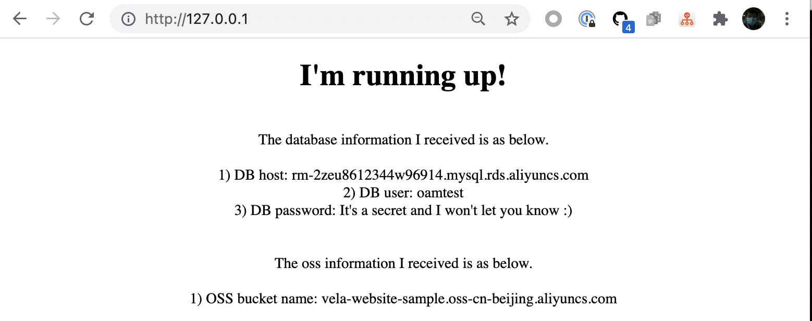

Cloud-oriented development is now becoming the norm, there is an urgent need to integrate cloud resources from different
sources and types. Whether it is the most basic object storage, cloud database, or load balancing, it is all faced with
the challenges of hybrid cloud, multi-cloud and other complex environments. KubeVela is perfect to satisfy the needs.

KubeVela efficiently and securely integrates different types of cloud resources through resource binding capabilities in
cloud resource Components and Traits. At present, you can directly use the default components of AliCloud Kubernetes(ACK),
AliCloud Object Storage Service (OSS) and AliCloud Relational Database Service (RDS). At the same time, more new cloud
resources will gradually become the default option under the support of the community in the future. You can use cloud
resources of various manufacturers in a standardized and unified way.

This tutorial will talk about how to provision and consume Cloud Resources by Terraform.

> ⚠️ This section requires your platform engineers have already enabled [add-on 'terraform/provider-alicloud'](../../../platform-engineers/components/component-terraform).

## Supported Cloud Resource list

Orchestration Type | Cloud Provider | Cloud Resource | Description
------------ | ------------- | ------------- | -------------
Terraform | Alibaba Cloud | [ACK](./terraform/alibaba-ack) | Terraform configuration for Alibaba Cloud ACK cluster
| |  | [EIP](./terraform/alibaba-eip) | Terraform configuration for Alibaba Cloud EIP object
| |  | [OSS](./terraform/alibaba-oss) | Terraform configuration for Alibaba Cloud OSS object
| |  | [RDS](./terraform/alibaba-rds) | Terraform configuration for Alibaba Cloud RDS object

## Terraform

All supported Terraform cloud resources can be seen in the list above. You can also filter them by command by `vela components --label type=terraform`.

### Provision cloud resources

Use the following Application to provision an OSS bucket:

```yaml
apiVersion: core.oam.dev/v1beta1
kind: Application
metadata:
  name: provision-cloud-resource-sample
spec:
  components:
    - name: sample-oss
      type: alibaba-oss
      properties:
        bucket: vela-website-0911
        acl: private
        writeConnectionSecretToRef:
          name: oss-conn
```

The above `alibaba-oss` component will create an OSS bucket named `vela-website-0911`, with private acl, with connection information stored in a secreted named `oss-conn`.
description, whether it's compulsory, and default value.

Apply the above application, then check the status:

```shell
$ vela ls
APP                            	COMPONENT 	TYPE       	TRAITS	PHASE  	HEALTHY	STATUS                                       	CREATED-TIME
provision-cloud-resource-sample	sample-oss	alibaba-oss	      	running	healthy	Cloud resources are deployed and ready to use	2021-09-11 12:55:57 +0800 CST
```

After the phase becomes `running` and `healthy`, you can then check the OSS bucket in Alibaba Cloud console or by [ossutil](https://partners-intl.aliyun.com/help/doc-detail/50452.htm)
command.

```shell
$ ossutil ls oss://
CreationTime                                 Region    StorageClass    BucketName
2021-09-11 12:56:17 +0800 CST        oss-cn-beijing        Standard    oss://vela-website-0911
```

### Consume cloud resources

Let's deploy
the [application](https://github.com/oam-dev/kubevela/tree/master/docs/examples/terraform/cloud-resource-provision-and-consume/application.yaml)
below to provision Alibaba Cloud OSS and RDS cloud resources, and consume them by the web component.

```yaml
apiVersion: core.oam.dev/v1beta1
kind: Application
metadata:
  name: webapp
spec:
  components:
    - name: express-server
      type: webservice
      properties:
        image: zzxwill/flask-web-application:v0.3.1-crossplane
        ports: 80
      traits:
        - type: service-binding
          properties:
            envMappings:
              # environments refer to db-conn secret
              DB_PASSWORD:
                secret: db-conn                                   # 1) If the env name is the same as the secret key, secret key can be omitted.
              endpoint:
                secret: db-conn
                key: DB_HOST                                      # 2) If the env name is different from secret key, secret key has to be set.
              username:
                secret: db-conn
                key: DB_USER
              # environments refer to oss-conn secret
              BUCKET_NAME:
                secret: oss-conn

    - name: sample-db
      type: alibaba-rds
      properties:
        instance_name: sample-db
        account_name: oamtest
        password: U34rfwefwefffaked
        writeConnectionSecretToRef:
          name: db-conn

    - name: sample-oss
      type: alibaba-oss
      properties:
        bucket: vela-website-0911
        acl: private
        writeConnectionSecretToRef:
          name: oss-conn
```

The component `sample-db` will generate secret `db-conn` with [these keys](./terraform/alibaba-rds#outputs), and the component
`sample-oss` will generate secret `oss-conn`. These secrets are binded to the Envs of component `express-server` by trait
[Service Binding](../../traits/service-binding). Then the component can consume instances of OSS and RDS.

Deploy and verify the application.

```shell
$ vela ls
APP   	COMPONENT     	TYPE       	TRAITS         	PHASE         	HEALTHY  	STATUS	CREATED-TIME
webapp	express-server	webservice 	service-binding	running     	healthy  	      	2021-09-08 16:50:41 +0800 CST
├─    	sample-db     	alibaba-rds	               	running     	healthy  	      	2021-09-08 16:50:41 +0800 CST
└─    	sample-oss    	alibaba-oss	               	running     	healthy  	      	2021-09-08 16:50:41 +0800 CST
```

```shell
$ sudo kubectl port-forward deployment/express-server 80:80

Forwarding from 127.0.0.1:80 -> 80
Forwarding from [::1]:80 -> 80
Handling connection for 80
Handling connection for 80
```



## Next

- [Component Observability](../../component-observability)
- [Data Pass Between Components ](../../workflow/component-dependency-parameter)
- [Multi-Cluster and Environment](../../../case-studies/multi-app-env-cluster)
