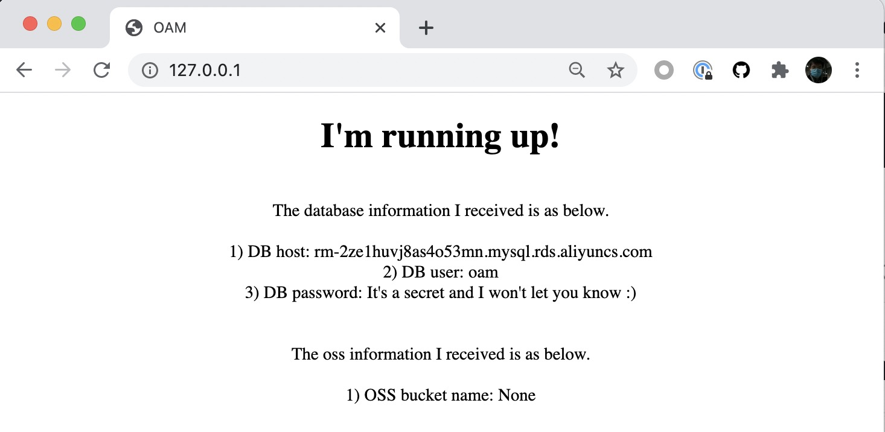

This tutorial will talk about how to provision and consume Cloud Resources by Terraform.

> ⚠️ This section requires your platform engineers have already enabled [add-on 'terraform/provider-alicloud'](../../../platform-engineers/components/component-terraform).

## Supported Cloud Resource list

Orchestration Type | Cloud Provider | Cloud Resource | Description
------------ | ------------- | ------------- | -------------
Terraform | Alibaba Cloud | [ACK](./terraform/alibaba-ack) | Terraform configuration for Alibaba Cloud ACK cluster
| |  | [OSS](./terraform/alibaba-oss) | Terraform configuration for Alibaba Cloud OSS object
| |  | [RDS](./terraform/alibaba-rds) | Terraform configuration for Alibaba Cloud RDS object

## Terraform

All supported Terraform cloud resources can be seen in the list above. You can also filter them by command by `vela components --label type=terraform`.


Let's deploy
the [application](https://github.com/oam-dev/kubevela/tree/master/docs/examples/terraform/cloud-resource-provision-and-consume/application.yaml)
below to provision Alibaba Cloud OSS and RDS cloud resources, and consume them by the web component.

```yaml
apiVersion: core.oam.dev/v1beta1
kind: Application
metadata:
  name: webapp
spec:
  components:
    - name: express-server
      type: webservice
      properties:
        image: zzxwill/flask-web-application:v0.3.1-crossplane
        ports: 80
      traits:
        - type: service-binding
          properties:
            envMappings:
              # environments refer to db-conn secret
              DB_PASSWORD:
                secret: db-conn                                   # 1) If the env name is the same as the secret key, secret key can be omitted.
              endpoint:
                secret: db-conn
                key: DB_HOST                                      # 2) If the env name is different from secret key, secret key has to be set.
              username:
                secret: db-conn
                key: DB_USER
              # environments refer to oss-conn secret
              BUCKET_NAME:
                secret: oss-conn

    - name: sample-db
      type: alibaba-rds
      properties:
        instance_name: sample-db
        account_name: oamtest
        password: U34rfwefwefffaked
        writeConnectionSecretToRef:
          name: db-conn

    - name: sample-oss
      type: alibaba-oss
      properties:
        bucket: vela-website
        acl: private
        writeConnectionSecretToRef:
          name: oss-conn
```

The component `express-server` consume OSS and RDS by trait [Service Binding](../../traits/service-binding).

Deploy and verify the application.

```shell
$ vela ls
APP   	COMPONENT     	TYPE       	TRAITS         	PHASE         	HEALTHY  	STATUS	CREATED-TIME
webapp	express-server	webservice 	service-binding	running     	healthy  	      	2021-09-08 16:50:41 +0800 CST
├─    	sample-db     	alibaba-rds	               	running     	healthy  	      	2021-09-08 16:50:41 +0800 CST
└─    	sample-oss    	alibaba-oss	               	running     	healthy  	      	2021-09-08 16:50:41 +0800 CST
```

```shell
$ sudo kubectl port-forward deployment/express-server 80:80

Forwarding from 127.0.0.1:80 -> 80
Forwarding from [::1]:80 -> 80
Handling connection for 80
Handling connection for 80
```


