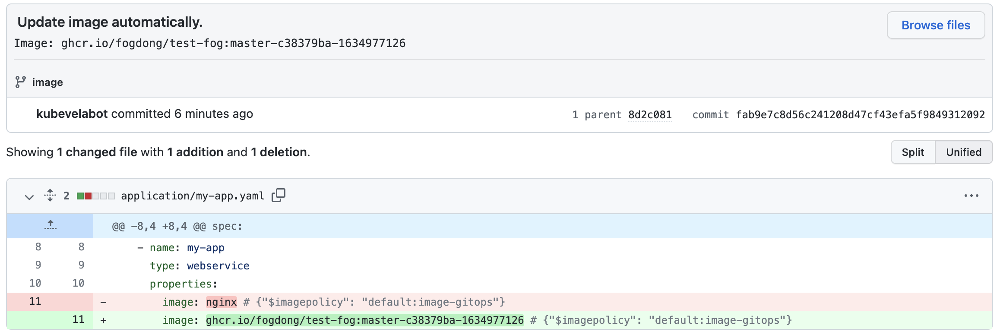

In this section, we will introduce how to use KubeVela to deliver in GitOps mode.

> Please make sure you have enabled the [fluxcd](../../reference/addons/fluxcd) addon.

## Watch the Git repositories and sync automatically

### Preparing the configuration repository

GitOps will automatically synchronize the configuration in the repository to the cluster. First, we need a repository that stores all the configuration files you need: such as some Kubernetes native resources Deployment, Secret, ConfigMap, etc. Also, you can store KubeVela's Application in the repository.

Suppose in our repository, there is a folder called `infrastructure`, which has a KubeVela Application called `server` and a ConfigMap called `server-config`.

The directory structure of the repository is as follows:

```shell
├── infrastructure
    ├── server-config.yaml
    └── server.yaml
```

Deploy the following KubeVela GitOps application:

```yaml
apiVersion: core.oam.dev/v1beta1
kind: Application
metadata:
  name: infra-gitops
spec:
  components:
  - name: database-config
    type: kustomize
    properties:
      repoType: git
      # replace it with your repo url
      url: https://github.com/FogDong/KubeVela-GitOps-Infra-Demo
      # replace it with your git secret if it's a private repo
      # secretRef: git-secret
      # the pull interval time, set to 10m since the infrastructure is steady
      pullInterval: 10m
      git:
        # the branch name
        branch: infra
      # the path to sync
      path: ./infrastructure
```

Check the status of this GitOps application:

```yaml
$ vela status infra-gitops
About:

  Name:      	infra-gitops
  Namespace: 	default
  Created at:	2022-06-30 14:52:33 +0800 CST
  Status:    	running

Workflow:

  mode: DAG
  finished: true
  Suspend: false
  Terminated: false
  Steps
  - id:dgatat8jag
    name:database-config
    type:apply-component
    phase:succeeded
    message:

Services:

  - Name: database-config
    Cluster: local  Namespace: default
    Type: kustomize
    Healthy
    No trait applied
```

As you can see, the GitOps application is running successfully. At this point, the application continuously pulls the configuration from the repository and syncs across the cluster at 10-minute intervals.

Looking at the resources in the cluster, you can find that the `server` Application and the `server-config` ConfigMap have been automatically deployed.

```bash
$ vela ls
APP         	COMPONENT      	TYPE      	TRAITS	PHASE  	HEALTHY	STATUS   	CREATED-TIME
infra-gitops	database-config	kustomize 	      	running	healthy	         	2022-06-30 14:52:33 +0800 CST
server      	server         	webservice	      	running	healthy	Ready:1/1	2022-06-30 14:52:35 +0800 CST

$ kubectl get configmap
NAME                                             DATA   AGE
server-config                                    1      2m58s
```

## Watch the image repositories and synchronize automatically

GitOps can also watch your image repository, get the latest image version, and update the configuration in your code repository with the latest version, so as to achieve the purpose of automatically updating the image.

Suppose the directory structure of our repository is as follows:

```shell
├── application
    └── my-app.yaml
```

The `my-app.yaml` in the application is as follows:

```yaml
apiVersion: core.oam.dev/v1beta1
kind: Application
metadata:
  name: my-app
  namespace: default
spec:
  components:
    - name: my-app
      type: webservice
      properties:
        image: nginx # {"$imagepolicy": "default:image-gitops"}
```

> Note that there is a `# {"$imagepolicy": "default:image-gitops"}` comment after the image field. KubeVela will update the corresponding image field through this annotation. `default:image-gitops` is the namespace and name of the GitOps application component we will deploy.

Deploy the following KubeVela GitOps application:

```yaml
apiVersion: core.oam.dev/v1beta1
kind: Application
metadata:
  name: image-gitops
spec:
  components:
  - name: image-gitops
    type: kustomize
    properties:
      repoType: git
      # replace it with your repo url
      url: https://github.com/FogDong/KubeVela-GitOps-Infra-Demo
      # replace it with your git secret, GitOps will update the files in your repository with the latest image, which requires write permission
      secretRef: git-secret
      pullInterval: 1m
      git:
        # the branch name
        branch: image
      # the path to sync
      path: ./application
      imageRepository:
        # replace it with your image url
        image: ghcr.io/fogdong/test-fog
        # if it's a private image registry, use `kubectl create secret docker-registry` to create the secret
        # secretRef: imagesecret
        filterTags:
          # filter the image tag
          pattern: '^master-[a-f0-9]+-(?P<ts>[0-9]+)'
          extract: '$ts'
        # use the policy to sort the latest image tag and update
        policy:
          numerical:
            order: asc
        # add more commit message
        commitMessage: "Image: {{range .Updated.Images}}{{println .}}{{end}}"
```

After the application is deployed successfully, you can see that the `my-app` application has also been automatically deployed. At this point, the image in `my-app` is `nginx`:

```bash
$ vela ls
APP         	COMPONENT   	TYPE      	TRAITS	PHASE          	HEALTHY  	STATUS   	CREATED-TIME
image-gitops	image-gitops	kustomize 	      	running        	healthy  	         	2022-06-30 15:16:30 +0800 CST
my-app      	my-app      	webservice	      	running       	healthy	 Ready:1/1	2022-06-30 15:16:31 +0800 CST
```

After a period of time, the imageRepository we configured will automatically pull the latest image we want and update the application image in the repository.

At this point, you can see a commit from `kubevelabot` in the config repository, which replaces the `nginx` image with the latest image from our own repository. Commits are prefixed with `Update image automatically.`. You can also append the information you want in the `commitMessage` field with `{{range .Updated.Images}}{{println .}}{{end}}`.



> Note that if you want to put the code and config in the same repository, you need to filter out the commit from KubeVela in CI configuration like below to avoid the repeat build of pipeline.
> 
> ```shell
> jobs:
>  publish:
>    if: "!contains(github.event.head_commit.message, 'Update image automatically')"
> ```

Re-check the Application in cluster, we can see that the image of the `my-app` has been updated after a while.

> KubeVela polls the latest information from the code and image repo periodically (at an interval that can be customized):
> * When the Application file in the Git repository is updated, KubeVela will update the Application in the cluster based on the latest configuration.
> * When a new tag is added to the image registry, KubeVela will filter out the latest tag based on your policy and update it to Git repository. When the files in the repository are updated, KubeVela repeats the first step and updates the files in the cluster, thus achieving automatic deployment.

## FAQ

### How to use Publish Version in GitOps

If you want to use [Publish Version](../version-control) to control the publish of the Application with GitOps, you can checkout the [example repo](https://github.com/FogDong/auto-commit) or setup a CI workflow like below:

```
name: Auto Commit
on:
  push:
    branches:
    - '*'

jobs:
  run:
    name: Auto Commit
    runs-on: ubuntu-latest
    steps:
      - name: Checkout repo
        uses: actions/checkout@v2

      - name: Update publish version
        id: update
        run: |
          VERSION=${GITHUB_SHA::8}
          echo ::set-output name=VERSION::${VERSION}
          # replace app.yaml with your app file name
          sed -i "s|app.oam.dev/publishVersion: .*|app.oam.dev/publishVersion: $VERSION|" app.yaml

      - name: Commit changes
        uses: EndBug/add-and-commit@v7
        with:
          default_author: github_actions
          add: '.'
          message: "[ci skip] deploy from ${{ steps.update.outputs.VERSION }}"
          signoff: true
          # specify the branch you want to commit if need
          # branch: main
```

This CI will use GitHub SHA as the PublishVersion and update it every time when you push to the branch. Note that this is an example of updating PublishVersion in GitHub Action, if you're using other CI tools, you can setup the CI like above.

## More

You can also check out GitOps [blog](https://kubevela.io/blog/2021/10/10/kubevela-gitops) and [video practice](https://kubevela.io/videos/best-practice/gitops ) to better experience and use GitOps.
