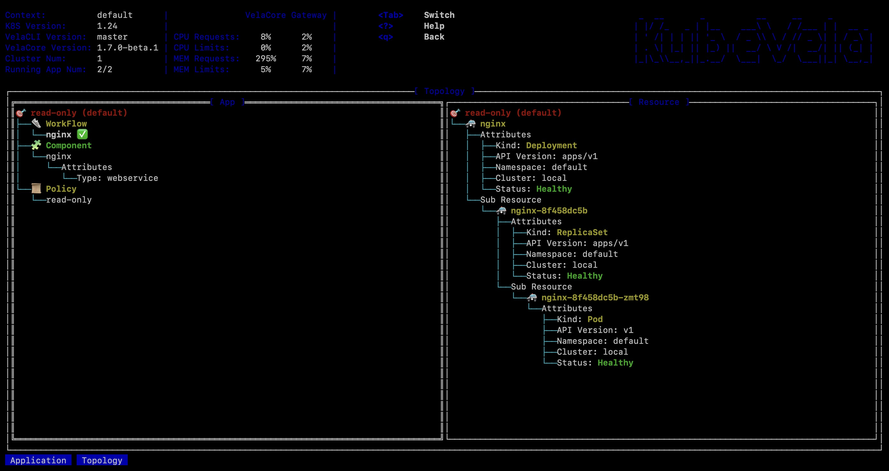
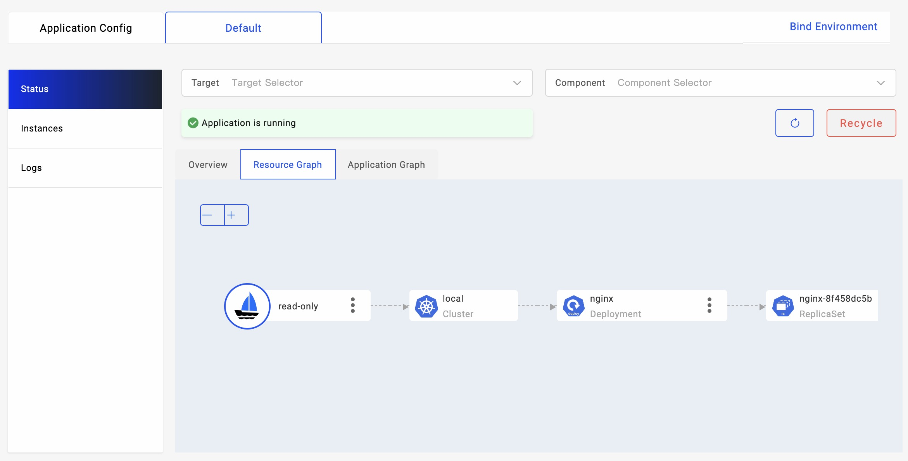

There are times that you might want to use KubeVela application to adopt existing resources or from other sources like Helm release. In this case, you can leverage the capability of resource adoption in KubeVela.

## Use in Application

By default, when KubeVela application tries to dispatch (create or update) one resource, it will first check if this resource belongs to itself. This check is done by comparing the label values of `app.oam.dev/name` & `app.oam.dev/namespace` and see whether they are equal to the application's name & namespace.

If this resource does not belongs to the application itself (belongs to no one or some other application), the application will stop the dispatch operation and report an error. This mechanism is designed to prevent unintended edits to resources managed by other operators or systems.

If the resource is currently managed by other applications, you can refer to [shared-resource](./shared-resource) policy and read more about sharing resources across multiple applications.

If the resource is managed by no one, to allow KubeVela application to manage the resource, you can leverage the `read-only` policy or `take-over` policy to enforce resource adoption on these resources.

### ReadOnly Policy

With `read-only` policy, you can select resources that could be adopted by the current application. For example, in the below application, Deployment typed resources are treated as read-only resources and are able to be adopted by the given application.

```yaml
apiVersion: core.oam.dev/v1beta1
kind: Application
metadata:
  name: read-only
spec:
  components:
    - name: nginx
      type: webservice
      properties:
        image: nginx
  policies:
    - type: read-only
      name: read-only
      properties:
        rules:
          - selector:
              resourceTypes: ["Deployment"]
```

The `read-only` policy allows application to read the selected resources but will skip all edits to the target resource. Error will be reported if the target resource does not exist.

The target resource will **NOT** be attached with the application's label. It is possible for multiple applications to use the same resource with `read-only` policy concurrently. The deletion of the application will also skip the recycle process of the target resources.

Although the resources selected in the `read-only` policy will not be editable through application, both health check and resource topology graph can work normally. Therefore, you can use KubeVela application with `read-only` policy to build "monitoring group" for underlying resources and leverage tools such as `vela top` or `velaux` to observe them, without any modification.

<details>
<summary>practice</summary>

1. First creat the nginx deployment.
```bash
kubectl create deploy nginx --image=nginx
```

2. Deploy the application with `read-only` policy.
```bash
cat <<EOF | vela up -f -
apiVersion: core.oam.dev/v1beta1
kind: Application
metadata:
  name: read-only
spec:
  components:
    - name: nginx
      type: webservice
      properties:
        image: nginx
  policies:
    - type: read-only
      name: read-only
      properties:
        rules:
          - selector:
              resourceTypes: ["Deployment"]
EOF
```

3. Check the running status of the application.
```bash
vela status read-only
```

4. Use `vela top` to see the resource topology of the application.


5. Use `velaux` to see the resource topology graph of the application.


</details>

### TakeOver Policy

In the case you not only want KubeVela application to observe underlying resource but also want the application to be able to edit them, you can use the `take-over` policy in replace of the `read-only` policy.

```yaml
apiVersion: core.oam.dev/v1beta1
kind: Application
metadata:
  name: take-over
spec:
  components:
    - name: nginx-take-over
      type: k8s-objects
      properties:
        objects:
          - apiVersion: apps/v1
            kind: Deployment
            metadata:
              name: nginx
      traits:
        - type: scaler
          properties:
            replicas: 3
  policies:
    - type: take-over
      name: take-over
      properties:
        rules:
          - selector:
              resourceTypes: ["Deployment"]
```

In the above application, the `nginx` deployment will be added with owner labels and marked as belonged to the current app. The attached `scaler` trait in the application will modify the replica number of the target deployment to 3, while keeping all other fields untouched.
 
After the resource is taken over by the application, the application will control the upgrades and deletion of the target resource. Therefore, differ from `read-only` policy, each resource can only be managed by one application with `take-over` policy.

The `take-over` policy is helpful when you want to let the application to take the complete control for the given resources.

<details>
<summary>practice</summary>

1. First create the nginx deployment
```bash
kubectl create deploy nginx --image=nginx
```
2. Deploy the application with `take-over` policy.
```bash
cat <<EOF | vela up -f -
apiVersion: core.oam.dev/v1beta1
kind: Application
metadata:
  name: take-over
spec:
  components:
    - name: nginx-take-over
      type: k8s-objects
      properties:
        objects:
          - apiVersion: apps/v1
            kind: Deployment
            metadata:
              name: nginx
      traits:
        - type: scaler
          properties:
            replicas: 3
  policies:
    - type: take-over
      name: take-over
      properties:
        rules:
          - selector:
              resourceTypes: ["Deployment"]
EOF
```

3. Check the application running status.
```bash
vela status take-over
```
</details>


## Use in CLI

The `read-only` policy and `take-over` policy provide a way for users to directly adopt resources within KubeVela application api. If you prefer directly build KubeVela application by existing resources from scratch, you can use the `vela adopt` CLI command.

### Adopt Native Resource

By providing a list of native Kubernetes resources, `vela adopt` command can help you automatically adopt those resources in an application. You can follow the below procedure to try it out.

1. Create some resources for adoption.

```bash
kubectl create deploy example --image=nginx
kubectl create service clusterip example --tcp=80:80
kubectl create configmap example
kubectl create secret generic example
```

2. Run `vela adopt` command to create an application that contains all the resource mentioned above.
```bash
vela adopt deployment/example service/example configmap/example secret/example
```

<details>
<summary>expected output</summary>

```yaml
apiVersion: core.oam.dev/v1beta1
kind: Application
metadata:
  creationTimestamp: null
  labels:
    app.oam.dev/adopt: native
  name: example
  namespace: default
spec:
  components:
  - name: example.Deployment.example
    properties:
      objects:
      - apiVersion: apps/v1
        kind: Deployment
        metadata:
          name: example
          namespace: default
        spec:
          progressDeadlineSeconds: 600
          replicas: 1
          revisionHistoryLimit: 10
          selector:
            matchLabels:
              app: example
          strategy:
            rollingUpdate:
              maxSurge: 25%
              maxUnavailable: 25%
            type: RollingUpdate
          template:
            metadata:
              creationTimestamp: null
              labels:
                app: example
            spec:
              containers:
              - image: nginx
                imagePullPolicy: Always
                name: nginx
                resources: {}
                terminationMessagePath: /dev/termination-log
                terminationMessagePolicy: File
              dnsPolicy: ClusterFirst
              restartPolicy: Always
              schedulerName: default-scheduler
              securityContext: {}
              terminationGracePeriodSeconds: 30
    type: k8s-objects
  - name: example.Service.example
    properties:
      objects:
      - apiVersion: v1
        kind: Service
        metadata:
          name: example
          namespace: default
        spec:
          clusterIP: 10.43.65.46
          clusterIPs:
          - 10.43.65.46
          internalTrafficPolicy: Cluster
          ipFamilies:
          - IPv4
          ipFamilyPolicy: SingleStack
          ports:
          - name: 80-80
            port: 80
            protocol: TCP
            targetPort: 80
          selector:
            app: example
          sessionAffinity: None
          type: ClusterIP
    type: k8s-objects
  - name: example.config
    properties:
      objects:
      - apiVersion: v1
        kind: ConfigMap
        metadata:
          name: example
          namespace: default
      - apiVersion: v1
        kind: Secret
        metadata:
          name: example
          namespace: default
    type: k8s-objects
  policies:
  - name: read-only
    properties:
      rules:
      - selector:
          componentNames:
          - example.Deployment.example
          - example.Service.example
          - example.config
    type: read-only
status: {}
```
</details>

By default, the application first embeds all the given resources in its components. Then it attaches the `read-only` policy. You can edit the returned configuration and make your own adoption application. Or you can directly apply this application with the `--apply` arg.

```bash
vela adopt deployment/example service/example configmap/example secret/example --apply
```

You can also set the application name you would like to use.
```bash
vela adopt deployment/example service/example configmap/example secret/example --apply --app-name=adopt-example
```

Now if you can use `vela status` and `vela status -t -d` command show the status the applied application.

```bash
vela status adopt-example
```

<details>
<summary>expected output</summary>

```bash
About:                                
                                           
  Name:         adopt-example                 
  Namespace:    default                       
  Created at:   2023-01-11 14:21:21 +0800 CST
  Status:       running                                                                                                                                                       
                                                                                       
Workflow:                                                                                                                                                                     
                                                                                                                                                                              
  mode: DAG-DAG                                                                                                                                                               
  finished: true                                                                                                                                                              
  Suspend: false                                                                                                                                                              
  Terminated: false
  Steps
  - id: 8d8capzw7e
    name: adopt-example.Deployment.example
    type: apply-component
    phase: succeeded 
  - id: 6u6c6ai1gu
    name: adopt-example.Service.example
    type: apply-component
    phase: succeeded 
  - id: r847uymujz
    name: adopt-example.config
    type: apply-component
    phase: succeeded 

Services:

  - Name: adopt-example.Deployment.example   
    Cluster: local  Namespace: default
    Type: k8s-objects
    Healthy 
    No trait applied

  - Name: adopt-example.Service.example  
    Cluster: local  Namespace: default
    Type: k8s-objects
    Healthy 
    No trait applied

  - Name: adopt-example.config  
    Cluster: local  Namespace: default
    Type: k8s-objects
    Healthy 
    No trait applied    
```

</details>

```bash
vela status adopt-example -t -d
```

```bash
CLUSTER       NAMESPACE     RESOURCE           STATUS    APPLY_TIME          DETAIL
local     ─── default   ─┬─ ConfigMap/example  updated   2023-01-11 14:15:34 Data: 0  Age: 6m1s
                         ├─ Secret/example     updated   2023-01-11 14:15:52 Type: Opaque  Data: 0  Age: 5m43s
                         ├─ Service/example    updated   2023-01-11 14:12:00 Type: ClusterIP  Cluster-IP: 10.43.65.46  External-IP: <none>  Port(s): 80/TCP  Age: 9m35s
                         └─ Deployment/example updated   2023-01-11 14:11:06 Ready: 1/1  Up-to-date: 1  Available: 1  Age: 10m
```

The `read-only` only allows the application to observe resources, but disallow any edits to it. If you want to make modifications you can use the `--mode=take-over` to use the `take-over` policy in the adoption application.

### Adopt Helm Release

`vela adopt` also supports directly reading native resources from existing helm release. This is helpful if you previously deployed resources through helm.

1. For example, you can firstly deploy a mysql instance through helm.

```bash
helm repo add bitnami https://charts.bitnami.com/bitnami
helm repo update
helm install mysql bitnami/mysql
```

2. You can validate the installation through `helm ls`.

```bash
helm ls
```
```bash
NAME    NAMESPACE       REVISION        UPDATED                                 STATUS          CHART           APP VERSION
mysql   default         1               2023-01-11 14:34:36.653778 +0800 CST    deployed        mysql-9.4.6     8.0.31  
```

2. Run `vela adopt` command to adopt resources from existing release. Similar to native resource adoption, you can get a KubeVela application with `read-only` policy.

```bash
vela adopt mysql --type helm
```

<details>
<summary>expected output</summary>

```yaml
apiVersion: core.oam.dev/v1beta1
kind: Application
metadata:
  creationTimestamp: null
  labels:
    app.oam.dev/adopt: helm
  name: mysql
  namespace: default
spec:
  components:
  - name: mysql.StatefulSet.mysql
    properties:
      objects:
      - apiVersion: apps/v1
        kind: StatefulSet
        metadata:
          name: mysql
          namespace: default
        spec:
          podManagementPolicy: ""
          replicas: 1
          selector:
            matchLabels:
              app.kubernetes.io/component: primary
              app.kubernetes.io/instance: mysql
              app.kubernetes.io/name: mysql
          serviceName: mysql
          template:
            metadata:
              annotations:
                checksum/configuration: f8f3ad4a6e3ad93ae6ed28fdb7f7b4ff9585e08fa730e4e5845db5ebe5601e4d
              labels:
                app.kubernetes.io/component: primary
                app.kubernetes.io/instance: mysql
                app.kubernetes.io/managed-by: Helm
                app.kubernetes.io/name: mysql
                helm.sh/chart: mysql-9.4.6
            spec:
              affinity:
                nodeAffinity: null
                podAffinity: null
                podAntiAffinity:
                  preferredDuringSchedulingIgnoredDuringExecution:
                  - podAffinityTerm:
                      labelSelector:
                        matchLabels:
                          app.kubernetes.io/instance: mysql
                          app.kubernetes.io/name: mysql
                      topologyKey: kubernetes.io/hostname
                    weight: 1
              containers:
              - env:
                - name: BITNAMI_DEBUG
                  value: "false"
                - name: MYSQL_ROOT_PASSWORD
                  valueFrom:
                    secretKeyRef:
                      key: mysql-root-password
                      name: mysql
                - name: MYSQL_DATABASE
                  value: my_database
                envFrom: null
                image: docker.io/bitnami/mysql:8.0.31-debian-11-r30
                imagePullPolicy: IfNotPresent
                livenessProbe:
                  exec:
                    command:
                    - /bin/bash
                    - -ec
                    - |
                      password_aux="${MYSQL_ROOT_PASSWORD:-}"
                      if [[ -f "${MYSQL_ROOT_PASSWORD_FILE:-}" ]]; then
                          password_aux=$(cat "$MYSQL_ROOT_PASSWORD_FILE")
                      fi
                      mysqladmin status -uroot -p"${password_aux}"
                  failureThreshold: 3
                  initialDelaySeconds: 5
                  periodSeconds: 10
                  successThreshold: 1
                  timeoutSeconds: 1
                name: mysql
                ports:
                - containerPort: 3306
                  name: mysql
                readinessProbe:
                  exec:
                    command:
                    - /bin/bash
                    - -ec
                    - |
                      password_aux="${MYSQL_ROOT_PASSWORD:-}"
                      if [[ -f "${MYSQL_ROOT_PASSWORD_FILE:-}" ]]; then
                          password_aux=$(cat "$MYSQL_ROOT_PASSWORD_FILE")
                      fi
                      mysqladmin status -uroot -p"${password_aux}"
                  failureThreshold: 3
                  initialDelaySeconds: 5
                  periodSeconds: 10
                  successThreshold: 1
                  timeoutSeconds: 1
                resources:
                  limits: {}
                  requests: {}
                securityContext:
                  runAsNonRoot: true
                  runAsUser: 1001
                startupProbe:
                  exec:
                    command:
                    - /bin/bash
                    - -ec
                    - |
                      password_aux="${MYSQL_ROOT_PASSWORD:-}"
                      if [[ -f "${MYSQL_ROOT_PASSWORD_FILE:-}" ]]; then
                          password_aux=$(cat "$MYSQL_ROOT_PASSWORD_FILE")
                      fi
                      mysqladmin status -uroot -p"${password_aux}"
                  failureThreshold: 10
                  initialDelaySeconds: 15
                  periodSeconds: 10
                  successThreshold: 1
                  timeoutSeconds: 1
                volumeMounts:
                - mountPath: /bitnami/mysql
                  name: data
                - mountPath: /opt/bitnami/mysql/conf/my.cnf
                  name: config
                  subPath: my.cnf
              initContainers: null
              securityContext:
                fsGroup: 1001
              serviceAccountName: mysql
              volumes:
              - configMap:
                  name: mysql
                name: config
          updateStrategy:
            type: RollingUpdate
          volumeClaimTemplates:
          - metadata:
              annotations: null
              labels:
                app.kubernetes.io/component: primary
                app.kubernetes.io/instance: mysql
                app.kubernetes.io/name: mysql
              name: data
            spec:
              accessModes:
              - ReadWriteOnce
              resources:
                requests:
                  storage: 8Gi
    type: k8s-objects
  - name: mysql.Service.mysql
    properties:
      objects:
      - apiVersion: v1
        kind: Service
        metadata:
          name: mysql
          namespace: default
        spec:
          ports:
          - name: mysql
            nodePort: null
            port: 3306
            protocol: TCP
            targetPort: mysql
          selector:
            app.kubernetes.io/component: primary
            app.kubernetes.io/instance: mysql
            app.kubernetes.io/name: mysql
          sessionAffinity: None
          type: ClusterIP
    type: k8s-objects
  - name: mysql.Service.mysql-headless
    properties:
      objects:
      - apiVersion: v1
        kind: Service
        metadata:
          name: mysql-headless
          namespace: default
        spec:
          clusterIP: None
          ports:
          - name: mysql
            port: 3306
            targetPort: mysql
          publishNotReadyAddresses: true
          selector:
            app.kubernetes.io/component: primary
            app.kubernetes.io/instance: mysql
            app.kubernetes.io/name: mysql
          type: ClusterIP
    type: k8s-objects
  - name: mysql.config
    properties:
      objects:
      - apiVersion: v1
        kind: Secret
        metadata:
          name: mysql
          namespace: default
      - apiVersion: v1
        kind: ConfigMap
        metadata:
          name: mysql
          namespace: default
    type: k8s-objects
  - name: mysql.sa
    properties:
      objects:
      - apiVersion: v1
        kind: Secret
        metadata:
          name: mysql
          namespace: default
      - apiVersion: v1
        kind: ConfigMap
        metadata:
          name: mysql
          namespace: default
    type: k8s-objects
  policies:
  - name: read-only
    properties:
      rules:
      - selector:
          componentNames:
          - mysql.StatefulSet.mysql
          - mysql.Service.mysql
          - mysql.Service.mysql-headless
          - mysql.config
          - mysql.sa
    type: read-only
status: {}
```

</details>

3. You can similarly use `--apply` parameter to apply the application into cluster and use `--mode=take-over` to allow modifications by enforcing `take-over` policy. In addition to that, if you want to completely adopt resources in helm chart into KubeVela application and disable the management of that helm chart (prevent multiple sources), you can add `--recycle` flag to remove the helm release secret after the application has entered running status.

```bash
vela adopt mysql --type helm --mode take-over --apply --recycle
```
```
resources adopted in app default/mysql
successfully clean up old helm release
```

4. You can check the application status using `vela status` and `vela status -t -d`.

```bash
vela status mysql
```

<details>
<summary>expected output</summary>

```bash
About:

  Name:         mysql                        
  Namespace:    default                      
  Created at:   2023-01-11 14:40:16 +0800 CST
  Status:       running                      

Workflow:

  mode: DAG-DAG
  finished: true
  Suspend: false
  Terminated: false
  Steps
  - id: orq8dnqbyv
    name: mysql.StatefulSet.mysql
    type: apply-component
    phase: succeeded 
  - id: k5kwoc49jv
    name: mysql.Service.mysql-headless
    type: apply-component
    phase: succeeded 
  - id: p5qe1drkoh
    name: mysql.Service.mysql
    type: apply-component
    phase: succeeded 
  - id: odicbhtf9a
    name: mysql.config
    type: apply-component
    phase: succeeded 
  - id: o36adyqqal
    name: mysql.sa
    type: apply-component
    phase: succeeded 

Services:

  - Name: mysql.StatefulSet.mysql  
    Cluster: local  Namespace: default
    Type: k8s-objects
    Healthy 
    No trait applied

  - Name: mysql.Service.mysql-headless  
    Cluster: local  Namespace: default
    Type: k8s-objects
    Healthy 
    No trait applied

  - Name: mysql.Service.mysql  
    Cluster: local  Namespace: default
    Type: k8s-objects
    Healthy 
    No trait applied

  - Name: mysql.config  
    Cluster: local  Namespace: default
    Type: k8s-objects
    Healthy 
    No trait applied

  - Name: mysql.sa  
    Cluster: local  Namespace: default
    Type: k8s-objects
    Healthy 
    No trait applied
```

</details>

```bash
vela status mysql -t -d
```

```bash
CLUSTER       NAMESPACE     RESOURCE               STATUS    APPLY_TIME          DETAIL
local     ─── default   ─┬─ ConfigMap/mysql        updated   2023-01-11 14:40:16 Data: 1  Age: 7m41s
                         ├─ Secret/mysql           updated   2023-01-11 14:40:16 Type: Opaque  Data: 2  Age: 7m41s
                         ├─ Service/mysql          updated   2023-01-11 14:40:16 Type: ClusterIP  Cluster-IP: 10.43.154.7  External-IP: <none>  Port(s): 3306/TCP  Age: 7m41s
                         ├─ Service/mysql-headless updated   2023-01-11 14:40:16 Type: ClusterIP  Cluster-IP: None  External-IP: <none>  Port(s): 3306/TCP  Age: 7m41s
                         └─ StatefulSet/mysql      updated   2023-01-11 14:40:16 Ready: 1/1  Age: 7m41s
```

5. If you run `helm ls` you will not be able to find the original mysql helm release since the records have been recycled.

```bash
helm ls
```

```bash
NAME    NAMESPACE       REVISION        UPDATED STATUS  CHART   APP VERSION
```

:::tip
There are multiple ways to use KubeVela together with Helm.

If you want to use Helm to control the release process of charts and use KubeVela to monitor those resources, you can use the default mode (`read-only`) and do not recycle the helm release secret. In this case, you will be able to monitor resources dispatched by Helm Chart with KubeVela tools or eco-system (like viewing on Grafana).

If you want to migrate existing resources from Helm Chart to KubeVela application, you can use the `take-over` mode and use the `--apply` flag to recycle helm release records.
:::

### Customized Adoption

By default, `vela adopt` will take resources from given source (native resource list or helm chart) and group them into different components. For resources like Deployments or Statefulsets, the original spec will be reserved. For other resources like ConfigMap or Secret, the data will not be recorded in the adoption application (which means the application does not care for the content in them). For special resources (CustomResourceDefinition), the `garbage-collect` and `apply-once` policy will be additionally attached in the application.

The conversion from resources into application is achieved by using the CUE template. You can refer to [GitHub](https://github.com/kubevela/kubevela/blob/master/references/cli/adopt-templates/default.cue) to see the default template.

You can also build your own adoption rule using CUE and add `--adopt-template` to `vela adopt` command.

1. For example, let's create an example deployment.

```bash
kubectl create deploy custom-adopt --image=nginx
```

2. Create a file named `my-adopt-rule.cue`.

```
import "list"

#Resource: {
	apiVersion: string
	kind:       string
	metadata: {
		name:       string
		namespace?: string
		...
	}
	...
}

#Component: {
	type: string
	name: string
	properties: {...}
	dependsOn?: [...string]
	traits?: [...#Trait]
}

#Trait: {
	type: string
	properties: {...}
}

#Policy: {
	type: string
	name: string
	properties?: {...}
}

#Application: {
	apiVersion: "core.oam.dev/v1beta1"
	kind:       "Application"
	metadata: {
		name:       string
		namespace?: string
		labels?: [string]:      string
		annotations?: [string]: string
	}
	spec: {
		components: [...#Component]
		policies?: [...#Policy]
		workflow?: {...}
	}
}

#AdoptOptions: {
	mode:         *"read-only" | "take-over"
	type:         *"helm" | string
	appName:      string
	appNamespace: string
	resources: [...#Resource]
	...
}

#Adopt: {
	$args:    #AdoptOptions
	$returns: #Application

	// adopt logics

	$returns: #Application & {
		metadata: {
			name:      $args.appName
			labels: "app.oam.dev/adopt": $args.type
		}
		spec: components: [for r in $args.resources if r.kind == "Deployment" {
		    type: "webservice"
		    name: r.metadata.name
		    properties: image: r.spec.template.spec.containers[0].image
		    traits: [{
		        type: "scaler"
		        properties: replicas: r.spec.replicas
		    }]
		}]
		spec: policies: [
			{
				type: $args.mode
				name: $args.mode
				properties: rules: [{
					selector: componentNames: [ for comp in spec.components {comp.name}]
				}]
			}]
	}
}
```

This customized adoption rule will automatically recognize deployment resources and convert it into KubeVela application's `webservice` component. It can intelligently detect the replicas number of the given deployment and attach a `scaler` trait to the component.

3. Run `vela adopt deployment/custom-adopt --adopt-template=my-adopt-rule.cue`. You can see the converted application as 
```yaml
apiVersion: core.oam.dev/v1beta1
kind: Application
metadata:
  creationTimestamp: null
  labels:
    app.oam.dev/adopt: native
  name: custom-adopt
spec:
  components:
  - name: custom-adopt
    properties:
      image: nginx
    traits:
    - properties:
        replicas: 1
      type: scaler
    type: webservice
  policies:
  - name: read-only
    properties:
      rules:
      - selector:
          componentNames:
          - custom-adopt
    type: read-only
status: {}
```

With this capability, you can make your own rules for building application from existing resources or helm charts.