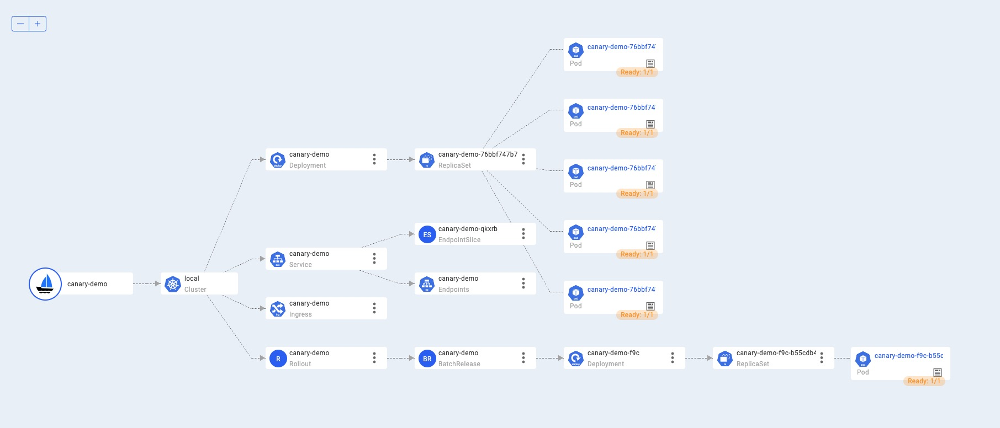

In this section, we will introduce how to canary rollout a container service.

## Before starting

1. Enable `kruise-rollout` addon.

```shell
% vela addon enable kruise-rollout
enable addon by local dir: addons/kruise-rollout
Addon: kruise-rollout enabled Successfully.
```


2. Please make sure one of the [ingress controllers](https://kubernetes.github.io/ingress-nginx/deploy/) is available in your Kubernetes cluster.
   If not yet, you can install one in your cluster by enable the [ingress-nginx](../../reference/addons/nginx-ingress-controller) addon:

```shell
vela addon enable ingress-nginx
```

Please refer [this](../../reference/addons/nginx-ingress-controller) to get the gateway's access address.


## First Deployment

Deploy the application:

```shell
cat <<EOF | vela up -f -
apiVersion: core.oam.dev/v1beta1
kind: Application
metadata:
  name: canary-demo
  annotations:
    app.oam.dev/publishVersion: v1
spec:
  components:
  - name: canary-demo
    type: webservice
    properties:
      image: barnett/canarydemo:v1
      ports:
      - port: 8090
    traits:
    - type: scaler
      properties:
        replicas: 5
    - type: gateway
      properties:
        domain: canary-demo.com
        http:
          "/version": 8090
    - type: kruise-rollout
      properties:
        canary:
          steps:
           # The first batch of Canary releases 20% Pods, and 20% traffic imported to the new version, require manual confirmation before subsequent releases are completed
          - weight: 20
          # The second batch of Canary releases 90% Pods, and 90% traffic imported to the new version.
          - weight: 90
          trafficRoutings:
            - type: nginx
EOF
```

Then check the status of application will find out the application is running.

```shell
$ vela status canary-demo
About:

  Name:         canary-demo                  
  Namespace:    default                      
  Created at:   2022-06-09 16:43:10 +0800 CST
  Status:       running                      

Workflow:

  mode: DAG
  finished: true
  Suspend: false
  Terminated: false
  Steps
  - id:x6rnat7iby
    name:canary-demo
    type:apply-component
    phase:succeeded 
    message:

Services:

  - Name: canary-demo  
    Cluster: local  Namespace: default
    Type: webservice
    Healthy Ready:5/5
    Traits:
      ✅ scaler      ✅ gateway: No loadBalancer found, visiting by using 'vela port-forward canary-demo'
      ✅ kruise-rollout: rollout is healthy

```

If you have enabled [velaux](../../reference/addons/velaux) addon you can view the application topology graph , then you will see all `v1` pods are ready now.


Access the gateway endpoint with the specific host.
```shell
$ curl -H "Host: canary-demo.com" <ingress-controller-address>/version
Demo: V1
``` 


## Canary Release
Modify the webservice image tag, from v1 to v2, as follows:

```shell
cat <<EOF | vela up -f -
apiVersion: core.oam.dev/v1beta1
kind: Application
metadata:
  name: canary-demo
  annotations:
    app.oam.dev/publishVersion: v2
spec:
  components:
  - name: canary-demo
    type: webservice
    properties:
      image: barnett/canarydemo:v2
      ports:
      - port: 8090
    traits:
    - type: scaler
      properties:
        replicas: 5
    - type: gateway
      properties:
        domain: canary-demo.com
        http:
          "/version": 8090
    - type: kruise-rollout
      properties:
        canary:
          # The first batch of Canary releases 20% Pods, and 20% traffic imported to the new version, require manual confirmation before subsequent releases are completed
          steps:
          - weight: 20
          - weight: 90
          trafficRoutings:
          - type: nginx
EOF
```

The configuration strategy of kruise-rollout trait means: The first batch of Canary releases 20% Pods, and 20% traffic imported to the new version, require manual confirmation before subsequent releases are completed.

Check the status of applciation:
```shell
$ vela status canary-demo
About:

  Name:         canary-demo                  
  Namespace:    default                      
  Created at:   2022-06-09 16:43:10 +0800 CST
  Status:       runningWorkflow              

Workflow:

  mode: DAG
  finished: false
  Suspend: false
  Terminated: false
  Steps
  - id:8adxa11wku
    name:canary-demo
    type:apply-component
    phase:running 
    message:wait healthy

Services:

  - Name: canary-demo  
    Cluster: local  Namespace: default
    Type: webservice
    Unhealthy Ready:5/5
    Traits:
      ✅ scaler      ✅ gateway: No loadBalancer found, visiting by using 'vela port-forward canary-demo'
      ❌ kruise-rollout: Rollout is in step(1/1), and you need manually confirm to enter the next step

```

The application's status is `runningWorkflow` that means the application's rollout process has not finished yet.

View topology graph again, you will see `kruise-rollout` trait created a `v2` pod, and this pod will serve the canary traffic. Meanwhile, the pods of `v1` are still running and server non-canary traffic.



Access the gateway endpoint again. You will find out there is about 20% chance to meet `Demo: v2` result.

```shell
$ curl -H "Host: canary-demo.com" <ingress-controller-address>/version
Demo: V2
```

## Continue rollout process

After verify the success of the canary version through business-related metrics, such as logs, metrics, and other means, you can resume the workflow to continue the process of rollout.

```shell
vela workflow resume canary-demo
```

Access the gateway endpoint again multi times. You will find out the chance to meet result `Demo: v2` is highly increased, almost 90%.

```shell
$ curl -H "Host: canary-demo.com" <ingress-controller-address>/version
Demo: V2
```

## Canary validation successful, full release

In the end, you can resume again to finish the rollout process.

```shell
vela workflow resume canary-demo
```

Access the gateway endpoint again multi times. You will find out the result always is `Demo: v2`.

```shell
$ curl -H "Host: canary-demo.com" <ingress-controller-address>/version
Demo: V2
```

## Canary verification failed, rollback

If you want to cancel the rollout process and rollback the application to the latest version, after manually check. You can use this command:
```shell
vela workflow rollback canary-demo
```

Access the gateway endpoint again. You can see the result always is `Demo: V1`.
```shell
$ curl -H "Host: canary-demo.com" <ingress-controller-address>/version
Demo: V1
```