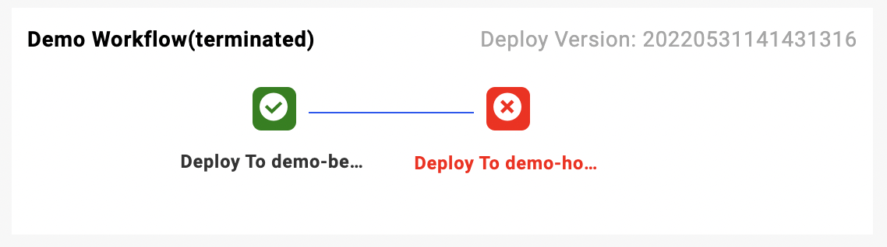

## Overview

Workflows, as part of the Application, can glue together additional delivery processes and specify arbitrary delivery environments. In short, `Workflow` provides customized control flow and flexibility based on the original delivery model of Kubernetes(Apply). For example, `Workflow` can be used to implement complex operations such as pause, manual approval, if conditions, waiting status, data flow, multi-environment gray release, A/B testing, etc.

A workflow consists of multiple steps, and typical workflow steps include step groups (containing a series of sub-steps), human review, multi-cluster publishing, notifications, etc. You can view all built-in workflow steps provided by default in KubeVela in [built-in workflow steps](./built-in-workflow-defs). If the built-in workflow steps don't meet your needs, you can also [custom workflow steps](../../platform-engineers/workflow/workflow).

`Workflow` consists of steps, you can either use KubeVela's [built-in workflow steps](./built-in-workflow-defs) like `suspend`, `notification`, `deploy`, `step-group` etc, or [customize your own `WorkflowStepDefinition`](../../platform-engineers/workflow/workflow).

In fact, if you only use components in the Application and do not declare a workflow, KubeVela will automatically create a default workflow for deploying the components when running the Application.

In VelaUX, you can feel the workflow more intuitively. As shown in the figure: The following is a workflow where the first step succeeds and the second fails:



## Execution order

In the workflow, all the steps will be executed sequentially and the next step will be executed after the previous one succeeded. If a step is of type `step-group`, it can contain a series of sub-steps, all of which are executed together when the step group is executed.

> In future versions of KubeVela (1.5+), you can explicitly specify the execution mode of steps, such as:
> ```yaml
> workflow:
>   mode:
>     steps: StepByStep
>     subSteps: DAG
> ```
> There're two modes of execution: StepByStep and DAG.
> 
> If you do not explicitly declare the execution mode, by default steps are executed sequentially in StepByStep and subSteps are executed in parallel in DAG.

## State of Application and Workflow

|  Application   |  Workflow  |                 Description                  |
| :-------: | :----: | :-----------------------------------: |
|    runningWorkflow    | executing |      When the workflow is executing, the status of the application is runningWorkflow      |
|    workflowSuspending    | suspending |      When the workflow is suspended, the status of the application is workflowSuspending     |
|    workflowTerminated    | terminated |      When a step in the workflow fails or is terminated, the status of the application is workflowTerminated     |
|    running    | succeeded |      When all steps in the workflow are executed successfully, the status of the application is running    |

## Core features

Workflow has powerful process control capabilities, including:

- View [Suspend and Resume Workflow](./suspend) to learn how to suspend and resume a workflow.
- View [Sub Steps](./step-group) to learn how to use sub-steps in the workflow.
- View [Dependency](./dependency) to learn how to specify dependencies for workflow steps.
- View [Pass data between steps](./inputs-outputs) to learn how to use `inputs`, `outputs` to pass data between steps.
- View [If Conditions](./if-condition) to learn how to use `if` to determine whether the step should be executed.
- View [Timeout Steps](./timeout) to learn how to set `timeout` for steps.
