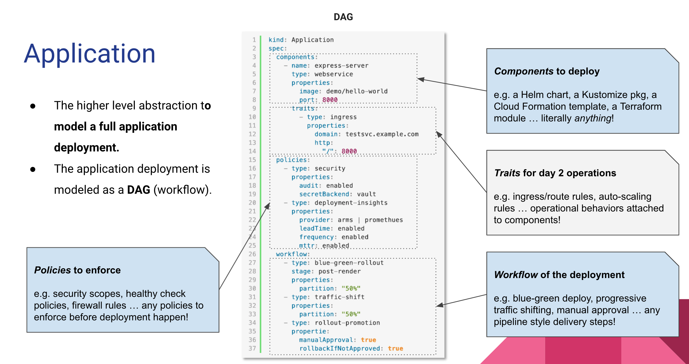
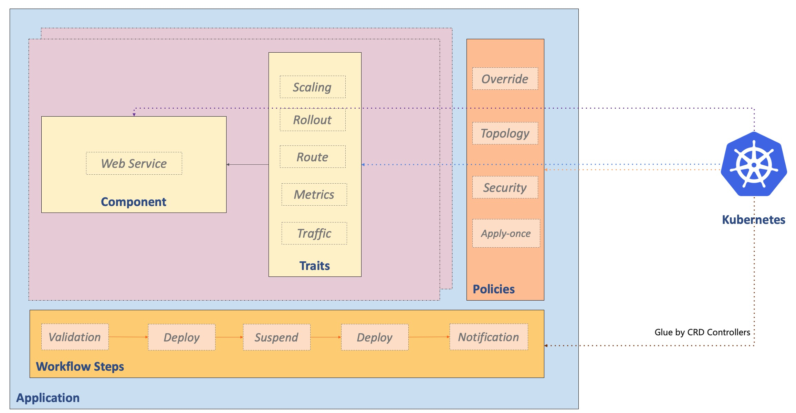

KubeVela revolves around cloud-native application delivery scenarios. The application delivery model behind it is [Open Application Model](https://oam.dev/), or OAM for short.

## An Abstraction to Model Application Deployment Process

OAM allows end users to work with a simple artifact to capture the complete application deployment workflow with easier primitives. This provides a simpler path for on-boarding end users to the platform without leaking low level details in runtime infrastructure and allows users to fully focus on the application delivery itself.



Every application deployment plan can be composed by multiple components with attachable operational behaviors (traits), deployment policy and workflow. It works in the following format:

```yaml
apiVersion: core.oam.dev/v1beta1
kind: Application
metadata:
  name: <name>
spec:
  components:
    - name: <component name>
      type: <component type>
      properties:
        <parameter values>
      traits:
        - type: <trait type>
          properties:
            <traits parameter values>
    - name: <component name>
      type: <component type>
      properties:
        <parameter values>
  policies:
  - name: <policy name>
    type: <policy type>
    properties:
      <policy parameter values>
  workflow:
    - name: <step name>
      type: <step type>
      properties:
        <step parameter values>   
```

This `Application` entity will reference `component`, `trait`, `policy` and `workflow step` types which are essentially programmable modules that are maintained by platform team. Hence, this abstraction is highly extensible and can be customized in-place at ease.

* **Component**: A Component defines the delivery artifact (binary, Docker image, Helm Chart...) or cloud service included in one application. As we will regard an application as a microservice unit, the best practice is to control one application only has one core service for frequent development, other components within this application can be dependencies such as database, cache or other middleware/cloud services, the maximum number of components within an application should under ~15.

* **Trait**: Traits are management requirements of an artifact that can be declared with each Component. For example: scale and rollout strategy, persistent storage claim, gateway endpoint and so on.

* **Policy**: Policy defines a strategy of certain aspect for application as to multi-cluster topology, configuration overrides, security/firewall rules, SLO and etc. It's a bit similar with traits but take affects to the whole application instead of one component.

* **Workflow Step**: Workflow step allows you to define every steps in the delivery process, typical steps are manual approval, partial deploy, notification.

The modules that make up the application are all extensible, they are defined by a bunch of programmable configurations called [Definitions](../platform-engineers/oam/x-definition). Under the hood, KubeVela will glue and leverage Kubernetes API to drive the infrastructure capabilities. You can check the following picture to see their relationships:



## Package for programmable capabilities

A package of OAM Definitions and [Kubernetes CRD Controller](https://kubernetes.io/docs/concepts/extend-kubernetes/api-extension/custom-resources/) is called an `Addon`. KubeVela has a large and growing [catalog](https://github.com/kubevela/catalog) of addons to support modern application delivery, such as [terraform](https://github.com/kubevela/catalog/tree/master/addons/terraform) for cloud resource provisioning, [OCM](https://github.com/kubevela/catalog/tree/master/addons/ocm-hub-control-plane) for multi-cluster management, [fluxcd](https://github.com/kubevela/catalog/tree/master/addons/fluxcd) for gitops, and etc.

With these addons, KubeVela provides a unified and good experience for developers to deliver modern application in a multi-cloud/hybrid-cloud environment. 

## No Configuration Drift

Despite the efficiency and extensibility in abstracting application deployment, programmable (Infrastructure-as-Code) approach may lead to an issue called *Infrastructure/Configuration Drift*, i.e. the rendered component instances are not in line with the expected configuration. This could be caused by incomplete coverage, less-than-perfect processes or emergency changes. This makes them can be barely used as a platform level building block.

Hence, KubeVela is designed to maintain all these programmable capabilities with [Kubernetes Control Loop](https://kubernetes.io/docs/concepts/architecture/controller/) and leverage Kubernetes control plane to eliminate the issue of configuration drifting, while still keeps the flexibly and velocity enabled by IaC.


## Next Step

- Learn [Definition](./definition) concept to understand how the extension mechanism works.
- View [Architecture](./architecture) to learn the overall architecture of KubeVela.
