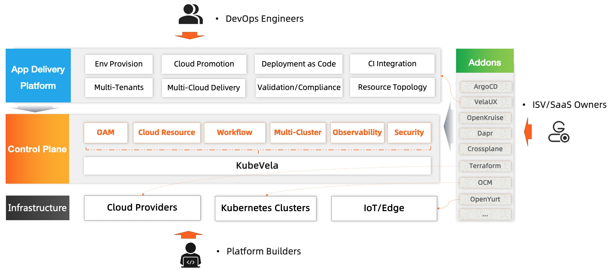

## What is KubeVela?

KubeVela is a modern application platform that makes it easier and faster to deliver and manage applications across hybrid, multi-cloud environments. At the mean time, it is highly extensible and programmable, which can adapt to your needs as they grow. 

## Why KubeVela?

The trend of cloud-native technology is moving towards pursuing consistent experience of application delivery across clouds and on-prem clusters. Kubernetes is becoming the standard layer which is excellent in abstracting away low-level infrastructure details. But it does not provide abstractions to model application deployment on top of hybrid and distributed environments. The lack of application level context have impacted user experience, slowed down productivity, led to unexpected errors due to misconfigurations in production.

Meanwhile, modeling the deployment of a microservice application is a highly fragmented and challenging process. Thus, many solutions that tried to solve the problem so far are either over simplified and could not fix the real issue, or too complicated to use at all. On the other hand, though many solutions provided friendly UI layer, the platform themselves are not customizable. This means as the needs of your platform grow, it is inevitable for the feature requirements to outgrow the capabilities of such systems.

This is why KubeVela appears here. It can simplify the application delivery and management experience across hybrid environments (e.g. multi-cluster/multi-cloud/hybrid-cloud/distributed-cloud), while also be flexible enough to satisfy the fast growth of businesses requirements. KubeVela can be used by platform-engineers as an extensible application engine, while developers can also use it as an out-of-box application platforms with lots of addons available.

## Who should use KubeVela?

- Platform builders for PaaS, Serverless, Application Management/Delivery systems
	- KubeVela works as an application delivery engine that you could build your advanced platform with.
- ISV, SaaS owners, and Application Architects who need to distribute software to anywhere
	- KubeVela has full extension and integration capabilities to allow users to distribute applications with [customized addons](./platform-engineers/addon/intro) easily. Think about an App Store but on Kubernetes and clouds.
- Application Developers, Operators, DevOps Engineers
	- VelaUX is an addon of KubeVela, with this addon enabled, it provides an out-of-box modern application Continuous Delivery (CD) and Management platform with an easy-to-use UI console.

## What's the relationship between OAM, KubeVela and VelaUX?

- [OAM(Open Application Model)](https://github.com/oam-dev/spec) is the model behind KubeVela, it provides a platform-agnostic application model including the best practices and methodology for different vendors to follow. The evolution of the model depends primarily on the practices of KubeVela currently.
- KubeVela is the core engine running on Kubernetes, it works as a [CRD controller](https://kubernetes.io/docs/concepts/extend-kubernetes/api-extension/custom-resources/) and brings OAM model into your Cloud Native PaaS along with lots of addon capabilities.
- VelaUX is one of the KubeVela addons, it provides out-of-box application delivery and management platform with **restful API** and **UI console**.

The KubeVela team will mainly focus on the core controller. By building VelaUX, we aim to provide out-of-box solutions for small and medium sized companies, and also eat our own dog food and make the extension, integration and the addon system capabilities of KubeVela better. 

## Comparisons

### KubeVela vs. CI/CD systems

KubeVela is a CD (Continuous Delivery) control plane that works at downstream of your CI process. So you will reuse the CI process you already adopted and KubeVela will take over CD process by empowering it with modern application delivery best practices such as declarative CD workflow, programmable workflow steps, pull model, multi-cloud/cluster delivery, unified cloud resource provision/binding, and much more. 

If you already adopted GitOps practice in CD section, KubeVela is even easier to fit in as it's fully declarative by design. All KubeVela features including CD workflow and multi-cloud/cluster delivery will be immediately available in your GitOps process by simply putting a KubeVela application YAML inside your configuration repository.

> Feel free to check the [Best Practices](../tutorials/jenkins) documentation for more details.

### KubeVela vs. Platform-as-a-Service (PaaS) 

The typical examples are Heroku and Cloud Foundry. They provide full application deployment and management capabilities and aim to improve developer experience and efficiency. In this context, KubeVela shares the same goal.

Though the biggest difference lies in **flexibility**.

KubeVela is fully programmable. All of its deployment workflow and component feature set are LEGO-style CUE modules and can be extended or removed in-place when your needs change. Comparatively, traditional PaaS systems are highly restricted, i.e. they have to enforce constraints in the supported types of applications and capabilities. When your needs expand, you always outgrow the capabilities of the PaaS system - this will never happen in KubeVela platform.

Also, as a CD control plane, KubeVela is working on top of runtime infrastructures (and we believe this is the right form for next-gen PaaS), while most existing PaaS systems tend to be installed as a plugin inside runtime cluster.

### KubeVela vs. Serverless  

Serverless platform such as AWS Lambda provides extraordinary user experience and agility to deploy serverless applications. However, those platforms impose even more constraints in extensibility. They are arguably "hard-coded" PaaS, so KubeVela differ from them in similar way.

On the other hand, KubeVela can easily deploy both Kubernetes based serverless workloads such as Knative/OpenFaaS, or cloud based functions such as AWS Lambda.

### KubeVela vs. Platform agnostic developer tools

The typical example is Hashicorp's Waypoint. Waypoint is a developer facing tool which introduces a consistent workflow (i.e., build, deploy, release) to ship applications on top of different platforms.

KubeVela can be integrated with such tools seamlessly. In this case, developers would use the Waypoint workflow as the UI to deploy and release applications with KubeVela as the underlying deployment platform.

### KubeVela vs. Helm 

Helm is a package manager for Kubernetes that provides package, install, and upgrade a set of YAML files for Kubernetes as a unit. 

KubeVela as a modern deployment system can naturally deploy Helm charts. For example, you could use KubeVela to define an application that is composed by a WordPress chart and a AWS RDS Terraform module, orchestrate the components' topology, and then deploy them to multiple environments following certain strategy.

Of course, KubeVela also supports other encapsulation formats including Kustomize etc.

### KubeVela vs. Kubernetes

KubeVela is a modern application deployment system built with cloud native stack. It leverages [Open Application Model](https://github.com/oam-dev/spec) and Kubernetes as control plane to resolve a hard problem - making shipping applications enjoyable.

Welcome onboard and sail Vela!

## What's Next

- Start to [install KubeVela](./install).
