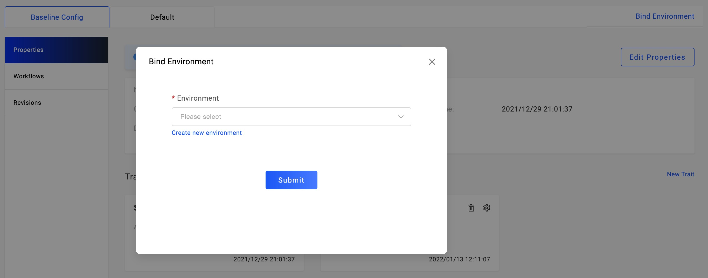

We can specify bind with one or more environments before deploy.

After we have created application and configured the baseline well, we can bind an application with environment to deploy.

You can bind with one environment as `dev` environment for develop and debug. When everything works well, you can bind with the production environment.

The operation likes below:

As the picture shows, in the application management page, click `Bind Environment`, choose the environment prepared.

If there's no environment, you can click the `Create new environment` for creation.

After choose well, click the `submit` button, it will show the new environment created on the right side of the baseline config as a tab.

KubeVela will automatically generate the deploy workflow for the newly created environments.

In the environment tab, you can click `Deploy` button to deploy the application.

### Next Step

* [Manage Workflow](../../../tutorials/workflows)