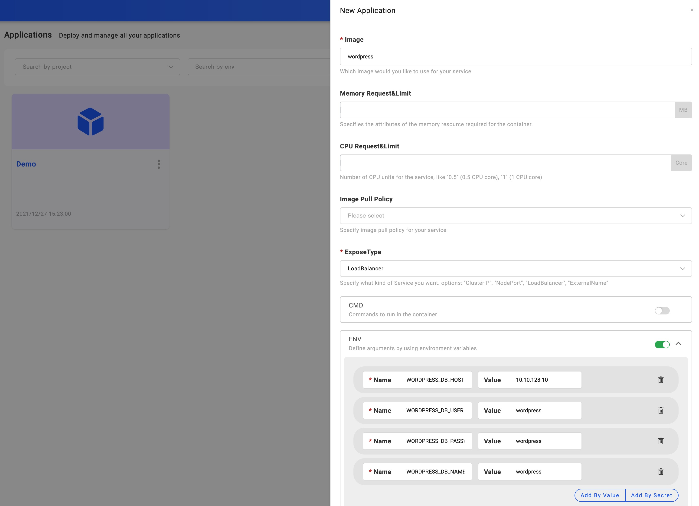

### Configure the basic information

Enter the `Applications` page, click `New Application` button, you can see the basic application configuration page. 

### Choose your application(component) type

Currently we only support one component for one application in VelaUX,
so the application type here is actually component type.

There're many component types supported in KubeVela including cloud resources and container based service type. New component types can be easily extended by KubeVela addons or component definition.

- We recommend to use `webservice` for your container based application.
- For helm packages, you can choose `helm` type.

### Configure the component

After you choose component type well, KubeVela will render the configuration
page according to the component type.

Different component types are different significantly, you can fill in the forms with the help of UI. For example, below is the configuration page for `webservice` type.

### Submit your application

After you finished configuring the application, click "Submit" to create the application. This means the application configuration was saved.

You need to [bind environment](./bind-new-environment) for real deployment.

### Next Step

* [Bind Application with Environment](./bind-new-environment)