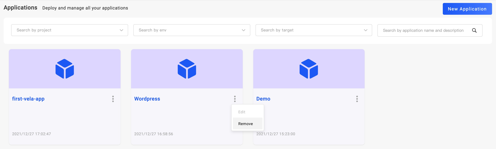

Before you delete an application, you should recycle all instances bond in environments.

After all application instance were recycled, you can click `Remove` for deletion.

As the picture shows, the `Remove` button is hidden in the application detail.
