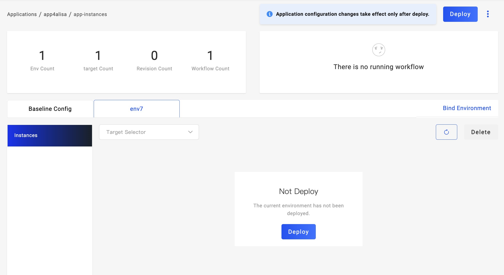

应用创建完成后，需要分别执行环境对应的工作流完成环境的部署，每个环节的对应工作流会自动生成。

### 首次部署

从应用列表点击指定应用进入应用详细页面，在 `Baseline Config` 右侧即为所有已绑定的环境列表。选择你需要部署的环境，点击环境名称进入环境页面。

环境处于未部署状态时将显示部署按钮，点击按钮即可开始执行当前环境的部署工作流。工作流执行状态显示在页面的右上方。如果你设置了审核的步骤，到达该步骤时页面中将弹出审核窗口。如果部署步骤出现故障，该步骤显示为红色，鼠标移动到该步骤上将显示故障原因。

### 更新部署

应用详情页面的右上方有一个常驻的 `Deploy` 按钮，点击该按钮执行默认工作流。按钮右边三点按钮为选择不同的环境工作流，鼠标移动到其上方即可显示多个工作流选项。

更新部署可以在任意状态下进行，选择执行某一个流水线后，将使用最新的应用配置进行部署。如果该环境正在执行部署，UI 将提示你是否强制进行新的部署。
