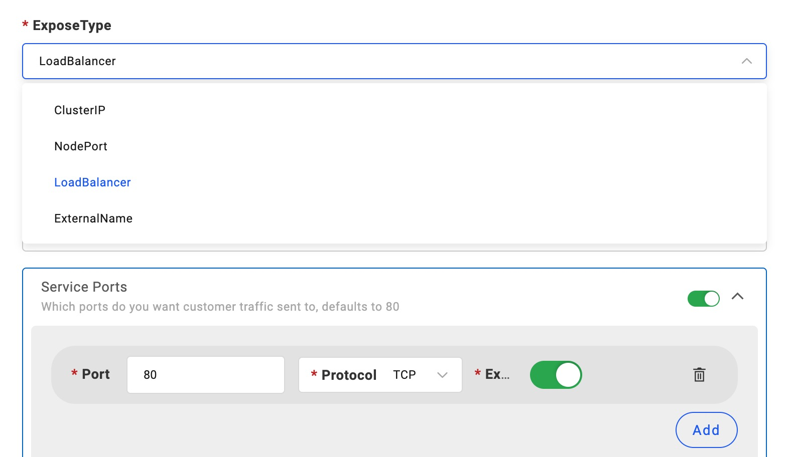
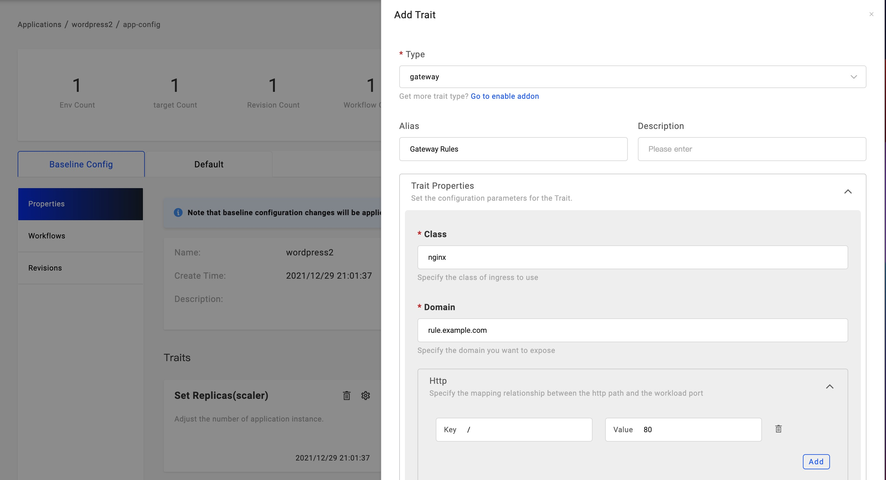

### Expose your application for public access

You can configure your application for public access.

There're mainly three ways to expose your service.

1. Choose `webservice` Type and configure the service type to be `LoadBalancer` or `NodePort`.
2. Configure `gateway` trait, it works for `webservice`, `worker` and `task` component types. `gateway` trait must configure a domain and works only for HTTP/HTTPs protocols.
3. Case by case component configurations.

#### Expose service for `webservice` typed component

You can modify `ExposeType` to choose the way, and you should configure the `Service Ports` to listen the ports and turn on the `Expose` radio.

#### Add `gateway` trait

The `gateway` trait requires you have `Ingress Controller` available in your cluster. You can add this trait to expose your service and configure a domain.

As the picture shows, the `Domain` field configure your domain, please configure your DNS for domain to route to the Kubernetes cluster gateway IP.

In the `Http` section, you can configure the routing rules. For example, set `/`:`80` means the domain index page will route to the port `80`. You can configure this rule as you need.

Other component types can also be able to configure the service expose, but they're usually case by case, especially for helm charts.

### Get the service endpoint

After the application deployed with service exposed configuration, you can see a `Service Endpoint` button on the left of the `Recycle` button. You'll see the endpoint when hover your mouse there.

