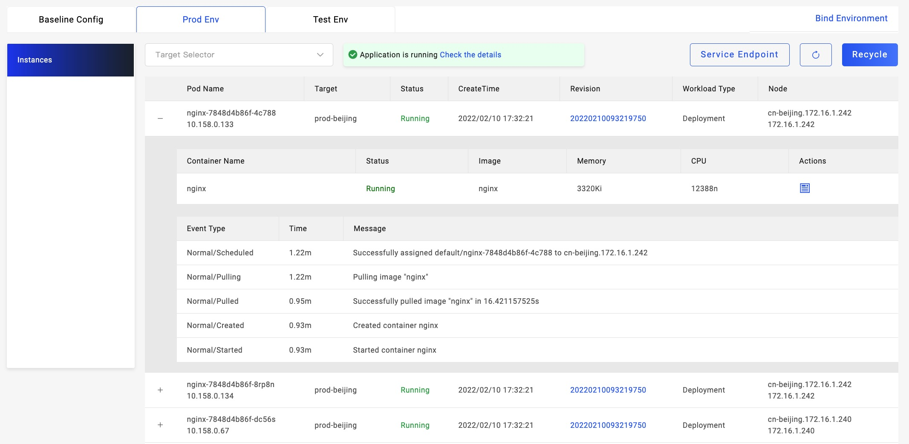

查看应用运行实例信息是掌握应用运行状态的直接方式。

如上图所示，应用的运行实例页面处在应用环境视图下。切换不同的环境即可查询不同环境下部署的实例。

默认情况下，实例列表显示该应用在当前环境下的所有实例。通过实例列表上方的交付目标筛选，可以查询不同交付目标的实例列表。在实例列表中显示版本、状态等信息。

对于交付的 Kubernetes 集群的应用，用户可以点击实例行前方的 + 号展开一个实例的详情，即 Pod 详情，包括了容器状态及资源消耗情况，如果实例的拉起故障，可以从事件列表中查看到详细信息。

对于交付的 云服务 应用，用户可通过点击实例名称跳转到云服务商管理页面。

