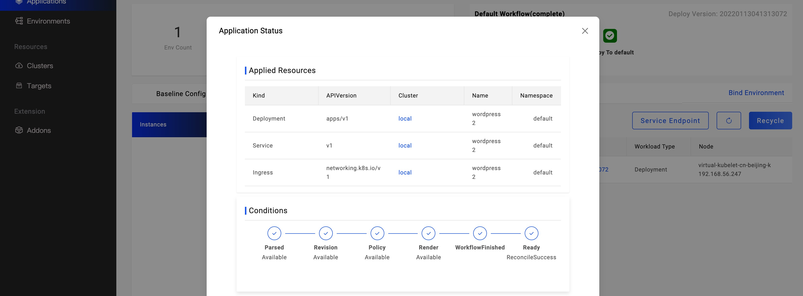

If you want to learn the resources created by the applications, you can click  `Check the details` text button, it will provide a window to show the resources.

There're three kinds of information including `Applied Resources`,`Conditions` and `Component Status`. The `Applied Resources` are all resources created by the applications.
