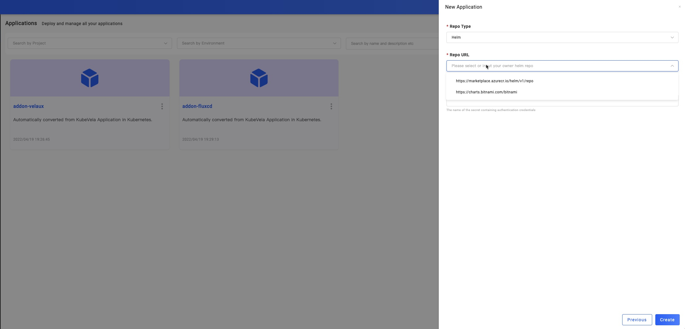

In this guide, we will introduce how to use Config to connect a private helm repository and create an application with Helm type to use this repository.

:::info
You must enable the [fluxcd](../../../reference/addons/fluxcd.md) addon first.
:::

Check the [config template](./config-template.md) is exist with the following command:

```bash
vela config-template list | grep helm-repository
```

## Create a Helm Repository config

There are two ways to create the config. On the Configs page, you could create the configs that belong to the system scope. Then, the Helm Repository could be used for all projects. If you only want to use it for one project, let's create the config on the Project summary page.

You can set the URL of your private repository in the `URL` field. If your repository has set up the HTTP basic authentication, you can set the `Username` and `Password` for it.

BTW, If your helm repository's certificate is self-signed, you can set the `CaFile` field with the certificate content.


Also, you could create the config via CLI:

```bash
vela config create <Config Name> -t helm-repository url=<Repo URL> username=<Username> password=<password>
```

List all Helm Repositories:

```bash
vela config list -t helm-repository
```

## Distribute the config

After creating a config, it only saves as a Secret in the system namespace in the hub cluster. But the Helm application will generate the HelmRepository resource that depends on this Secret. So, we should distribute the Secret to all namespaces that we could use and include managed clusters. The config distribution could help you.

Let's go to the project summary page for which you want to create the Application.


Click the `Distribute` button and select the targets that you want to distribute the config.

Also, you could distribute the config via CLI:

```bash
vela config distribute <Config Name> --target <cluster/namespace>
```

## Create an application with this repository

You can follow the [application creation guide](../application/create-application.md) to create a helm type application in project `default`. eg:


Then you can choose the helm repo url configured before like this image, and use the available charts in this repo.

