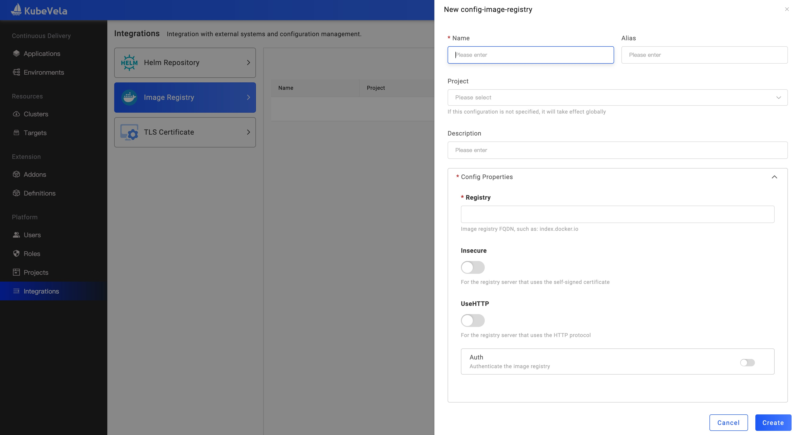
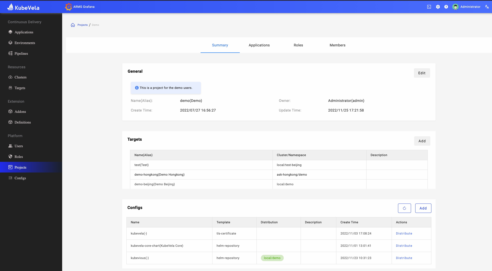

In this guide, we will introduce how to create a private image registry and how to create an application whose image locates in the registry.

Check the [config template](./config-template.md) is exist with the following command:

```bash
vela config-template list | grep image-registry
```

## Create an Image Registry config

There are two ways to create the config. On the Configs page, you could create the configs that belong to the system scope. Then, the Image registry could be used for all projects. If you only want to use it for one project, let's create the config on the Project summary page.

On the `Configs/ImageRegistry` page, let's create a private image registry with the following fields:

* Registry

Your image registry domain, such as `index.docker.io`. Please make sure this domain could be accessed from all cluster nodes.

* Insecure

If your registry server uses the self-signed certificate, you should enable this field. This only means KubeVela could trust your registry. You also need to make sure the `dockerd` or `containerd` in your cluster node trust this registry. refer to: [Test an insecure registry with docker](https://docs.docker.com/registry/insecure/).

* UseHTTP

If your registry with the HTTP protocol to provide the service, you should enable this field. You also need to make sure the `dockerd` or `containerd` in your cluster node trust this registry. refer to: [Test an insecure registry with docker](https://docs.docker.com/registry/insecure/).

* Auth

If your registry needs authentication, you need must set the username and password. KubeVela will generate the secret and distribute it to all clusters.



Also, we could create the image registry config via CLI:

```bash
vela config create <Config Name> -t image-registry registry=<Registry Domain>
```

List all Image registries:

```bash
vela config list -t image-registry
```

## Distribute the config

After creating a config, it only saves as a Secret in the system namespace in the hub cluster. But the application will generate the Workload resource that depends on this Secret which type is `kubernetes.io/dockerconfigjson`. So, we should distribute the Secret to all namespaces that we could use and include managed clusters. The config distribution could help you.

Let's go to the project summary page for which you want to create the Application.



Click the `Distribute` button and select the targets that you want to distribute the config.

Also, you could distribute the config via CLI:

```bash
vela config distribute <Config Name> --target <cluster/namespace>
```

## How to use the image registry

Let's follow the [Deploy Container Image](../../../tutorials/webservice.mdx) to create an application. After you input the image name, KubeVela will automatically identify the matched registries.
