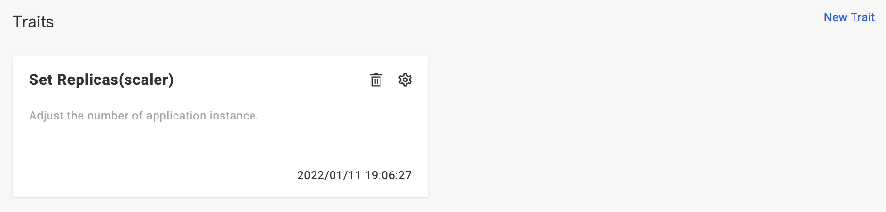
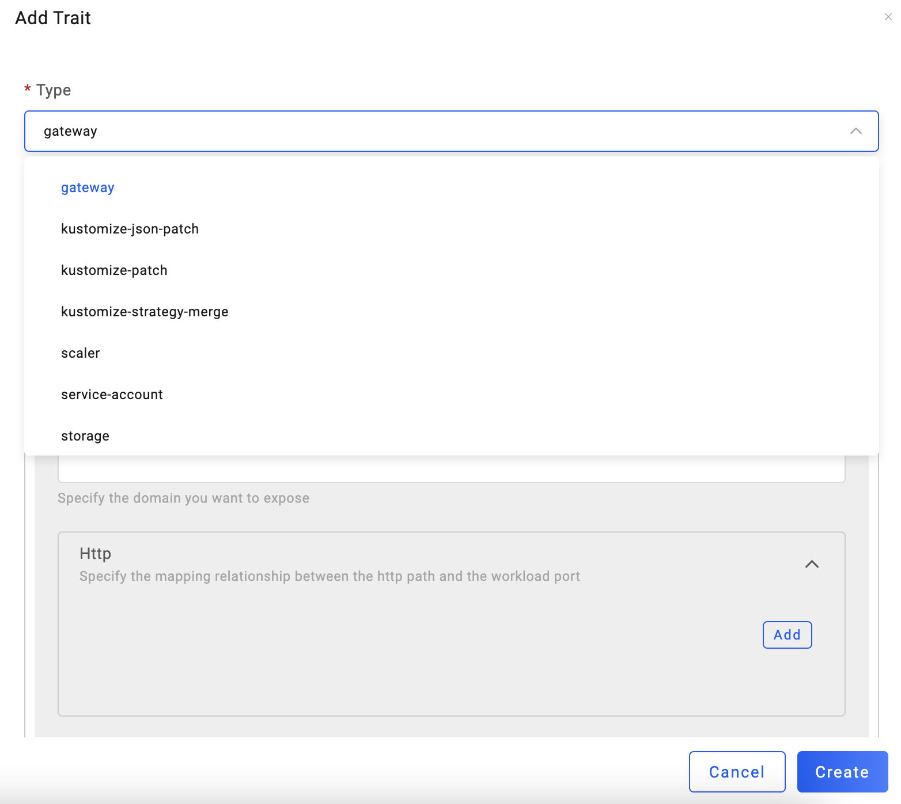
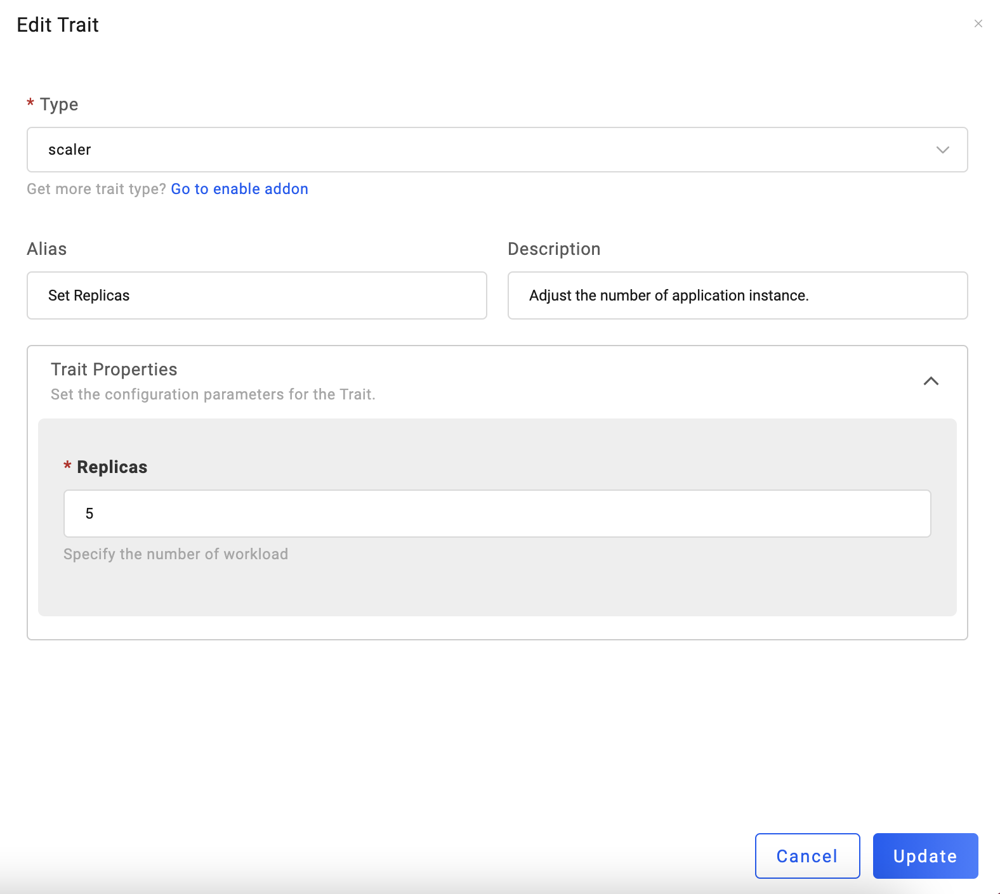

After deploying an application, VelaUX will automatically bind a `scaler` trait to the application. You can update, delete or bind other traits in the dashboard.

> Note: You need to re-deploy the application after updating traits.

## Bind new traits

Click `New Trait` to bind traits for the application.

You can select different type of traits. In addition, addons can be enabled to enable more traits.

## Update traits

Click the gear icon to enter the edit page of the trait. You can set the number of replicas to 5:

## Delete traits

Open the component configuration page, and click the trash icon of the trait to delete.

## More

For more information about all traits, please refer to [Traits](../../../end-user/traits/references).