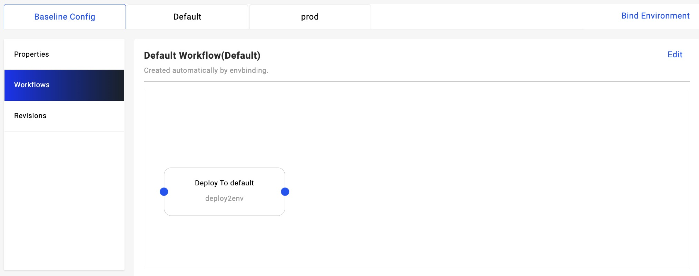

When an application is created, it is associated with an environment. Each environment is associated with a workflow for deployment. After a workflow is created, there is only one step by default. You can enter workflow editing mode by clicking the `Edit` button.

## Edit workflow steps

Click the `Edit` button, in addition to modifying the name and description of the workflow, you can also add different types of workflow steps and orchestrate them. Here we have added a `Notification` step to send a notification when the deployment is complete.

For more information of workflow steps, please refer to the [built-in workflow steps](../../../end-user/workflow/built-in-workflow-defs) page.

## Create Workflow

Each environment is bound to one workflow, you can deploy a new workflow by binding a new environment.

There can be multiple delivery targets in each environment, take an environment which contains a test delivery target and a prod delivery target as an example. After binding the environment for the application, you can see that a new workflow has been added: by default, there are two steps: one is `Deploy to test`, one is `Deploy to prod`.

Let's edit this workflow, add `suspend` between two steps:

After modification, we choose this new workflow to deploy:

After deployment, when the resources in the test target are deployed, the work flow will be suspended. We can have some manual operations.

1. Click `Rollback`, the workflow will rollback to the latest succeeded revision and re-deploy.
2. Click `Terminate`, the workflow will be terminated.
3. Click `Continue`, the workflow will continue to execute.
