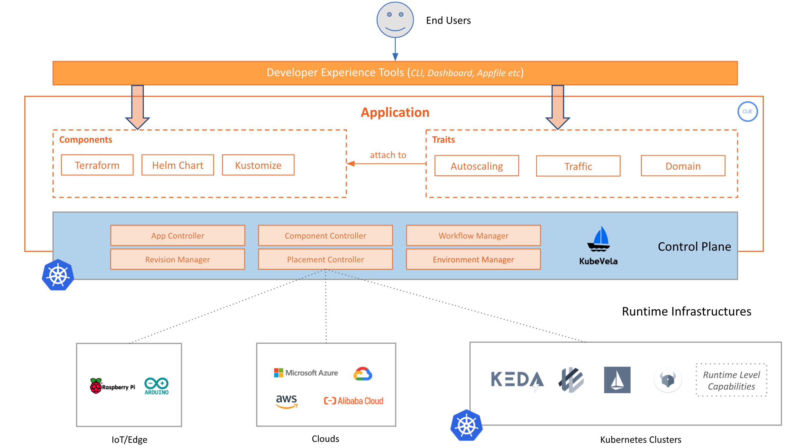

## Motivation

The trend of cloud-native technology is moving towards pursuing consistent application delivery across clouds and on-premises infrastructures using Kubernetes as the common layer. Kubernetes, although excellent in abstracting low-level infrastructure details, does not introduce abstractions to model software deployment on top of today's hybrid and distributed environments. We’ve seen the lack of application level context have impacted user experiences, slowed down productivity, led to unexpected errors or misconfigurations in production.

On the other hand, modeling the deployment and operation of microservice application across hybrid environments is a complicated and fragmented process. Many CD or PaaS systems today are either over complex or highly restrictive (which means your needs are almost certain to outgrow the capabilities of such systems today or tomorrow). End Users complain those platforms are  rigid and slow in response to features requests and improvements. Administrators do want to help but the engineering effort to build such a cross-environments, flexible and consistent application delivery system seems daunting.

## What is KubeVela?

KubeVela is a modern application platform that makes deploying and managing applications across today's hybrid, multi-cloud environments easier and faster, while at meantime, provides high level of flexibility when your needs grow. This is achieved by doing the following:

**Application Centric** - KubeVela introduces [Open Application Model (OAM)](https://oam.dev/) as the consistent yet higher level API to capture a full deployment of microservices on top of hybrid environments. Placement strategy, traffic shifting and rolling update are declared at application level. No infrastructure level concern, simply deploy.

**Programmable Workflow** - KubeVela leverages [CUE](https://cuelang.org/) to implement its model layer. This allows you to declare application deployment workflow as a DAG, with all steps and application's needs glued together in programmable approach. No restrictions, natively extensible.

**Runtime Agnostic** - KubeVela works as an application delivery control plane that is fully runtime agnostic. It can deploy and manage any application components including containers, cloud functions, databases, or even EC2 instances across hybrid environments, following the workflow you defined.

## Architecture

The overall architecture of KubeVela is shown as below:

### Control Plane

Control plane is where KubeVela itself lives in. As the project's name implies, KubeVela by design leverages Kubernetes as control plane. This is the key of how KubeVela guarantees full *automation* and strong *determinism* to application delivery at scale. Users will interact with KubeVela via the  application centric API to model the application deployment, and KubeVela will distribute the application to target *runtime infrastructure* per policies and workflow declared by users.

### Runtime Infrastructures

Runtime infrastructures are where the applications are actually running on. KubeVela allows you to deploy and manage applications on both Kubernetes based infrastructures (local, managed offerings, or IoT/Edge/On-Premise ones) and non-Kubernetes environments such as public/private clouds in a consistent workflow.

## Comparisons

### KubeVela vs. Platform-as-a-Service (PaaS) 

The typical examples are Heroku and Cloud Foundry. They provide full application deployment and management capabilities and aim to improve developer experience and efficiency. In this context, KubeVela shares the same goal.

Though the biggest difference lies in **flexibility**.

KubeVela is fully programmable. The deployment workflow in KubeVela are composed by LEGO-sytle CUE modules and can be extended at any time when your needs grow. Comparing to this mechanism, traditional PaaS systems are highly restricted, i.e. they have to enforce constraints in the type of supported applications and capabilities, and as application needs grows, you always outgrow the capabilities of the PaaS system - this will never happen in KubeVela platform.

### KubeVela vs. Serverless  

Serverless platform such as AWS Lambda provides extraordinary user experience and agility to deploy serverless applications. However, those platforms impose even more constraints in extensibility. They are arguably "hard-coded" PaaS.

KubeVela can easily deploy both Kubernetes based serverless workloads such as Knative/OpenFaaS, or cloud based functions such as AWS Lambda.

### KubeVela vs. Platform agnostic developer tools

The typical example is Hashicorp's Waypoint. Waypoint is a developer facing tool which introduces a consistent workflow (i.e., build, deploy, release) to ship applications on top of different platforms.

KubeVela can be integrated with such tools seamlessly. In this case, developers would use the Waypoint workflow as the UI to deploy and release applications with KubeVela as the underlying deployment platform.

### KubeVela vs. Helm 

Helm is a package manager for Kubernetes that provides package, install, and upgrade a set of YAML files for Kubernetes as a unit. 

KubeVela as a modern deployment system can naturally deploy Helm charts. For example, you could use KubeVela to define an application that is composed by a WordPress chart and a AWS RDS Terraform module, orchestrate the components' topology, and then deploy them to multiple environments following certain strategy.

Furthermore, KubeVela also supports other encapsulation formats including Kustomize etc.

### KubeVela vs. Kubernetes

KubeVela is a modern application deployment system built with cloud native stack. It leverages [Open Application Model](https://github.com/oam-dev/spec) and Kubernetes as control plane to resolve a hard problem - making shipping applications enjoyable.

## What's Next

Here are some recommended next steps:
- [Get started](./quick-start) with KubeVela.
- Learn KubeVela's [core concepts](./concepts).
- Learn how to [deploy an application](end-user/application) in detail and understand how it works.
- Join `#kubevela` channel in CNCF [Slack](https://cloud-native.slack.com) and/or [Gitter](https://gitter.im/oam-dev/community)

Welcome onboard and sail Vela!