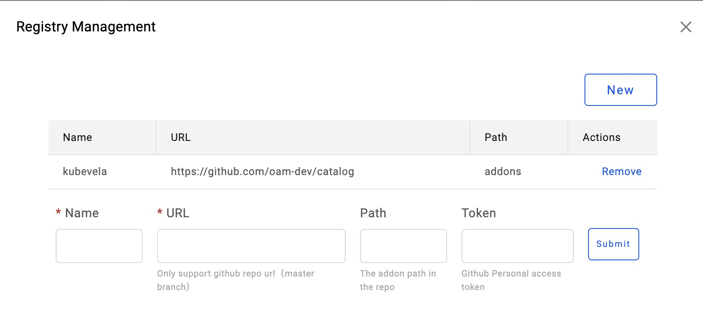
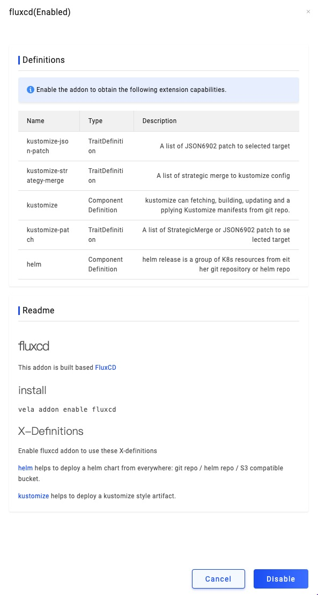

Addon can be used to manage and extend KubeVela platform capabilities.
Users and install/uninstall addons on KubeVela via UI/CLI interfaces.
Addons can be stored and discovered via addon registries.

By default, KubeVela community maintains an [official addon registry](https://github.com/oam-dev/catalog/tree/master/addons) with some official addons.
Users can add their own addons and registries.

## Addon Registry

Addon registry is a place to upload and store addons, or discover and download addons.
An addon registry is either a Git repo or an Object Storage bucket by now.
You can see what a registry looks like by visiting [the official registry](https://github.com/oam-dev/catalog/tree/master/addons).

You can manage addon registries via UI/CLI. Here is how to add a registry on UI:

## Addon Format

Each addon contains X-Definitions, application controller and component resource templates, and its self description.
You can see what an addon looks like by checking out [this example addon](https://github.com/oam-dev/catalog/tree/master/experimental/addons/example).

An addon must obey the following directory structure:

- `template.yaml`: contains the basic app, you can add some component and workflow to meet your requirements. Other files 
  in `resources/` and `definitions/` will be rendered as Components and appended in `spec.components`
- `metadata.yaml`: contains addon metadata information.
- `definitions/`: contains the X-Definition yaml/cue files. These file will be rendered as KubeVela Component in `template.yaml`
- `resources/`:
  - `parameter.cue` to expose parameters. It will be converted to JSON schema and rendered in UI forms.
  - All other files will be rendered as KubeVela Components. It can be one of the two types:
    - YAML file that contains only one resource. This will be rendered as a `raw` component
    - CUE template file that can read user input as `parameter.XXX` as defined `parameter.cue`.
      Basically the CUE template file will be combined with `parameter.cue` to render a resource.
      **You can specify the type and trait in this format**

Once an addon is uploaded to the registry, you can manage addons via UI/CLI. Here is how it looks lik on UI:

