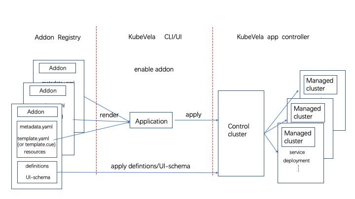

The picture below shows what KubeVela does when an addon is enabled. There are mainly three process:
* [Addon Registry](./addon-registry) store addons which can be used to share and distribute addons anywhere, it can be any git repo, OSS bucket or OCI registry.
* When an addon is enabled through UX/CLI, it will pull these resource files from the Addon Registry, render them and create a KubeVela application.
* Finally, the KubeVela controller take care the rest things and deliver the addon as a normal application into control plane or multi-clusters.



## Build an addon

To build an addon, you should follow some basic rules as follows.

You need to create an addon directory to place addon resource files. Won't bother to create? `vela addon init` command will create a basic structure for you (vela CLI v1.5 or later). Please refer to `vela addon init -h` for details. For quick starts, we will just use `vela addon init your-addon-name` now.

Typically, the directory hierarchy looks like below:

```shell
├── resources/
│   ├── xxx.cue
│   ├── xxx.yaml
│   └── parameter.cue
├── definitions/
├── schemas/
├── README.md
├── metadata.yaml
└── template.yaml
```

Not all of these directories or files are necessary, let's explain them one by one.

### metadata.yaml(Required)

A `metadata.yaml` describes the basic information of an addon, such as the name, version, description, etc. With this basic info, an addon can be recognized by UX/CLI, an example likes:

```yaml
name: example
version: 1.0.0
description: Example adddon.
icon: xxx
url: xxx

tags:
  - only_example

deployTo:
  runtimeCluster: false

dependencies:
- name: addon_name

system:
  vela: ">=v1.4.0"
  kubernetes: ">=1.19.0-0"

needNamespace:
  - flux-system

invisible: false
```

Here's the usage of every field:

| Field | Required  | Type | Usage  |
|:----:|:---:|:--:|:------:|
|  name    |  yes | string | The name of the addon.  |
|  version    | yes  | string | The version of addon, increase for every changes and follow [SemVer](https://semver.org/) rule.  |
| description     | yes  | string | Description of the addon.  |
| icon     | no  | string | Icon of the addon, will display in addon dashboard.  |
| url     | no  | string | The official website of the project behind the addon.  |
| tags     | no  | []string | The tags to display and organize the addon.  |
| deployTo.runtimeCluster     | no  | bool | By default, the addon will not be installed in the managed clusters. If it's `true`, it will be delivered to all managed clusters automatically.  |
| dependencies     | no  | []{ name: string } | Names of other addons it depends on. KubeVela will make sure these dependencies are enabled before installing this addon.  |
| system.vela     | no  | string | Required version of vela controller, vela CLI will block the installation if vela controller can't match the requirements.  |
| system.kubernetes     | no  | string | Required version of Kubernetes, vela CLI will block the installation if Kubernetes cluster can't match the requirements.  |
| needNamespace     | no  | []string | Vela will create these namespaces needed for addon in every clusters before installation.  |
| invisible     | no  | bool | If `true`, the addon won't be discovered by users. It's useful for tests when addon is in draft state. |

### README.md(Required)

The README of this addon, it will be displayed in the dashboard for end user who's going to install this addon. So you should let them understand the basic knowledge of the addon which contains:

* What is the addon?
* Why to use this addon? The use case and scenarios.
* How to use this addon? It is the `end user` who should understand. An end to end demo is recommended.
* What will be installed? The definitions along with the CRD controllers behind.

There're no restrict rules for an [experimental addon](https://github.com/kubevela/catalog/tree/master/experimental/addons), but if the addon want to be [verified](https://github.com/kubevela/catalog/tree/master/addons), the README is the most important thing.

### template.yaml(Optional)

An addon is actually a KubeVela Application in the system, so you can also define the application by using the `template.yaml`. 

```yaml
apiVersion: core.oam.dev/v1beta1
kind: Application
metadata:
  name: velaux
  namespace: vela-system
spec:
# component definition of resource dir .
```

You can describe anything in the application if you want, the rest resources defined in other folders will be automatically rendered and appended into this template as components.

The name of Application in template will be replaced by the addon name in `metadata.yaml`. The addon application will always have a unified name in the format of `addon-<addon_name>`.

> If the addon will be installed in managed clusters, please don't define policies or workflow steps in the template, or it will break the automatic precess built internally for addon installation.

#### Examples

* [velaux](https://github.com/kubevela/catalog/blob/master/addons/velaux/template.yaml), define only the header of application in the template.
* [OCM control plane](https://github.com/kubevela/catalog/blob/master/addons/ocm-hub-control-plane/template.yaml), the addon only be installed in control plane, so it just defines everything in the application template.

### `resources/` directory(Optional)

Addon is actually an Application, but it provides more convenience for you to compose a complex application. You can use CUE or YAML to render resources into an application. This is what `resources` directory does for you.

Files defined in `resources` folder eventually rendered as components in the application described in `template.yaml`.

#### CUE format resource

If you need to add a component to your application that needs to be rendered dynamically based on parameters when enabled, you can write a CUE format file as shown below:

```cue
output: {
	type: "webservice"
	properties: {
		image: "oamdev/vela-apiserver:v1.4.0"
	}
	traits:[{
		type: "service-account"
		properties: name: "serviceAccountName"
	}]
}
```

You can refer to the [CUE basic](../cue/basic) to learn language details.

The `output` is the keywords of addon, contents defined in output will be rendered as component of application.

The result of the example will be as follows in YAML:

```yaml
kind: Application
... 
# application header in template
spec:
  components:
  - type: webservice
    properties:
    	image: "oamdev/vela-apiserver:v1.4.0"
    traits:
    - type: service-account
      properties:
        name: serviceAccountName
```

The detail of the example is [velaux](https://github.com/kubevela/catalog/tree/master/addons/velaux).

### Define parameter for addon

When the resource is defined in CUE, you can also define parameters for addon by writing a `parameter.cue` file in the resources folder as shown below:

```cue
parameter: {
  serviceAccountName: string
}
```

It can cooperate with the resource file in CUE, here we have a CUE file `vela-apiserver.cue` :

```cue
output: {
	type: "webservice"
	properties: {
		image: "oamdev/vela-apiserver:v1.4.0"
	}
	traits:[{
		type: "service-account"
		properties: name: parameter.serviceAccountName
	}]
}
```

When an end user enabling the addon, he will be able to specify parameters:

```
vela addon enable velaux serviceAccountName="my-account"
```

Then the render result will be:

```yaml
kind: Application
... 
# application header in template
spec:
  components:
  - type: webservice
    name: api-server
    properties:
    	image: "oamdev/vela-apiserver:v1.4.0"
    traits:
    - type: service-account
      properties:
        name: my-account
```

**Please notice** The **name** of component is the same with file name in the `resource/` folder with file type suffix trimmed.

##### Use context render component

Besides using `parameter` to generate component dynamically, you can also use `context` to  render runtime variable.
For example, you can define the component with cue like this:
```cue
output: {
	type: "webservice"
	properties: {
		image: "oamdev/vela-apiserver:" + context.metadata.version
		....
    }
}
```

And the `metadata.yaml` is:
```yaml
...
name: velaux
version: 1.2.4
...
```

The render will be:
```yaml
kind: Application
... 
# application header in template
spec:
  components:
  - type: webservice
    properties:
    	image: "oamdev/vela-apiserver:v1.2.4"
```

The image tag becomes the addon's version due to the `context.metadata.version` points to. The real example is [VelaUX](https://github.com/kubevela/catalog/blob/master/addons/velaux/resources/apiserver.cue).
Other available fields please refer to [metadata](#metadata.yaml(Required)).

UX/CLI renders all CUE files , `parameter.cue` and data defined in `metadata.yaml` in one context when the addon is enabled, resulting in a set of components that are appended to the application template.


#### YAML format resource

The YAML format resources is just a Kubernetes YAML object, you can define any object one by one in a file.

It will be directly added to the application as a `K8s-object` type component during rendering.

For example, the [OCM](https://github.com/kubevela/catalog/tree/master/addons/ocm-hub-control-plane) addon defines all it's resources in the addon. All these YAML objects will be rendered as components in an Application.


### `definitions/` directory(Optional)

You can create a definition's file directory under the Addon Registry to store template definition files such as component definitions, trait definitions, and workflowstep definitions. It should be noted that since the KubeVela controller is usually not installed in the managed cluster, even if the addon is enabled by setting the `deployTo.runtimeCluster` field in the metadata file (metadata.yaml) to install the addon in the subcluster, the template definition file will not be distributed to sub-clusters.

For example, the [`fluxcd`](https://github.com/kubevela/catalog/tree/master/addons/fluxcd/definitions) addon defines multiple ComponentDefinition and TraitDefinition.

### `schemas/` directory(Optional)

The schemas directory is used to store the [UI schema](../../reference/ui-schema) files corresponding to `Definitions`, which is used to enhance the display effect when displaying the parameters required by `Definitions` in UX.

The above is a complete introduction to how to make an addon, you can find the complete description of the above-mentioned addon in this [catalog](https://github.com/kubevela/catalog/tree/master/experimental/addons/example) example.

In addition to uploading the addon resource files to your addon repository, you can also submit a pull request to KubeVela [community addon repository](https://github.com/kubevela/catalog/tree/master/addons) and [experimental addon repository](https://github.com/kubevela/catalog/tree/master/experimental/addons) to addon new addons. After pr merged your addons can be discovered and used by other KubeVela users.

## Install Addon Locally

You can install addon from local to debug your own addon:

```
vela addon enable ./your-addon-dir/
```

## Known Limits

- Cannot only install addon in the sub-clusters. Because of KubeVela need render out every kind of resource in control plane, if an addon contain some [CRD](https://kubernetes.io/docs/concepts/extend-kubernetes/api-extension/custom-resources/), these CRD must be installed in control plane, otherwise Vela-core controller will meet an error of cannot find CRD.

## Extend Terraform Addon

*  We have built some tools to extend cloud resource as addons  for convenience, you can refer to the [extend terraform addon docs](./terraform).

## Contribution

If you have developed your own addons, welcome to contribute to the [community catalog](https://github.com/kubevela/catalog). 

Meanwhile, any bugfix of existing addons are welcomed. Just make a pull request to [this](https://github.com/kubevela/catalog) repo.