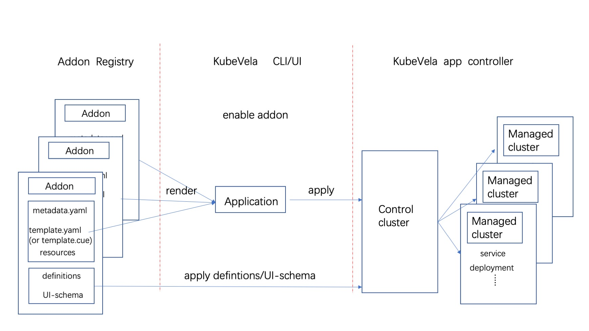

The picture below shows what KubeVela does when an addon is enabled. You can see that the Addon Registry stores the addon's resource files. When an addon is enabled through UX/CLI, it will pull these resource files from the Addon Registry, render them and create a KubeVela application. Finally, the KubeVela controller running in the management cluster completes the delivery of the resources described in the application.



## Make an addon

Next, we will introduce how to make an addon of your own. First, you need to add a directory for storing addon resource files in the Addon Registry. Typically this directory structure looks like this:

```shell
├── resources/
│   ├── xxx.cue
│   ├── xxx.yaml
│   └── parameter.cue
├── definitions/
├── schemas/
├── definitions/
├── schemas/
├── README.md
├── metadata.yaml
└── template.yaml
```

Then let's get to the details of each resource file and subdirectory under this directory.

### metadata.yaml(Required)

First, you need to write an addon metadata file (metadata.yaml), which describes the basic information such as the name and description of the addon. Only obeying this format, a directory under a repository will be recognized by UX/CLI as an addon's resource directory, an example of a metadata file is shown below:

```yaml
name: example
version: 1.0.0
description: Example adddon.
icon: xxx
url: xxx

tags:
  - only_example

deployTo:
  runtimeCluster: false

dependencies: []
- name: addon_name

invisible: false
```

Other than the basic information such as name, version, tag, etc, it includes the following fields that control the behavior of the addon:

- `deployTo.runtimeCluster`: Indicates whether the addon is installed in the sub-cluster. When this field is set to `true`, the resources in the application will be delivered to the sub-cluster.
- `dependencies`: Indicates other addons it depends on. When enabled, KubeVela will automatically enable the addons it depends on.
- `invisible`: Indicates whether to display the addon when pulling the addon list. When you find that the addon has some fatal bugs, you can temporarily hide the addon from users by setting this field to `true`.

### template.yaml(Required)

Next, you need to write an addon application template file (template.yaml). Through the above introduction, we know that all files under the Addon Registry will eventually be rendered as a KubeVela application, then you can describe the basic information of the application through this file. For example, you can add specific tags or annotations to the application. Of course, you can also add components and workflowsteps directly in the application template file.

Note that even if you set the application name through the `metadata.name` field, this setting will not take effect. When enabled, the application will be uniformly named in the format of addon-{addonName}.

### README.md(Required)

The addon's self-describing file is used to describe the main functionality of the addon, and this file is presented to the user on the addon details page in UX.

### Resources directory(Optional)

In addition to adding components directly in the template file, you can also create a `resources` directory in the Addom Registry, and add YAML/CUE type files in it. These files are eventually rendered into components and added to the application.
Among them, the YAML type file should contain a K8S resource object, which will be directly added to the application as a K8s-object type component during rendering.

If you need to add a component to your application that needs to be rendered dynamically based on parameters when enabled, you can write a CUE format file as shown below:

```cue
output: {
	type: "k8s-obeject"
	properties: {
		apiVersion: "v1"
		kind:       "ConfigMap"
		metadata: {
			name:      "exampleinput"
			namespace: "default"
		}
		data: input: parameter.example
	}
}
```

You also need to write a `parameter.cue` file describing which parameters are enabled, as shown below:

```cue
parameter: {
  example: string
}
```

If you know how to write the CUE template in [x-definition](../oam/x-definition), you should be very familiar with this. The difference between them is that the `output` defined by the template is a specific K8S object, and the `output` here is a specific component in an application.

You can see that `output` in the above example describes a component of type `k8s-object`, where `properties.data.input` needs to be specified according to the input parameters when enabled. You can see that `output` in the above example describes a component of type `k8s-object`, where `properties.data.input` needs to be specified according to the input parameters when enabled.

When the addon is enabled, the parameters need to be written in the `parameter.cue` file in CUE syntax. UX/CLI renders all CUE files and `parameter.cue` in one context when the addon is enabled, resulting in a set of components that are added to the application.

### X-Definitions directory(Optional)

You can create a definition's file directory under the Addon Registry to store template definition files such as component definitions, trait definitions, and workflowstep definitions. It should be noted that since the KubeVela controller is usually not installed in the managed cluster, even if the addon is enabled by setting the `deployTo.runtimeCluster` field in the metadata file (metadata.yaml) to install the addon in the subcluster, the template definition file will not be distributed to sub-clusters.

### UI-Schema directory(Optional)
The schemas directory is used to store the UI-schema files corresponding to `X-Definitions`, which is used to enhance the display effect when displaying the parameters required by `X-Definitions` in UX.

The above is a complete introduction to how to make an addon, you can find the complete description of the above-mentioned addon in this [catalog](https://github.com/oam-dev/catalog/tree/master/experimental/addons/example) example.

In addition to uploading the addon resource files to your addon repository, you can also submit a pull request to KubeVela [official addon repository](https://github.com/oam-dev/catalog/tree/master/addons) and [experimental addon repository](https://github.com/oam-dev/catalog/tree/master/experimental/addons) to addon new addons. After pr merged your addons can be discovered and used by other KubeVela users.

## Known Limits

- Now if you choose to enable the addon in the cluster, KubeVela will be installed in all subclusters by default, and the parameters filled in when enabling the addon will take effect in all clusters. Later, we plan to improve the multi-cluster addon management system, including supporting features such as cluster differential configuration.

- Addon version management and upgrade mechanisms, and plans to improve these features in the future.

- Convenient local addon debugging methods and the follow-up plan is to provide a complete addon local debugging function on the CLI side.

- Install the addon in the subcluster. If the addon is not installed in the control plane, but only in subclusters, there are some issues.