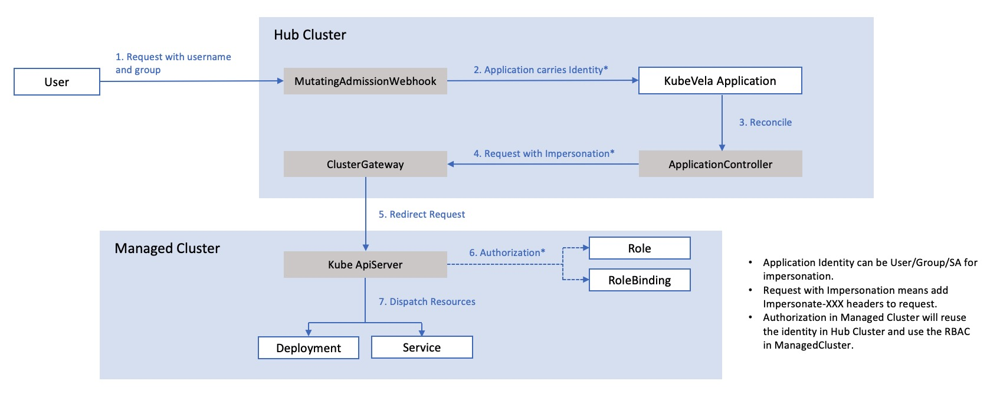

KubeVela introduces Authentication & Authorization for application delivery and management from v1.4. This article will deep dives in the underlying mechanism and demonstrates how it works.

> This underlying mechanism mainly focuses on the KubeVela application. VelaUX builds additional authentication and authorization layer on top of it.

> This article discusses the KubeVela Authentication & Authorization in a relatively wide range, including the design, implementation and advanced usage. Reading through all of them and comprehend the materials are not required to use it.

## Background Knowledge

KubeVela Authentication & Authorization mechanism is coherent with the native Kubernetes [Authentication mechanism](https://kubernetes.io/docs/reference/access-authn-authz/authentication/) and [RBAC Authorization mechanism](https://kubernetes.io/docs/reference/access-authn-authz/rbac/). KubeVela developers and operators can directly reuse the identity and access control from the underlying Kubernetes system without the need of learning or setting up new configurations.

To fully understand the working mechanism of KubeVela Authentication and Authorization, learning basic Kubernetes concepts would be helpful.

### Identity

KubeVela mainly works on two types of identity, one is the User/Groups and the other one is the ServiceAccount.

Usually, User/Groups information are embedded in the X.509 Certificates, where CN (Common Name) and O (Organization) in the Certificate indicate User and Groups [respectively](https://kubernetes.io/docs/reference/access-authn-authz/authentication/#x509-client-certs).

On the other hand, ServiceAccount is usually indicated by the Bearer Token of your KubeConfig, different from the X.509 Certificate. The ServiceAccount identity requires a real entity in Kubernetes cluster while User/Groups do not need that.

If you want to use the ServiceAccount identity in KubeVela applications, you need to create the ServiceAccount in Kubernetes first. But to use the User/Groups, you only need a proper X.509 Certificate based KubeConfig carrying the User/Groups fields (which you can generate by OpenSSL or Vela CLI). 

For the most time, when you setup your own Kubernetes cluster through either tools like KinD/Minikube/K3s or cloud providers like EKS(Amazon) / ACK (Alibaba) / GKE (Google), you will get a KubeConfig based on X.509 Certificate which embeds User/Groups like `system:admin`, `kuberetes-amdin`, `system:users`, `system:masters`, etc. They will be bound to the `cluster-admin` ClusterRole which gives you the full privileges to manage your Kubernetes cluster.

### Privileges

The access control for identity in KubeVela application is totally based on the native Kubernetes RBAC (Role-Based Access Control) mechanism. That means the RoleBinding/ClusterRoleBinding entities define what the identities can & cannot do. You could use either native ways such as using `kubectl` to apply YAML files or using Vela CLI to bind pre-defined privileges to identities.

No matter which way you use, the source of truth is always the Kubernetes objects, including Roles, RoleBindings, ClusterRoles and ClusterRoleBindings, depending on the scope of the privileges. KubeVela does not introduce any additional privilege objects. So there is no consistency problem between KubeVela and the backing Kubernetes.

## Managing through Vela CLI

In KubeVela, Vela CLI provides a series of convenient commands to help you manage these identities and their privileges.

### Generating KubeConfig

If you ever tried to generate your own KubeConfig using OpenSSL or based on existing ServiceAccount, you will find the process is a bit complex and hard to remember. You can write shell scripts to automate the process but if you do not have that script yet, you can try the Vela CLI commands.

The `vela auth gen-kubeconfig` command can generate X.509 based KubeConfig or ServiceAccount token based KubeConfig.
```bash
# This will generate a kubeconfig for user `new-user`
$ vela auth gen-kubeconfig --user new-user

# This will generate a kubeconfig for user `new-user` in group `kubevela:developer` and `my-org:my-team`
$ vela auth gen-kubeconfig --user new-user --group kubevela:developer --group my-org:my-team

# This will generate a kubeconfig for the ServiceAccount default in demo namespace
$ vela auth gen-kubeconfig --serviceaccount default -n demo
```

For the X.509 based KubeConfig, the command will generate a pair of RSA Public Key and Private Key first, and create a CSR (CertificateSigningRequest) in the Kubernetes. The CSR carries a subject that uses the Kubernetes User as the Common Name and the Kubernetes Groups as the Organizations. After the CSR is created, the Vela CLI command will approve it automatically and the signed certificate in the CSR will then be extracted into the newly generated KubeConfig. Finally, you will get a new KubeConfig that will be properly recognized by your Kubernetes.

For the ServiceAccount based KubeConfig, the command will find the secret of the target ServiceAccount and embed its token into the newly generated KubeConfig. This process is much lighter but requires the ServiceAccount to exist first.

KubeVela recommends you to use the User/Groups based KubeConfig, since this method will not bother you creating or recycling ServiceAccount objects.

### Listing Privileges

In Kubernetes, if you want to know the privileges somebody has, you need to go through the RoleBindings/ClusterRoleBindings and find out all Roles/ClusterRoles that bound to it. Then you need to check all these role objects and see the privileges inside. This laborious process is more painful in KubeVela, since KubeVela supports multi-clusters which means the same work has to be done repeatedly.

Fortunately for KubeVela users, to alleviate the burden of looping over all the related role/rolebinding objects, Vela CLI provides `vela auth list-privileges` command to help you inspect privileges across multi-clusters. All you need is to give `--cluster` args. With this command, you can not only check the privileges of a single User or ServiceAccount, it is also possible to detect the identity in your KubeConfig and show the related privileges to the KubeConfig as well.

```bash
# This will show all the privileges User alice has
$ vela auth list-privileges --user alice
  
# This will show all the privielges Group org:dev-team has
$ vela auth list-privileges --group org:dev-team
  
# This will show all the privileges User alice has in two managed clusters
$ vela auth list-privileges --user alice --cluster managedcluster1,managedcluster2
 
# This will show all the privileges ServiceAccount demo/default has
$ vela auth list-privileges --serviceaccount default -n demo
  
# This will show all the privileges for the given kubeconfig
$ vela auth list-privileges --kubeconfig ./example.kubeconfig
```

The Vela CLI command will display the roles/rolebindings in the tree format, which provides a direct and transparent view for all the privileges the target identity has.

```bash
$ vela auth list-privileges --kubeconfig ~/.kube/config
User=system:admin Groups=system:masters
└── [Cluster]  local
    └── [ClusterRole]  cluster-admin
        ├── [Scope]  
        │   └── [Cluster]  (ClusterRoleBinding cluster-admin)
        └── [PolicyRules]  
            ├── APIGroups:       *
            │   Resources:       *
            │   Verb:            *
            └── NonResourceURLs: *
                Verb:            *
```

### Granting Privileges

One of the most common way for system operators to manage users is to divide the cluster resources by namespaces and assign users to their namespaces. To achieve that, system operators usually create a namespace first, and then create roles and rolebindings in the namespace for the target user. For multi-cluster scenario, this operation also need to be repeated several times. With `vela auth grant-privileges`, you can automate these operations in multi-clusters and use only one single command to grant all required privileges.

```bash
# Grant privileges for User alice in the namespace demo in managed clusetrs, create demo namespace if not exist
$ vela auth grant-privileges --user alice --for-namespace demo --for-cluster managedcluster1,managedcluster2 --create-namespace
  
# Grant cluster-scoped privileges for Group org:dev-team
$ vela auth grant-privileges --group org:dev-team
```

The `grant-privileges` command will first check the existence of the target namespace. The namespace will be created if not exists and `--create-namespace` flag is used. Then it will create a ClusterRole that allows user to do Read/Write actions to any resources in that namespace. The target identity will be bound to that ClusterRole through a RoleBinding or ClusterRoleBinding, depending on which scope would like to be granted. Finally, the whole process will be repeated in all the specified clusters.

Sometimes, you might want to grant readonly access to user. In this case, you need to use the `--readonly` flag.

```bash
# Grant read privileges for ServiceAccount observer in test namespace
$ vela auth grant-privileges --serviceaccount observer -n test --for-namespace test --readonly
```

Notice that Vela CLI only provides coarse-grained privileges management. If you would like to manage fine-grained privileges such as grant specific resource privileges, you can refer to the native Kubernetes RBAC managements. KubeVela also provides `vela kube apply --cluster` command to help you propagate your YAML object files into multi-clusters.

> Vela CLI does not provide commands for revoking privileges by now. If you need to revoke privileges, you can edit the corresponding RoleBindings/ClusterRoleBindings and remove the bound identity from them. If you just want to delete those bindings, you could use `vela kube delete --cluster` to delete in multi-clusters quickly.


## Diving into the Application

When Application Authentication is enabled in KubeVela, applications will not use KubeVela Controller's privileges to dispatch resources anymore. Instead, it will use the privileges of the identity who lastly created or modified it. It will prevent users to escalate their privileges through creating applications that manage resources outside their own privileges.



The whole implementation process is based on the Kubernetes [impersonation mechanism](https://kubernetes.io/docs/reference/access-authn-authz/authentication/#user-impersonation).

### Bind Identity to Application

When users create requests for applications (such as creating a new application or modifying existing applications), the mutating request will be firstly handled by Application MutatingAdmissionWebhook in KubeVela. The webhook will extract the UserInfo from the request and record it in the Application annotations. The webhook will prevent the user from disguising other users.

> Theoretically, if the user has the privileges to impersonate as other users, it could create applications through `kubectl apply --as=other-user`. The identity will first be handled by the kube-apiserver, where impersonation will be handled. Then the application webhook will receive the impersonated request from the kube-apiserver as the user `other-user`. At this time, the application will be bound to `other-user` instead of the original one. This can be useful when admin users want to debug/test as other users.

### Impersonate as bound Identity

When handling resources, KubeVela controller will send requests with impersonation header targeting at the bound identity, which means the kube-apiserver will process those resource requests using the impersonated identity. As for the single cluster scenario, the request will be handled properly by now.

For the multi-cluster scenario, the process is more complex. After the request is impersonated in the kube-apiserver of the control plane, it will be redirected to the cluster-gateway service.

The cluster-gateway service will then put the identity of the request (which carries the impersonated identity from the kube-apiserver, in other word, the original user) in the impersonation header again. The request from cluster-gateway to the kube-apiserver in the managed cluster will use the registered identity which is used when joining that managed cluster (this is usually an admin identity in managed cluster). Finally the request will be impersonated and handled in the managed cluster kube-apiserver properly. 

### Identity Flow

The whole process is shown in the following figure in detail.


## Discussion

### Limited Controller Access

When application authentication is enabled in KubeVela, the privileges of KubeVela controller are also restricted. Before it is enabled, the KubeVela controller will uses a ServiceAccount that bound to the cluster-admin ClusterRole, which gives the KubeVela controller all the privileges to manage clusters.

After the application authentication is enabled, the privileges of the KubeVela controller is also reducted. Since all the resource dispatch action will use the identity of the application, the KubeVela controller only needs the privileges to impersonate as the specified ideneity. Apart from that, there are still some other privileges that are required for KubeVela controller to manage system-level resources, like ResourceTracker.

In detail, for different operations of KubeVela application controller, some are impersonated and some are not. For example, the privileges such as accessing all the ResourceTrackers can be overlarge for ordinary users to have, so usually we do not give that privilege to users and keep this privilege to be limited for the controller. Below is a list of operations and whether they are impersonated.

- Reading X-Definitions for Rendering: Not Impersonated 
- Reading Kubernetes Objects for Reference: Impersonated
- Dispatching and Managing Resources (Create/Update/Delete): Impersonated
- StateKeeping and Recycling Resources: Impersonated
- Collecting Resources Health Status: Impersonated
- Creating and Recycling ComponentRevisions: Impersonated
- Creating and Recycling ApplicationRevisions: Not Impersonated
- Creating, Updating and Recycling ResourceTrackers: Not Impersonated

The not impersonated operations will still use the controller's identity, while the impersonated ones will use the bound identity in each Application.

### Identity Penetration

The multi-cluster application impersonation in KubeVela relies on the ClientIdentityPeneration in ClusterGateway. With this feature, ClusterGateway will always extract the identity from the incoming request and put it in the impersonation header on the request that is redirected to the managed cluster.

This can not only help KubeVela application to reuse the same identity across clusters, but also prevents any unauthorizationed access to managed clusters through ClusterGateway and secures the managed cluster access on the control plane.

However, there are limitations for this feature that identity used across multi-clusters must be consistent. For example, you cannot let the KubeVela application to act as alice in the cluster-1 but act as bob in cluster-2. That will require identity exchange or projection, which is supported in neither ClusterGateway nor KubeVela controller by now.

### Partial Identity Impersonation

By default, KubeVela does not pass all the identity information to the impersonation header. You can control it through controller's bootstrap parameters, or helm values.

| Controller Flags             | Helm Values                  | Type    | Default            | Explanation                                                                                                                                                                                                                                                                                                                                                                |
|------------------------------|------------------------------|---------|--------------------|----------------------------------------------------------------------------------------------------------------------------------------------------------------------------------------------------------------------------------------------------------------------------------------------------------------------------------------------------------------------------|
| authentication-with-user     | .authentication.withUser     | boolean | false              | If this flag is set to false, the User field in the identity will not be passed in the impersonation. Only selected groups will be passed. In the cases that managed clusters and the control plane are operated by different people, the control plane operator might not want to let the managed cluster knows the projection relationship between its Users and Groups. |
| authentication-default-user  | .authentication.defaultUser  | string  | kubevela:vela-core | If User field in the identity is not used for the impersonation, this field will be used for impersonated user as alternative.                                                                                                                                                                                                                                             |
| authentication-group-pattern | .authentication.groupPattern | string  | kubevela:*         | This field defines the pattern of groups that will be passed in the impersonation header from the identity. This will help the control plane operator to limit which groups should be passed into the request to the managed cluster.                                                                                                                                      |

In brief, if you have the lowest requirements to the transparency of your identity information (for example the hub cluster and managed clusters are operated by the same team), you can set `--authentication-with-user=true` and `--authentication-group-pattern=*`. The default configuration uses the most secure and opaque options.

### Access Resources with Limited Privileges

Some resources in KubeVela are data sensitive. For example, the ResourceTracker object in KubeVela records all the objects that are dispatched in the application. The secrets that records the managed clusters contain the credential information for accessing. Usually, the system operator may not want to expose all these information to ordinary users.

[vela-prism](https://github.com/kubevela/prism) is a project that aims to solve this problem. You can install it by following the installation guide in the repo.

The vela-prism provides alternative access to the data sensitive objects like ResourceTrackers and Cluster Secrets.


The original ResourceTracker in KubeVela is a cluster-scoped resource which records all the applied resources of the application and tracks them during application updating and recycling. 

Allowing user to access cluster-scoped ResourceTrackers can be dangerous, since users will have privileges to read objects dispatched by other users' applications. The ApplicationResourceTracker, served by vela-prism, provides a namespaced-scoped access to the ResourceTracker object, which means access can be restricted by namespaces. One of the benefit of using vela-prism is that you could run `vela status <appname> -n <namespace> --tree --detail` to see the details of applied resources, even with limited privileges.

The vela-cluster object similarly provides an alternative access to the cluster secret. It removed the sensitive credential fields which allows users to see what managed clusters are joined, without knowing the credentials to access them. You can run `kubectl get clusters` after installing vela-prism, you could get all the joined clusters the same as `vela cluster list` (which needs the privileges of accessing cluster secret directly).

### Design Principles

The overall design of the KubeVela's authentication & authorization in controllers follows the principles of reusing and being coherent to the native Kubernetes mechanism. KubeVela do not do extra authentication by itself since that will increase the learning burden of KubeVela users. Instead, by leveraing the impersonation mechanism, KubeVela controller defers the admission check to Kubernetes api-server, and so does the cluster-gateway.

The authentication & authorization in VelaUX, on the other hand, focus more on the admission checks of upper layer entities, like Projects or Targets. It reuses the underlying admission check for Applications and their resources.
