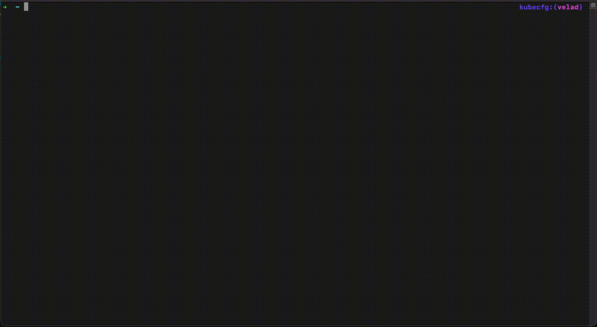

:::tip
Before reading this part, please make sure you've learned the [Definition Concept](../../getting-started/definition) of KubeVela.
:::

In KubeVela CLI, `vela def` command group provides a series of convenient definition writing tools. With these commands, users only need to write CUE files to generate and edit definitions, instead of composing Kubernetes YAML object with mixed CUE string.

## init

`vela def init` is a command that helps users bootstrap new definitions. To create an empty trait definition, run:

```bash
vela def init my-trait -t trait --desc "My trait description."
```

It will generate the following scaffold:

```cue
"my-trait": {
        annotations: {}
        attributes: {
                appliesToWorkloads: []
                conflictsWith: []
                definitionRef:   ""
                podDisruptive:   false
                workloadRefPath: ""
        }
        description: "My trait description."
        labels: {}
        type: "trait"
}
template: patch: {}
```

You can also initiate definitions interactively like below:

```bash
vela def init my-comp --interactive
```

<details>
<summary>expected output</summary>

```bash
Please choose one definition type from the following values: component, trait, policy, workload, scope, workflow-step
> Definition type: component
> Definition description: My component definition.
Please enter the location the template YAML file to build definition. Leave it empty to generate default template.
> Definition template filename: 
Please enter the output location of the generated definition. Leave it empty to print definition to stdout.
> Definition output filename: my-component.cue
Definition written to my-component.cue
```
</details>

In addition, users can create definitions from existing YAML files. For example, if a user want to create a ComponentDefinition which is designed to generate a deployment, and this deployment has already been created elsewhere, he/she can use the `--template-yaml` flag to complete the transformation. The YAML file is as below

```yaml
# my-deployment.yaml
apiVersion: apps/v1
kind: Deployment
metadata:
  name: hello-world
spec:
  replicas: 1
  selector:
    matchLabels:
      app.kubernetes.io/name: hello-world
  template:
    metadata:
      labels:
        app.kubernetes.io/name: hello-world
    spec:
      containers:
      - name: hello-world
        image: somefive/hello-world
        ports: 
        - name: http
          containerPort: 80
          protocol: TCP
---
apiVersion: v1
kind: Service
metadata:
  name: hello-world-service
spec:
  selector:
    app: hello-world
  ports:
  - name: http
    protocol: TCP
    port: 80
    targetPort: 8080
  type: LoadBalancer
```

Running the following command to get the CUE-format ComponentDefinition:

```bash
vela def init my-comp -t component --desc "My component." --template-yaml ./my-deployment.yaml
```

The expect output will be:

```cue
"my-comp": {
        annotations: {}
        attributes: workload: definition: {
                apiVersion: "<change me> apps/v1"
                kind:       "<change me> Deployment"
        }
        description: "My component."
        labels: {}
        type: "component"
}
template: {
        output: {
                metadata: name: "hello-world"
                spec: {
                        replicas: 1
                        selector: matchLabels: "app.kubernetes.io/name": "hello-world"
                        template: {
                                metadata: labels: "app.kubernetes.io/name": "hello-world"
                                spec: containers: [{
                                        name:  "hello-world"
                                        image: "somefive/hello-world"
                                        ports: [{
                                                name:          "http"
                                                containerPort: 80
                                                protocol:      "TCP"
                                        }]
                                }]
                        }
                }
                apiVersion: "apps/v1"
                kind:       "Deployment"
        }
        outputs: "hello-world-service": {
                metadata: name: "hello-world-service"
                spec: {
                        ports: [{
                                name:       "http"
                                protocol:   "TCP"
                                port:       80
                                targetPort: 8080
                        }]
                        selector: app: "hello-world"
                        type: "LoadBalancer"
                }
                apiVersion: "v1"
                kind:       "Service"
        }
        parameter: {}

}
```

Then the user can make further modifications based on the definition file above, like removing `<change me>` in **workload.definition**。

## vet

After initializing definition files, run `vela def vet <my-def.cue>` to validate if there are any syntax error in the definition file.

```bash
vela def vet my-comp.cue
```

It can be used to detect some simple errors such as missing brackets.

## apply

After confirming the definition file has correct syntax, users can apply this definition into control plane by:

```
vela def apply my-comp.cue --namespace my-namespace
```

The definition will be applied to the namespace named `my-namespace`, by default the namespace is `vela-system`。

:::tip
When definition applied to `vela-system`, the definition can be used for all applications in this cluster. If definitions are applied in some other namespaces, only the application in the same namespace can use that. It's useful when in multi-tenant cases.
:::

## dry-run

If you want to check the transformed Kubernetes API format, you can use `--dry-run` can achieve that.

```
vela def apply my-comp.cue --dry-run
```

<details>
<summary>expected output</summary>

```yaml
apiVersion: core.oam.dev/v1beta1
kind: ComponentDefinition
metadata:
  annotations:
    definition.oam.dev/description: My component.
  labels: {}
  name: my-comp
  namespace: vela-system
spec:
  schematic:
    cue:
      template: |
        output: {
                metadata: name: "hello-world"
                spec: {
                        replicas: 1
                        selector: matchLabels: "app.kubernetes.io/name": "hello-world"
                        template: {
                                metadata: labels: "app.kubernetes.io/name": "hello-world"
                                spec: containers: [{
                                        name:  "hello-world"
                                        image: "somefive/hello-world"
                                        ports: [{
                                                name:          "http"
                                                containerPort: 80
                                                protocol:      "TCP"
                                        }]
                                }]
                        }
                }
                apiVersion: "apps/v11"
                kind:       "Deployment"
        }
        outputs: "hello-world-service": {
                metadata: name: "hello-world-service"
                spec: {
                        ports: [{
                                name:       "http"
                                protocol:   "TCP"
                                port:       80
                                targetPort: 8080
                        }]
                        selector: app: "hello-world"
                        type: "LoadBalancer"
                }
                apiVersion: "v1"
                kind:       "Service"
        }
        parameter: {}
  workload:
    definition:
      apiVersion: apps/v1
      kind: Deployment
```

</details>


## get

While you can use native kubectl tools to confirm the results of the apply command, as mentioned above, the YAML object mixed with raw CUE template string is complex. Using `vela def get` will automatically convert the YAML object into the CUE-format definition.

```bash
vela def get my-comp
```

## list

You can list all definitions installed through:

```
vela def list
```

You can filter type by:

- List component only:
  ```
  vela def list -t component
  ```
- List trait only:
  ```
  vela def list -t trait
  ```  
- List workflow step only:
  ```
  vela def list -t workflow-step
  ```  
- List policy only:
  ```
  vela def list -t policy
  ```  

## edit

Using `vela def edit` to edit definitions in pure CUE-format. The transformation between CUE-format definition and YAML object is done by the command. Besides, you can specify the `EDITOR` environment variable to use your favorite editor.

```bash
EDITOR=vim vela def edit my-comp
```

## delete

`vela def del` can be utilized to delete existing definitions.

```bash
$ vela def del my-comp -n my-namespace  
Are you sure to delete the following definition in namespace my-namespace?
ComponentDefinition my-comp: My component.
[yes|no] > yes
ComponentDefinition my-comp in namespace my-namespace deleted.
```

A brief quick view for these commands are shown below.



## debug with applications

When we want to debug definition with application, we can use `vela dry-run --definitions` or `-d` for short, to specify local definitions.

Dry run will help you to understand what are the real resources which will to be expanded and deployed to the Kubernetes cluster. In other words, it will mock to run the same logic as KubeVela's controller and output the results locally.

For example, let's dry-run the following application:

```yaml
# app.yaml
apiVersion: core.oam.dev/v1beta1
kind: Application
metadata:
  name: vela-app
spec:
  components:
    - name: express-server
      type: my-comp
```

Use dry run for test:

```
vela dry-run -f app.yaml -d my-comp.cue
```

:::caution
Before KubeVela CLI 1.6.2, you can only use definition in Kubernetes API format.

```
vela dry-run -f app.yaml -d my-comp.yaml
```
:::

<details>
<summary>expected output</summary>

```
---
# Application(vela-app) -- Component(express-server)
---

apiVersion: apps/v1
kind: Deployment
metadata:
  annotations: {}
  labels:
    app.oam.dev/appRevision: ""
    app.oam.dev/component: express-server
    app.oam.dev/name: vela-app
    app.oam.dev/namespace: default
    app.oam.dev/resourceType: WORKLOAD
    workload.oam.dev/type: my-comp
  name: hello-world
  namespace: default
spec:
  replicas: 1
  selector:
    matchLabels:
      app.kubernetes.io/name: hello-world
  template:
    metadata:
      labels:
        app.kubernetes.io/name: hello-world
    spec:
      containers:
      - image: somefive/hello-world
        name: hello-world
        ports:
        - containerPort: 80
          name: http
          protocol: TCP

---
## From the auxiliary workload
apiVersion: v1
kind: Service
metadata:
  annotations: {}
  labels:
    app.oam.dev/appRevision: ""
    app.oam.dev/component: express-server
    app.oam.dev/name: vela-app
    app.oam.dev/namespace: default
    app.oam.dev/resourceType: TRAIT
    trait.oam.dev/resource: hello-world-service
    trait.oam.dev/type: AuxiliaryWorkload
  name: hello-world-service
  namespace: default
spec:
  ports:
  - name: http
    port: 80
    protocol: TCP
    targetPort: 8080
  selector:
    app: hello-world
  type: LoadBalancer

---
```

</details>


## Next Step

* Learn more about [defining customized component](../components/custom-component).
* Learn more about [defining customized trait](../traits/customize-trait).
