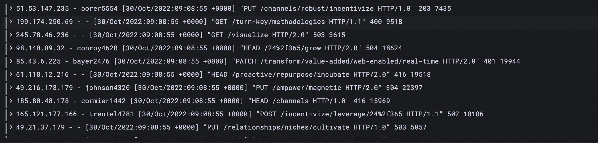
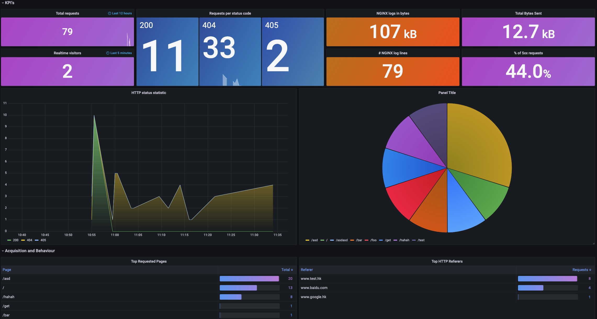

The application's log is very important to helps users quickly find and troubleshoot problems of online. This doc will introduce how to use `loki` addon to collecting application's log and viewing them.

## Quick start

The loki addon can be enabled by two modes: Collecting all applications' log by default or Collecting by specify.

### Enable the loki addon

#### Enable addon with mode of collecting all logs (Full collection mode)

```shell
vela addon enable loki agent=vector
```

After the addon is enabled, a [loki](https://github.com/grafana/loki) service will be deployed in the control plane as a log storage data source, and a log collection agent [vector](http://vector.dev/) will be deployed on the nodes of each cluster to collect the stdout of pods on the nodes.

:::tip
Enabling loki addon by this mode. The stdout of the application can be collected without configuring any traits, and the logs can be transmitted to the loki service of the control plane to storage. The most advantage of this mode is that the configuration is simple.
But the disadvantage are:
1. Collecting all running pods will cause a lot of pressure on the loki service when there are too many applications. On the one hand, too many logs need to be persisted, wasting a lot of hard disk resources. On the other hand, the vector agents of each cluster need to transmit the collected logs to the loki service, which will consume a lot of bandwidth.
2. The full collection mode can only collect logs in a unified way, and cannot perform special processing on the log content of different applications.
:::

#### Collecting by specify

Enable loki addon by setting parameter `agent=vector-controller`:

```shell
vela addon enable loki agent=vector-controller
```

:::tip
After specifying the `agent=vector-controller` parameter to enable the addon, the application's logs will not be collected by default, and the application needs to configure special trait to enable it. And this trait supports configuring the vector VRL configuration to perform specific processing on the log content. The following chapters will introduce this part in detail.
:::

### Enable the grafana addon

```shell
vela addon enable grafana
```

:::tip
Even if you have enabled the grafana addon as described in the [Automation Observability Documentation](./observability), you still need to re-enable the addon to register the loki  data source to grafana.
:::

## Kubernetes system events logs

After the loki addon is enabled, a component will be installed in each cluster, which is responsible for collecting Kubernetes events and converting them to logs transmit to loki. You can also view and analyze the events of the system through the Kubernetes events dashboard in the grafana addon.


<details>
    KubeVela Events dashboard

    ---

    **Kubernetes Event overview** Displays the number of latest Kubernetes events in each time period of the system.

    ---

    **Warning Events** The number of `Warning` type events.

    ---

    **Image Pull Failed/Container Crashed .../Pod Evicted** The number of events that indicate application failures, such as image pull failure and pod eviction in the last 12 hours.

    ---

    **TOP 10 Kubernetes Events** Top 10 types of events with the highest number of occurrences in the last 12 hours.

    ---

    **Kubernetes Events Source** Pie chart of the controllers producing these events.

    ---

    **Kubernetes Events Type** Pie chart of involved resource object types of events.

    ---

    **Kubernetes Live Events ** The recent event logs.

</details>

## Collecting stdout log

As mentioned above, if the full collection mode is selected when the addon is enabled, the of stdout logs of the container can be collected without any special configuration of the application. This section mainly introduces how to collect stdout logs when the mode is `collecting by specify`.

Configure the `stdout-logs-collector` trait in the component, as follows:

```yaml
apiVersion: core.oam.dev/v1beta1
kind: Application
metadata:
  name: app-collect-stdout
  namespace: default
spec:
  components:
    - name: flog
      type: webservice
      properties:
        cmd:
          - flog
        image: mingrammer/flog
      traits:
        type: stdout-logs-collector
```

After the application is created, you can find the deployment resource created by the application in the application dashboard of grafana, click `Detail` button to jump to the deployment resource dashboard, and find the log data below. as follows:



### nginx access log analyze

If your application is a nginx gateway, the `stdout-logs-collector` trait provide the capability to parse nginx [combined](https://docs.nginx.com/nginx/admin-guide/monitoring/logging/) format log to json format. As follows:

```yaml
apiVersion: core.oam.dev/v1beta1
kind: Application
metadata:
  name: nginx-app-2
spec:
  components:
    - name: nginx-comp
      type: webservice
      properties:
        image: nginx:1.14.2
        ports:
          - port: 80
            expose: true
      traits:
        - type: stdout-logs-collector
          properties:
            parser: nginx
```

Then a special nginx access log analysis dashboard will be generated as follows:



<details>
    KubeVela nginx application dashboard

    ---

    **KPI's** Contains the gateway's core key metrics, such as total request traffic in the last twelve hours, and percentage of 5xx requests.

    ---

    **HTTP status statistic** Statistics of the number of requests for each request code.

    ---

    **Top Request Pages** Statistics of the most visited pages.


</details>

### Customize log processing configuration

You can also set customize parse configuration for your application log in this trait. As follows:

```yaml
apiVersion: core.oam.dev/v1beta1
kind: Application
metadata:
  name: nginx-app-2
spec:
  components:
    - name: nginx-comp
      type: webservice
      properties:
        image: nginx:1.14.2
        ports:
          - port: 80
            expose: true
      traits:
        - type: stdout-logs-collector
          properties:
            parser: customize
            VRL: |
              .message = parse_nginx_log!(.message, "combined")
              .new_field = "new value"
```

In this example, we transform nginx `combinded` format logs to json format, and adding a `new_field` json key to each log, the json value is `new value`. Please refer to [document](https://vector.dev/docs/reference/vrl/) for how to write vector VRL.

If you have a special log analysis dashboard for this processing method, you can refer to [document](./observability) to import it into grafana.

## Collecting file log

The loki addon also support to collect file logs of containers. As follows:

```yaml
apiVersion: core.oam.dev/v1beta1
kind: Application
metadata:
  name: app-vector
  namespace: default
spec:
  components:
    - name: my-biz
      type: webservice
      properties:
        cmd:
          - flog
          - -t
          - log
          - -o
          - /data/daily.log
          - -d
          - 10s
          - -w
        image: mingrammer/flog
      traits:
        - properties:
            path: "/data/daily.log"
          type: file-logs-collector
```

In the example, we let business log of the `my-biz` component write to the `/data/daily.log` path in the container. After the application is created, you can view the corresponding file log results through the `deployment` dashboard.

:::tip
It should be noted that the logs that need to be collected mustn't is in the root directory of the container, otherwise it may cause the container to fail to start.
:::
