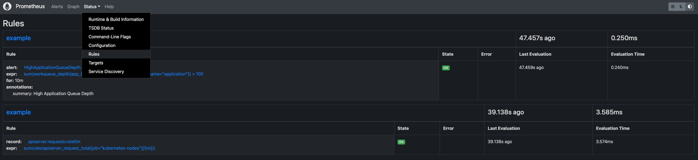

## Customized Prometheus Installation

If you want to make customization to your prometheus-server installation, you can put your configuration into an individual ConfigMap, like `my-prom` in namespace o11y-system. To distribute your custom config to all clusters, you can also use a KubeVela Application to do the job.

### Recording Rules

For example, if you want to add some recording rules to all your prometheus server configurations in all clusters, you can firstly create an application to distribute your recording rules as below.

```yaml
# my-prom.yaml
apiVersion: core.oam.dev/v1beta1
kind: Application
metadata:
  name: my-prom
  namespace: o11y-system
spec:
  components:
    - type: k8s-objects
      name: my-prom
      properties:
        objects:
          - apiVersion: v1
            kind: ConfigMap
            metadata:
              name: my-prom
              namespace: o11y-system
            data:
              my-recording-rules.yml: |
                groups:
                  - name: example
                    rules:
                      - record: apiserver:requests:rate5m
                        expr: sum(rate(apiserver_request_total{job="kubernetes-nodes"}[5m]))
  policies:
    - type: topology
      name: topology
      properties:
        clusterLabelSelector: {}
```

Then you need to add `customConfig` parameter to the enabling process of the prometheus-server addon, like

```shell
vela addon enable prometheus-server thanos=true serviceType=LoadBalancer storage=1G customConfig=my-prom
```

Then you will be able to see the recording rules configuration being delivered into all prometheus instances.

### Alerting rules & Other configurations

To make customization to other configurations like alerting rules, the process is same with the recording rules example shown above. You only need to change/add prometheus configurations in the application.

```yaml
data:
  my-alerting-rules.yml: |
    groups:
    - name: example
      rules:
      - alert: HighApplicationQueueDepth
        expr: sum(workqueue_depth{app_kubernetes_io_name="vela-core",name="application"}) > 100
        for: 10m
        annotations:
          summary: High Application Queue Depth
```



### Custom storage

If you want your prometheus-server to persist data in volumes, you can also specify `storage` parameter for your installation, like

```shell
vela addon enable prometheus-server storage=1G
```

This will create PersistentVolumeClaims and let the addon use the provided storage. The storage will not be automatically recycled even if the addon is disabled. You need to clean up the storage manually.


## Exposing Metrics in your Application

In your application, if you want to expose the metrics of your component (like webservice) to Prometheus, you just need to add the `prometheus-scrape` trait as follows.

```yaml
apiVersion: core.oam.dev/v1beta1
kind: Application
metadata:
  name: my-app
spec:
  components:
    - name: my-app
      type: webservice
      properties:
        image: somefive/prometheus-client-example:new
      traits:
        - type: prometheus-scrape
```

You can also explicitly specify which port and which path to expose metrics.

```yaml
apiVersion: core.oam.dev/v1beta1
kind: Application
metadata:
  name: my-app
spec:
  components:
    - name: my-app
      type: webservice
      properties:
        image: somefive/prometheus-client-example:new
      traits:
        - type: prometheus-scrape
          properties:
            port: 8080
            path: /metrics
```

This will let your application be scrapable by the prometheus server. If you want to see those metrics on Grafana, you need to create Grafana dashboard further. Go to [Visualization](./visualization#dashboard-customization) for learning the following steps.