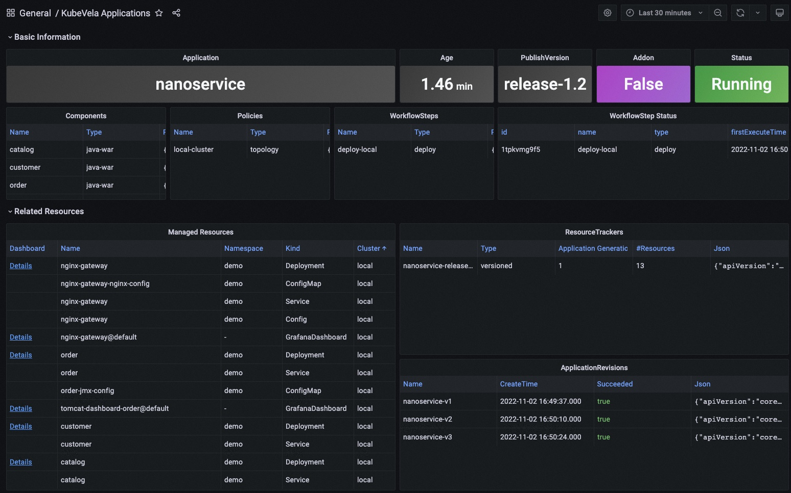

By default, a series of dashboards are pre-installed with the `grafana` addon and provide basic panels for viewing observability data. If you follow the [installation guide](./installation), you should be able to use these dashboards without further configurations.

## Dashboards

### KubeVela Application

This dashboard shows the basic information for one application.

URL: http://localhost:8080/d/application-overview/kubevela-applications

:::info
  The KubeVela Application dashboard shows the overview of the metadata for the application. It directly accesses the Kubernetes API to retrieve the runtime application information, where you can use it as an entrance. You can navigate to detail information for application resources by clicking the `Details` link in the *Managed Resources* panel.

The **Basic Information** section extracts key information into panels and give you the most straightforward view for the current application.

The **Related Resources** section shows those resources that work together with the application itself, including the managed resources, the recorded ResourceTrackers and the revisions.

:::

### Kubernetes Deployemnt

This dashboard shows the overview of native deployments. You can navigate deployments across clusters.

URL: http://localhost:8080/d/kubernetes-deployment/kubernetes-deployment

:::info
  The Kubernetes Deployment dashboard gives you the detail running status for the deployment.

The **Pods** panel shows the pods that the deployment itself is currently managing.

The **Replicas** panel shows how the number of replicas changes, which can be used to diagnose when and how your deployment shifted to undesired state.

The **Resource** section includes the details for the resource usage (including the CPU / Memory / Network / Storage) which can be used to identify if the pods of the deployment are facing resource pressure or making/receiving unexpected traffics.

There are a list of dashboards for various types of Kubernetes resources, such as DaemonSet and StatefulSet. You can navigate to those dashboards depending on your workload type.

:::

### KubeVela System

This dashboard shows the overview of the KubeVela system. It can be used to see if KubeVela controller is healthy.

URL: http://localhost:8080/d/kubevela-system/kubevela-system

:::info
  The KubeVela System dashboard gives you the running details of the KubeVela core modules, including the controller and the cluster-gateway. Other modules like velaux or prism are expected to be added in the future.

The **Computation Resource** section shows the usage for core modules. It can be used to track if there is any memory leak (if the memory usage is continuously increasing) or under high pressure (the cpu usage is always very high). If the memory usage hits the resource limit, the corresponding module will be killed and restarted, which indicates the lack of computation resource. You should add more CPU/Memory for them.

The **Controller** section includes a wide range of panels which can help you to diagnose the bottleneck of the KubeVela controller in your scenario.

The **Controller Queue** and **Controller Queue Add Rate** panels show you the controller working queue changes. If the controller queue is increasing continuously, it means there are too much applications or application changes in the system, and the controller is unable to handle them in time. Then it means there is performance issues for KubeVela controller. A temporary increase for the controller queue is tolerable, but keeping for a long time will lead to memory increase which will finally cause Out-Of-Memory problems.

**Reconcile Rate** and **Average Reconcile Time** panels give you the overview of the controller status. If reconcile rate is steady and average reconcile time is reasonable (like under 500ms, depending on your scenario), your KubeVela controller is healthy. If the controller queue add rate is increasing but the reconcile rate does not go up, it will gradually lead to increase for the controller queue and cause troubles. There are various cases that your controller is unhealthy:

1. Reconcile is healthy but there are too much applications, you will find everything is okay except the controller queue metrics increasing. Check your CPU/Memory usage for the controller. You might need to add more computation resources.
2. Reconcile is not healthy due to too much errors. You will find lots of errors in the **Reconcile Rate** panel. This means your system is continuously facing process errors for application. It could be caused by invalid application configurations or unexpected errors while running workflows. Check application details and see which applications are causing errors.
3. Reconcile is not healthy due to long reconcile times. You need to check **ApplicationController Reconcile Time** panel and see whether it is a common case (the average reconcile time is high), or only part of your applications have problems (the p95 reconcile time is high). For the former case, usually it is caused by either insufficient CPU (CPU usage is high) or too much requests and rate limited by kube-apiserver (check **ApplicationController Client Request Throughput** and **ApplicationController Client Request Average Time** panel and see which resource requests is slow or excessive). For the later case you need to check which application is large and uses lots of time for reconciliations.

Sometimes you might need refer to **ApplicationController Reconcile Stage Time** and see if there is some special reconcile stages are abnormal. For example, GCResourceTrackers use lots of time means there might be blockings for recycling resource in KubeVela system.

The **Application** section shows the overview of the applications in your whole KubeVela system. It can be used to see the changes of the application numbers and the used workflow steps. The **Workflow Initialize Rate** is an auxiliary panel which can be used to see how frequent new workflow execution is launched. The **Workflow Average Complete Time** can further show how much time it costs to finish the whole workflow.

:::

### Kubernetes APIServer

This dashboard shows the running status of all Kubernetes apiservers.

URL: http://localhost:8080/d/kubernetes-apiserver/kubernetes-apiserver

:::info
  The Kubernetes APIServer dashboard helps you to see the most fundamental part for your Kubernetes system. If your Kubernetes APIServer is not running healthy, all of your controllers and modules in your Kubernetes system will be abnormal and unable to handle requests successfully. So it is important to make sure everything is fine in this dashboard.

The **Requests** section includes a series of panels which shows the QPS and latency for various kind of requests. Usually your APIServer could fail to respond if it is flooded by too much requests. At this time, you can see which type of requests is causing trouble.

The **WorkQueue** section shows the process status of the Kubernetes APIServer. If the **Queue Size** is large, it means the number of requests is out of the process capability of your Kubernetes APIServer.

The **Watches** section shows the number of watches in your Kubernetes APIServer. Compared to other types of requests, WATCH requests will continuously consume computation resources in Kubernetes APIServer, so it will be helpful to keep the number of watches limited.

:::

