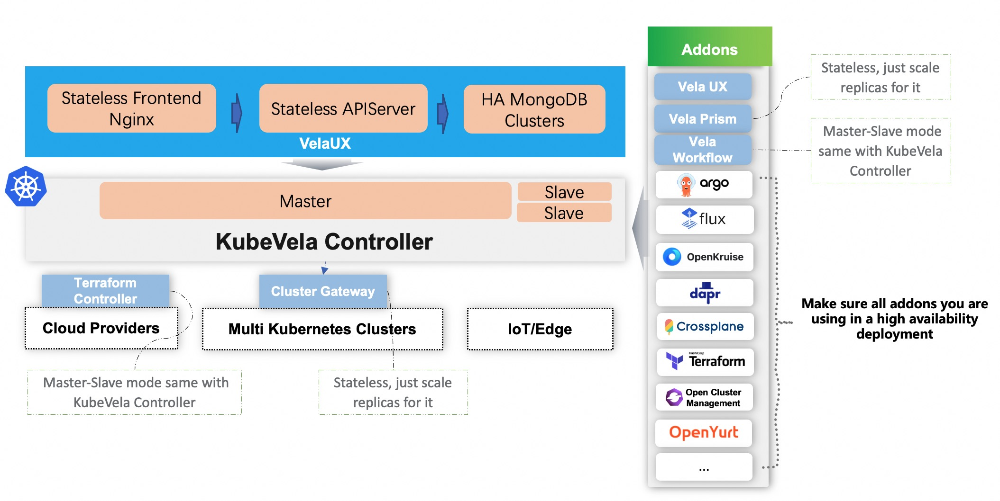

If you're using KubeVela in production, make sure they're deployed in high availability mode like the architecture below.




## KubeVela Core Controller

:::note
First of all, please make sure you have a high availability Kubernetes cluster for all the control plane components.
:::

KubeVela core controller is a standard Kubernetes CRD controller, it uses a master-slave mode for high availability. When set for more than one replicas, it will trigger leader election and make one replica as the master.

The recommend installation is:

```
helm install --create-namespace -n vela-system kubevela kubevela/vela-core --set replicaCount=3 --wait
```

If you have already installed, you can scale up with the command:

```
kubectl scale deploy -n vela-system kubevela-vela-core --replicas=3
```

## Cluster Gateway

The cluster gateway is a stateless component, it installed along with KubeVela core by default. You can scale it up when needed by:

```
kubectl scale deploy -n vela-system kubevela-cluster-gateway --replicas=3
```

## VelaUX

VelaUX is an addon, it composed by 3 major parts: nginx for frontend, APIServer as backend, and its database.

We strongly recommend to use high availability mongodb, mysql or postgresql cluster as the database driver. The frontend and backend are both stateless services, just configure multiple replicas for them. As a result, the high availability installation command just like below:

```
vela addon enable velaux dbType=mongodb dbURL=mongodb://<MONGODB_USER>:<MONGODB_PASSWORD>@<MONGODB_URL> replicas=3
```
You can refer [Setup with the database](../../reference/addons/velaux.md#setup-with-the-database) for more info.