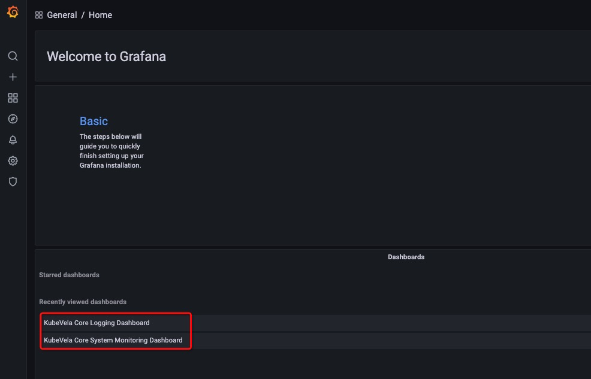

The Observability addon provides system-level monitoring for KubeVela core and business-level monitoring for applications
based on metrics, logging, and tracing data.

The following describes observability capabilities in detail, and how to enable the observability addon and view various
monitoring data.

## Introduction to Observable Capabilities

KubeVela observable capabilities are demonstrated through [Grafana](https://grafana.com/) and provide system-level and
application-level data monitoring.

### Built-in metric category I: KubeVela Core system-level observability

- KubeVela Core resource usage monitoring

1) CPU, memory, and other usage and utilization data


2) Graphical representation of CPU and memory usage and utilization over time (e.g. last three hours), and network bandwidth per second


### Built-in metrics category II: KubeVela Core log monitoring

1) Log statistics

The observable page displays the total number of KubeVela Core logs, as well as the number of `error` occurrences, frequency,
overview of all logs that occur, and details by default.


It also shows the total number and frequency, of `error` log occurrences over time.


2) Logging filter

You can also filter the logs by filling keywords at the top.


## Installing the addon

The observability plugin is installed with the `vela addon` command. Because this plugin relies on Prometheus,
and Prometheus relies on StorageClass, the StorageClass varies to various Kubernetes distribution, so there are some
differences in the installation command across Kubernetes distributions.

### Self-built/regular Kubernetes clusters

Execute the following command to install the observability plugin. The steps are the same for similar clusters, like KinD.

```shell
$ vela addon enable observability alertmanager-pvc-enabled=false server-pvc-enabled=false grafana-domain=example.com
```

### Kubernetes clusters provided by cloud providers

#### Alibaba Cloud ACK

```shell
$ vela addon enable observability alertmanager-pvc-class=alicloud-disk-available alertmanager-pvc-size=20Gi server-pvc-class=alicloud- disk-available server-pvc-size=20Gi grafana-domain=grafana.c276f4dac730c47b8b8988905e3c68fcf.cn-hongkong.alicontainer.
com
```

The meaning of each parameter is as follows.

 - alertmanager-pvc-class

The type of pvc required by 
the Prometheus alert manager, which is the StorageClass. On Alibaba Cloud, pick one from the StorageClass list.

```shell
$ kubectl get storageclass
NAME PROVISIONER RECLAIMPOLICY VOLUMEBINDINGMODE ALLOWVOLUMEEXPANSION AGE
alicloud-disk-available alicloud/disk Delete Immediate true 6d
alicloud-disk-efficiency alicloud/disk Delete Immediate true true 6d
alicloud-disk-essd alicloud/disk Delete Immediate true 6d
alicloud-disk-ssd alicloud/disk Delete Immediate true 6d
```

We set the value as `alicloud-disk-available`.

- alertmanager-pvc-size

The size of the pvc needed by the Prometheus alert manager, on Alibaba Cloud, the minimum PV is 20GB, here it takes the value 20Gi.

- server-pvc-class

The type of pvc required by Prometheus server, same as `alertmanager-pvc-class`.

- server-pvc-size 
  
The size of the pvc required by the Prometheus server, same as `alertmanager-pvc-size`.

- grafana-domain
  
The domain name of Grafana, you can use either your custom domain name, or the cluster-level wildcard domain provided by ACK,
`*.c276f4dac730c47b8b8988905e3c68fcf.cn-hongkong.alicontainer.com`. You can set the value as `grafana.c276f4dac730c47b8b8988905e3c68fcf.cn-hongkong.alicontainer.com`.

#### Kubernetes clusters offered by other cloud providers

Please change the following parameters according to the name and size specifications of the PVCs provided by different
cloud provider's Kubernetes clusters, and the domain rules.

- alertmanager-pvc-class
- alertmanager-pvc-size
- server-pvc-class
- server-pvc-size
- grafana-domain

## View monitoring data

### Get an account for the monitoring dashboard

```shell
$ kubectl get secret grafana -o jsonpath="{.data.admin-password}" -n observability | base64 --decode ; echo
<password printed here>
```

Using username `admin` and the password above to login to the monitoring dashboard below.

### Get the monitoring url

- Self-built/regular clusters

```shell
$ kubectl get svc grafana -n vela-system
NAME TYPE CLUSTER-IP EXTERNAL-IP PORT(S) AGE
grafana ClusterIP 192.168.42.243 <none> 80/TCP 177m

$ sudo k port-forward service/grafana -n vela-system 80:80
Password:
Forwarding from 127.0.0.1:80 -> 3000
Forwarding from [::1]:80 -> 
3000
```

Visit [http://127.0.0.1/dashboards](http://127.0.0.1/dashboards) and click on the corresponding Dashboard to view the
various monitoring data introduced earlier.


- Kubernetes clusters provided by cloud providers

Access the Grafana domain set up above directly to view the various monitoring data described earlier.

### View monitoring data for various categories

On the Grafana home page, click on the console as shown to access the monitoring data for the appropriate category.

The KubeVela Core System Monitoring Dashboard is the KubeVela Core system-level monitoring console.
The KubeVela Core Logging Dashboard is the KubeVela Core logging monitoring console.

 

