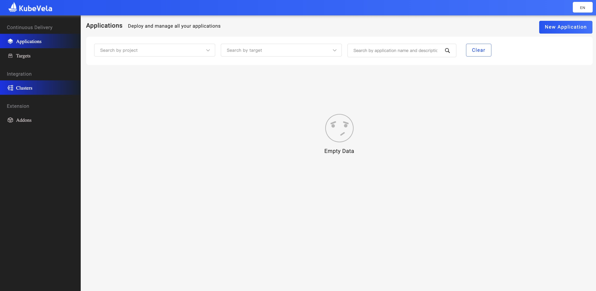
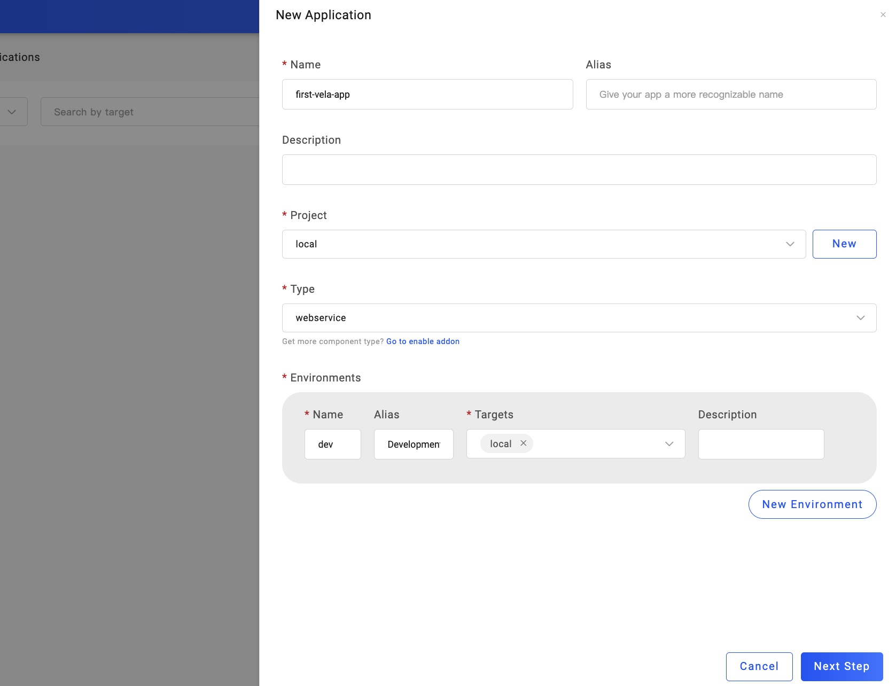
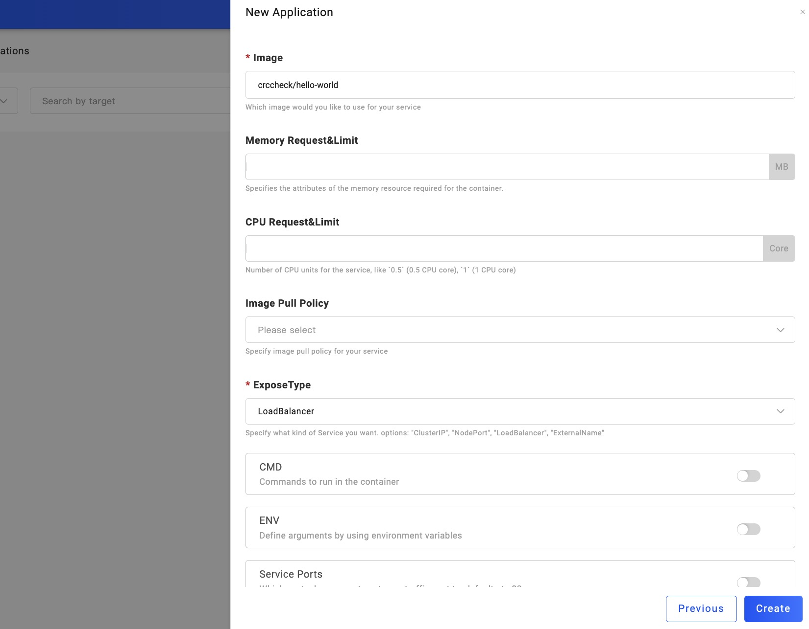
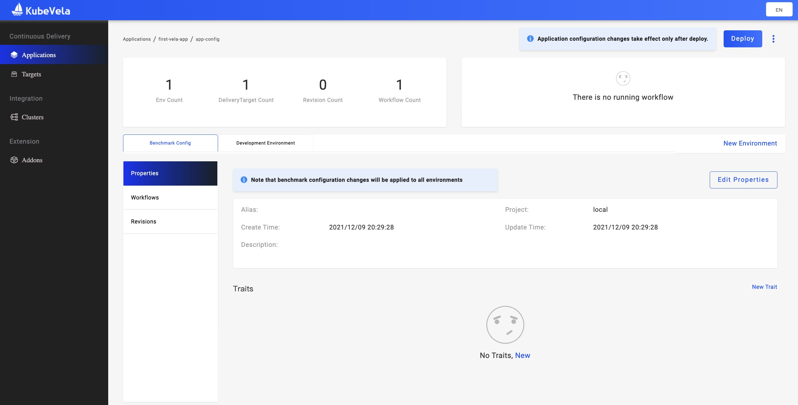
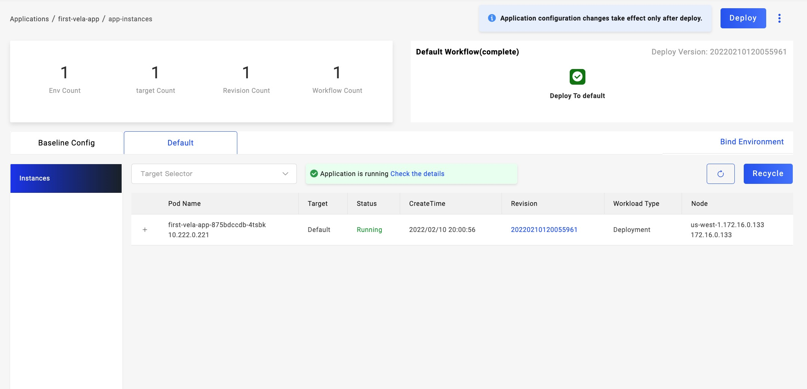
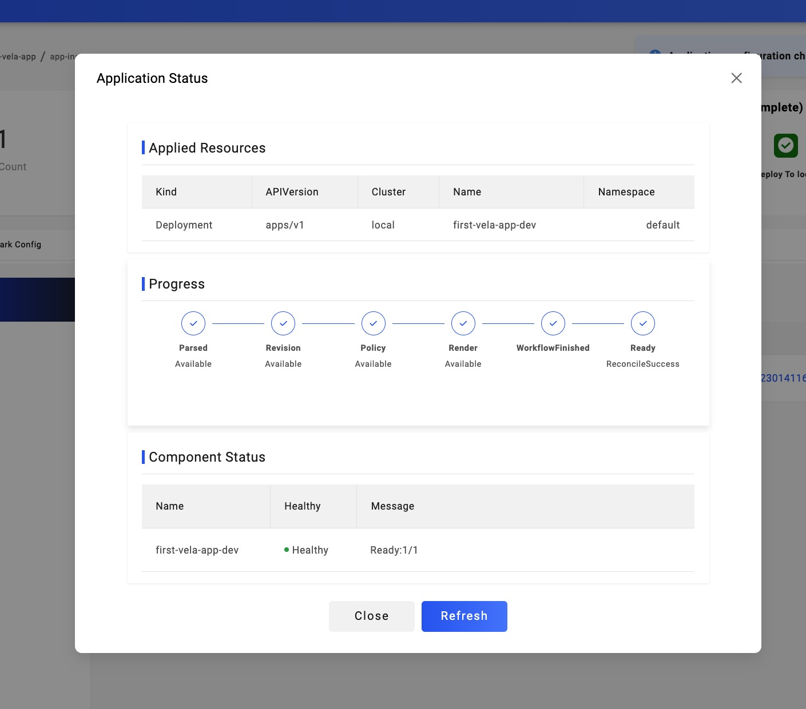

> Before starting, please confirm that you've installed KubeVela Core and VelaUX in the control plane cluster based on [Install from Kubernetes cluster](./install.mdx) 

Welcome to KubeVela! In this section, we show you how to deliver your first app via VelaUX.

Follow these steps:
1. Prepare a Docker image. we use [crccheck/hello-world](https://hub.docker.com/r/crccheck/hello-world) for this time. Double-check if you're able to download it properly.
2. Create the first `Application`.
3. Check out the status of the Application's instance.

You'll get to know:
- Get familiar with core concepts as [Application](./getting-started/core-concept#application), [Cluster](getting-started/core-concept#cluster), [Target](getting-started/core-concept#target) and [Project](getting-started/core-concept#project)
- Finished an application delivery by operating VelaUX

##  Choosing deployment type and Environment

After VelaUX is installed, the first page you enter is for managing the app:

Then click the button of `New Application` on the upper-right, type in these things:

- Name and other basic Infos
- Choose the Project. We've created a default Project for you to use or you can click `New` to create your own
- Choose the deployment type. In this case, we use `webservice` to deploy Stateless Application
- Choose your environment. We select `local` Target for dev Environment

## Setting up properties

Next step, we see the page of properties. Configure following:

- Image address `crccheck/hello-world`

> Other properties can be left blank for this case

Confirmed. Notice that this application is only created but not deployed yet. VelaUX defaultly generates [Workflow](./getting-started/core-concept#workflow) and replicas of [Trait](./getting-started/core-concept#trait).

## Executing Workflow to deploy

Click `Development Environment` and switch to the dev environment, deploy it. Or click the deploy button on the upper-right. When the workflow is finished, you'll get to see the list of instances lying within.

In the process of deploying, you can click `Check the details` to view the status of the application:

## Deleting Application

If you want to delete the application when it's no longer used, simply:

1. Enter the page of environment, click `Recycle` to reclaim the resources that this environment used.
2. Go back to the list of applications and click the drop-down menu to remove it. 

That's it! You succeed at the first application delivery. Congratulation!

## Next Step

- View [Continuous Delivery](./deliver-app/k8s-object.mdx) to look on more of what you can achieve with KubeVela
- View [Best Practices](./case-studies/jenkins-cicd) to check out more tutorials