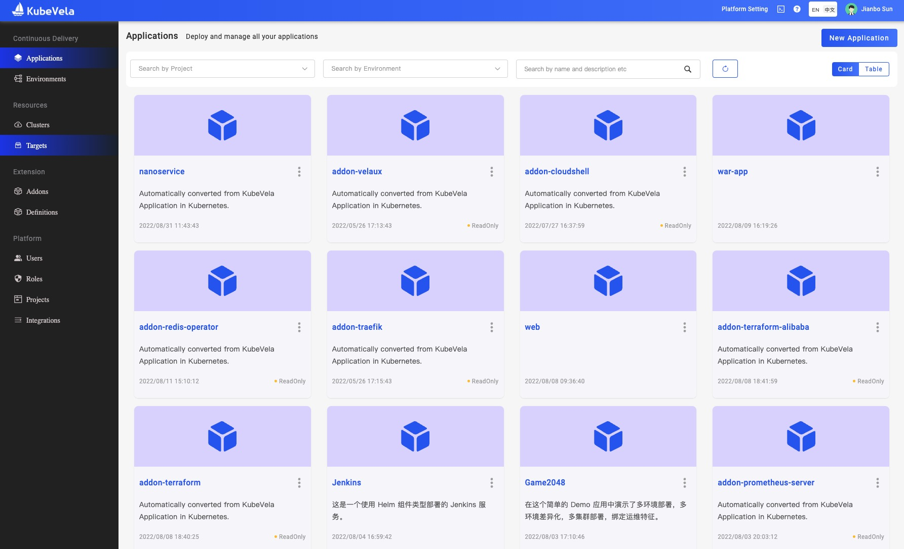

import Tabs from '@theme/Tabs';
import TabItem from '@theme/TabItem';

VelaUX provides the UI console of KubeVela.



## Install

```shell script
vela addon enable velaux
```

expected output:

```
Addon: velaux enabled Successfully.
```

VelaUX needs authentication. The default username is `admin` and the password is **`VelaUX12345`**. Please must set and remember the new password after the first login.

By default, VelaUX didn't have any exposed port.

## Visit VelaUX by port-forward

Port forward will work as a proxy to allow visiting VelaUX dashboard by local port.

```
vela port-forward addon-velaux -n vela-system
```

Choose `> local | velaux | velaux` for visit.

## Setup with Specified Service Type

There are three service types for VelaUX addon which aligned with Kubernetes service, they're `ClusterIP`, `NodePort` and `LoadBalancer`.

By default the service type is ClusterIP for security.

If you want to expose your VelaUX dashboard for convenience, you can specify the service type.

- `LoadBalancer` type requires your cluster has cloud LoadBalancer available.
  ```shell script
  vela addon enable velaux serviceType=LoadBalancer
  ```
- `NodePort` type requires you can access the Kubernetes Node IP/Port.
  ```shell script
  vela addon enable velaux serviceType=NodePort
  ```

After the service type specified to `LoadBalancer` or `NodePort`, you can obtain the access address through `vela status`:

```
vela status addon-velaux -n vela-system --endpoint
```

The expected output:

```
+----------------------------+----------------------+
|  REF(KIND/NAMESPACE/NAME)  |       ENDPOINT       |
+----------------------------+----------------------+
| Service/vela-system/velaux | http://<IP address> |
+----------------------------+----------------------+
```

## Setup with Ingress domain

If you have ingress and domain available in your cluster, you can also deploy VelaUX by specify a domain like below:

```bash
vela addon enable velaux domain=example.domain.com
```

The expected output:

```
I0112 15:23:40.428364   34884 apply.go:106] "patching object" name="addon-velaux" resource="core.oam.dev/v1beta1, Kind=Application"
I0112 15:23:40.676894   34884 apply.go:106] "patching object" name="addon-secret-velaux" resource="/v1, Kind=Secret"
Addon: velaux enabled Successfully.
Please access the velaux from the following endpoints:
+----------------------------+---------------------------+
|  REF(KIND/NAMESPACE/NAME)  |         ENDPOINT          |
+----------------------------+---------------------------+
| Ingress/vela-system/velaux | http://example.domain.com |
+----------------------------+---------------------------+
```

If you enabled the traefik addon, you can set the `gatewayDriver` parameter to use the Gateway API.

```shell script
vela addon enable velaux domain=example.doamin.com gatewayDriver=traefik
```

If you want to enable VelaUX with SSL:

1. Create the certificate configuration:

```shell
apiVersion: core.oam.dev/v1beta1
kind: Application
metadata:
  annotations:
    config.oam.dev/alias: "VelaUX SSL Certificate"
  labels:
    app.oam.dev/source-of-truth: from-inner-system
    config.oam.dev/catalog: velacore-config
    config.oam.dev/type: config-tls-certificate
  name: velaux-cert
  namespace: vela-system
spec:
  components:
  - name: velaux
    properties:
      cert: <CERT_BASE64>
      key: <KEY_BASE64>
    type: config-tls-certificate
```

Please make sure the certificate matches the domain.

2. Enable VelaUX with domain

```shell
vela addon enable velaux domain=example.doamin.com gatewayDriver=traefik secretName=velaux-cert
```

## Setup with the database

VelaUX supports Kubernetes, MongoDB, MySQL and PostgreSQL as the database. the default is Kubernetes. We strongly advise using the databases other than Kubernetes to power your production environment.

<Tabs className="unique-tabs" groupId="os">
<TabItem label="MongoDB" value="mongodb">

```shell script
vela addon enable velaux dbType=mongodb dbURL=mongodb://<MONGODB_USER>:<MONGODB_PASSWORD>@<MONGODB_URL>
```

You can also deploy the MongoDB with this application configuration:

> Your cluster must have a default storage class.

```yaml
apiVersion: core.oam.dev/v1beta1
kind: Application
metadata:
  name: velaux-db
  namespace: vela-system
spec:
  components:
    - name: velaux-db
      properties:
        chart: mongodb
        repoType: helm
        url: https://charts.bitnami.com/bitnami
        values:
          persistence:
            size: 20Gi
        version: 12.1.12
      type: helm
  policies:
    - name: vela-system
      properties:
        clusters:
          - local
        namespace: vela-system
      type: topology
  workflow:
    steps:
      - name: vela-system
        properties:
          policies:
            - vela-system
        type: deploy
```

After deployed, let's get the root password from the secret `vela-system/velaux-db-mongodb`.
</TabItem>

<TabItem label="MySQL" value="mysql">

```shell script
vela addon enable velaux dbType=mysql dbURL=mysql://<MYSQL_USER>:<MYSQL_PASSWORD>@<MYSQL_HOST>:<MYSQL_PORT>/<MYSQL_DB_NAME>
```
> It's necessary to create the specified database in advance. You can find the relevant connection string parameters [here](https://github.com/go-sql-driver/mysql#parameters)

You can also deploy the MySQL with this application configuration:

> Your cluster must have a default storage class.

```yaml
apiVersion: core.oam.dev/v1beta1
kind: Application
metadata:
  name: velaux-db
  namespace: vela-system
spec:
  components:
    - name: velaux-db
      properties:
        chart: mysql
        repoType: helm
        url: https://charts.bitnami.com/bitnami
        values:
          persistence:
            size: 20Gi
        version: 12.1.12
      type: helm
  policies:
    - name: vela-system
      properties:
        clusters:
          - local
        namespace: vela-system
      type: topology
  workflow:
    steps:
      - name: vela-system
        properties:
          policies:
            - vela-system
        type: deploy
```

After deployed, let's get the root password from the secret `vela-system/velaux-db-mysql`.
</TabItem>

<TabItem label="PostgreSQL" value="postgresql">

```shell script
vela addon enable velaux dbType=postgresql dbURL=postgres://<POSTGRESQL_USER>:<POSTGRESQL_PASSWORD>@<POSTGRESQL_HOST>:<POSTGRESQL_PORT>/<POSTGRESQL_DB_NAME>
```
> It's necessary to create the specified database in advance.

You can also deploy the PostgreSQL with this application configuration:

> Your cluster must have a default storage class.

```yaml
apiVersion: core.oam.dev/v1beta1
kind: Application
metadata:
  name: velaux-db
  namespace: vela-system
spec:
  components:
    - name: velaux-db
      properties:
        chart: postgresql
        repoType: helm
        url: https://charts.bitnami.com/bitnami
        values:
          persistence:
            size: 20Gi
        version: 12.1.12
      type: helm
  policies:
    - name: vela-system
      properties:
        clusters:
          - local
        namespace: vela-system
      type: topology
  workflow:
    steps:
      - name: vela-system
        properties:
          policies:
            - vela-system
        type: deploy
```

After deployed, let's get the root password from the secret `vela-system/velaux-db-postgresql`.
</TabItem>
</Tabs>

## Specify the addon image

By default the image repo is docker hub, you can specify the image repo by the `repo` parameter:

```
vela addon enable velaux repo=acr.kubevela.net
```

You can try to specify the `acr.kubevela.net` image registry as an alternative, It's maintained by KubeVela team, and we will upload/sync the built-in addon image for convenience.

This feature can also help you to build your private installation, just upload all images to your private image registry.

## Concept of VelaUX

VelaUX is an addon on top of KubeVela, it works as UI console for KubeVela, while it's also an out-of-box platform for end-user.

We add some more concepts for enterprise integration.


### Project

Project is where you manage all the applications and collaborate with your team member. Project is one stand alone scope that separates it from other project.

### Environment

Environment refers to the environment for development, testing, and production and it can include multiple Delivery Targets. Only applications in the same environment can visit and share resource with each other.

- <b>Bind Application with Environment</b> The application can be bound to multiple Environments, and for each environment, you can set the unique parameter difference for each environment.

### Delivery Target

Delivery Target describes the space where the application resources actually delivered. One target describes one Kubernetes cluster and namespace, it can also describe a region or VPC for cloud providers which includes shared variables and machine resources.

Kubernetes cluster and Cloud resources are currently the main way for KubeVela application delivery. In one target, credentials of cloud resources created will automatically delievered to the Kubernetes cluster.

### Application

An application in VelaUX is a bit different with KubeVela, we add lifecycle includes:

- <b>Create</b> an application is just create a metadata records, it won't run in real cluster.
- <b>Deploy</b> an application will bind with specified environment and instantiate application resource into Kubernetes clusters.
- <b>Recycle</b> an application will delete the instance of the application and reclaim its resources from Kubernetes clusters.
- <b>Delete</b> an application is actually delete the metadata.

The rest concept in VelaUX Application are align with KubeVela Core.
