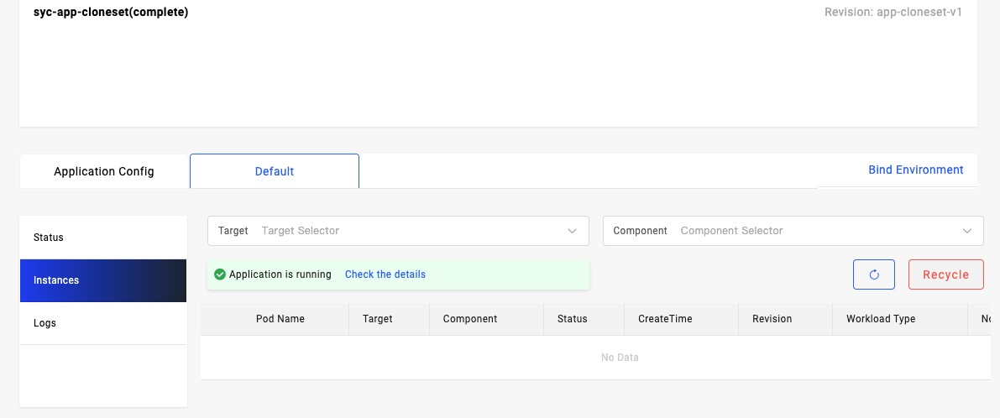
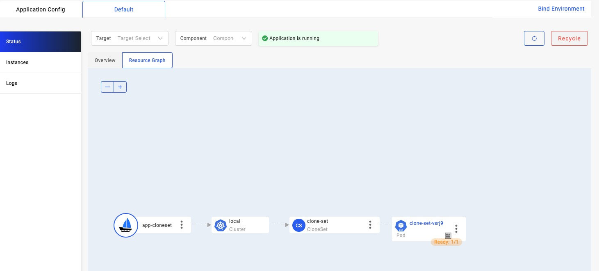
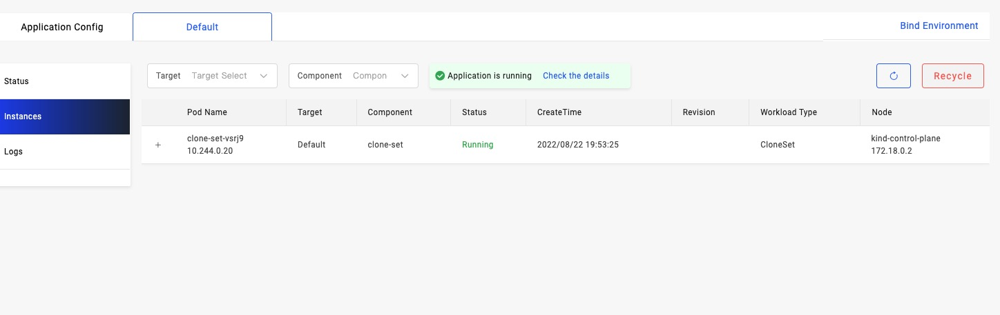

`Resource Relationships` mainly specify the relationship between two types of resources. Its main function is to help KubeVela establish the topological relationship of the resources managed by a KubeVela application. For example, the system has a built-in relationship rule: The sub-resources under the [Deployment](https://kubernetes.io/docs/concepts/workloads/controllers/deployment/)  can only be [ReplicaSet ](https://kubernetes.io/docs/concepts/workloads/controllers/replicaset/), and the child resource of ReplicaSet can only be [Pod](https://kubernetes.io/docs/concepts/workloads/pods/ ).

When a KubeVela application with Deployment as the workload is created, then view the topology graph of the application on VelaUX, KubeVela will first list all ReplicaSets in the same namespace with the Deployment, and filter out the results whose OwnerReference don't point to the Deployment, and then find the Pod under the ReplicaSet with the same way. This can help to establish the topology hierarchy of the managed resources under the application.

In general, these `Resource Relationships` are mainly used in the following scenarios:

- Help to display the topology graph of an application on VelaUX. The following is an example of topology graph:


- When using `vela port-forward`, `vela logs`, `vela exec` and `vela status --endpoint` via cli or check the log or access port of an application on VelaUX, it helps KubeVela to discover the pods or services of an application.

## Add more rules

The built-in `Resource Relationships` in the system are limited. If a Kubernetes CustomResourceDefinition is added to your cluster, you can add new relationship rules to the system by creating a Kubernetes `configmap` to your cluster. 

Then we will introduce the details with an example.

You can first enable the [kruise](https://github.com/kubevela/catalog/tree/master/experimental/addons/kruise) addon which is an experimental addon by running follow command:

```shell
vela addon registry add experimental --type=helm --endpoint=https://addons.kubevela.net/experimental/
vela addon enable kruise
```

After enable succeed you will see the `cloneset` componentDefinition whose  workload's type  is `clonesets.apps.kruise.io`. The cloneset controller will create pods for application.

```shell
$ vela componets
NAME                    DEFINITION                      DESCRIPTION                                                 
cloneset                autodetects.core.oam.dev        Describes long-running, scalable, containerized services    
                                                        that have a stable network endpoint to receive external     
                                                        network traffic from customers. If workload type is skipped 
                                                        for any service defined in Appfile, it will be defaulted to 
                                                        `webservice` type.
```

Then, create a `cloneset` application:

```yaml
cat <<EOF | vela up -f -
apiVersion: core.oam.dev/v1beta1
kind: Application
metadata:
  name: app-cloneset
spec:
  components:
    - name: clone-set
      type: cloneset
      properties:
        cmd:
          - ./podinfo
          - stress-cpu=1
        image: stefanprodan/podinfo:4.0.3
        port: 8080
        updateStrategyType: InPlaceOnly
EOF
```

When we view the application topology graph on VelaUX, we will find out the clonset resources has not any sub-resource, and the instance list is empty. As following picture shows:




If we use command `vela logs` and `vela exec` will get error like follows:

```shell
$ vela logs app-cloneset
Error: no pod found in your application
```

```shell
$ vela exec app-cloneset
Error: no pod found in your application
```

The reason of these problems is system has not any relationship rule about the new added CustomResource `cloneset`. So KubeVela doesn't know how to lookup the sub-resource of the CustomResource, so you can apply a configmap as follows to solve this problem:

```yaml
apiVersion: v1
kind: ConfigMap
metadata:
  name: clone-set-relation
  namespace: vela-system
  labels:
    "rules.oam.dev/resource-format": "yaml"
    "rules.oam.dev/resources": "true"
data:
  rules: |-
    - parentResourceType:
        group: apps.kruise.io
        kind: CloneSet
      childrenResourceType:
        - apiVersion: v1
          kind: Pod
```

As the example shows the configmap must contain a special label `"rules.oam.dev/resources": "true"`. Only a configmap containing such a label will be recognized by KubeVela as a configuration of `resource type relationship rule`. At the same time, in this example, we also add a `"rules.oam.dev/resource-format": "yaml"` annotation to specify the rules in `data.rules` field defined with YAML format, except Using YAML format, you can also define these rules with JSON format as follows:

```yaml
apiVersion: v1
kind: ConfigMap
metadata:
  name: clone-set-relation
  namespace: vela-system
  labels:
    "rules.oam.dev/resource-format": "json"
    "rules.oam.dev/resources": "true"
data:
  rules: |-
   [
     {
       "parentResourceType": {
           "group": "apps.kruise.io",
           "kind": "CloneSet"
       },
       "childrenResourceType": [
           {
               "apiVersion": "v1",
               "kind": "Pod"
           }
       ]
     }
  ]
```

The function of these two `configmap` is totally the same.

In the example above, the parent type is `Cloneset` in group `apps.kruise.io`, his child resource type is `v1/Pod`.

Then we check the topology graph and instance list on VelaUX again will see:





Using `vela logs` and `vela exec` command won't meet error neither:

```shell
$ vela logs app-cloneset
+ clone-set-vsrj9 › clone-set
clone-set 2022-08-22T11:53:46.005267600Z {"level":"info","ts":"2022-08-22T11:53:46.002Z","caller":"podinfo/main.go:123","msg":"Starting podinfo","version":"4.0.3","revision":"a2f9216fe43849c3b4844032771ba632307d8738","port":"9898"}
```

As the same, if your CustomResource contains a Kubernetes service as sub-resource, you can also add a relationship rules to support `vela status --endpoints`.

## Built inside with Addon

A KubeVela [addon](../platform-engineers/addon/intro.md) may install some Kubernetes CRD operators. By default, KubeVela cannot know what types of sub-resources this CRD can have, so you may encounter that the resources under the CRD cannot be displayed in the topology graph or cannot check the container logs of the application. Then you can add a configmap that define the relationship of resource type to solve this problem. You can define the configmap in `outputs` field in application template file of the addon. An example is as follows:

```cue
package main

output: {
	apiVersion: "core.oam.dev/v1beta1"
	kind:       "Application"
	spec: {
		
	}
	... 
}

outputs: resourceTree: {
	apiVersion: "v1"
	kind:       "ConfigMap"
	metadata: {
		name:      "resource-tree"
		namespace: "vela-system"
		labels: {
			"rules.oam.dev/resources":       "true"
			"rules.oam.dev/resource-format": "json"
		}
	}
	data: rules: json.Marshal(_rules)
}

_rules: {...}
```

Please refer to [doc](../platform-engineers/addon/addon-cue.md#auxiliary-resources) for more details.