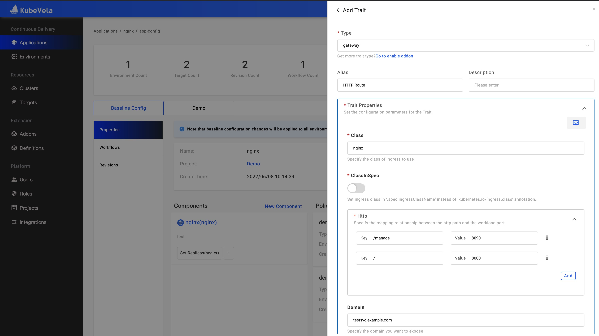
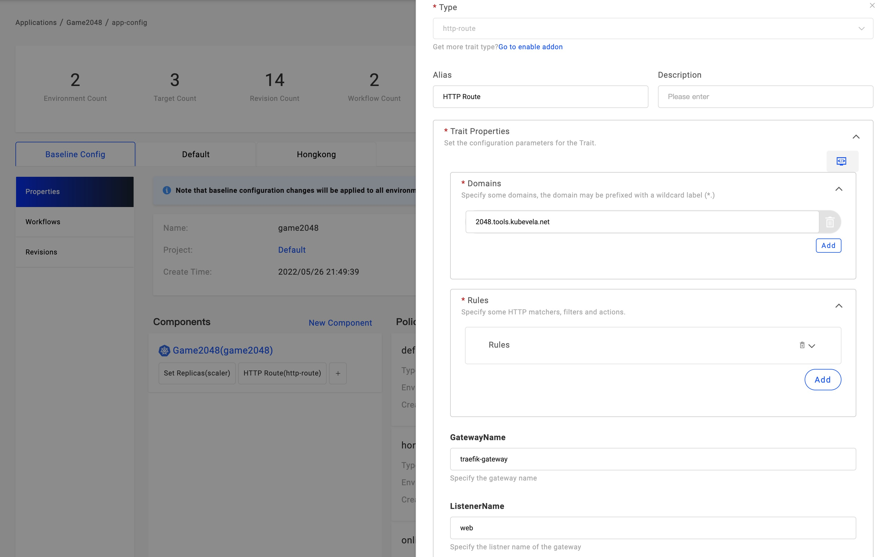
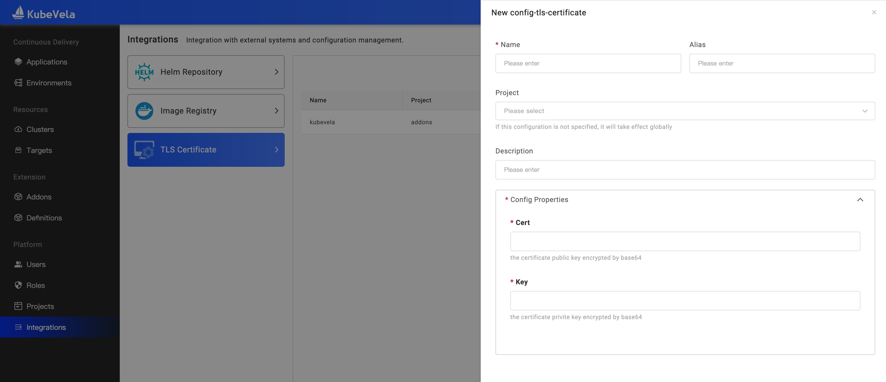
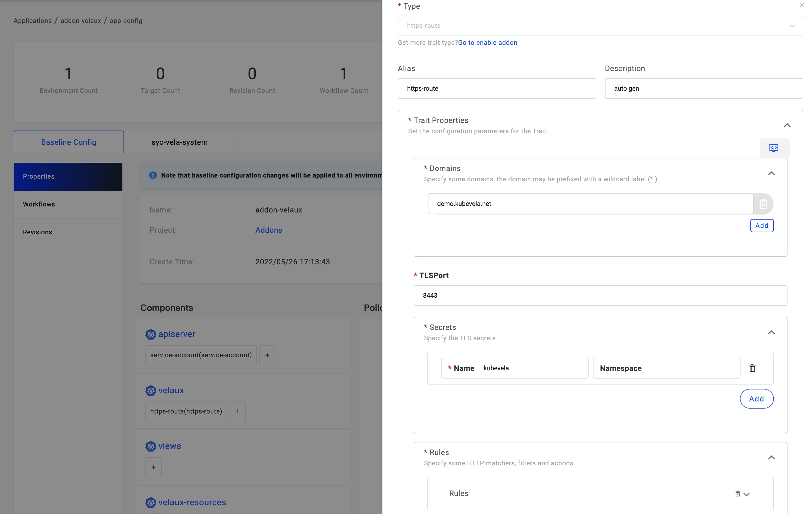
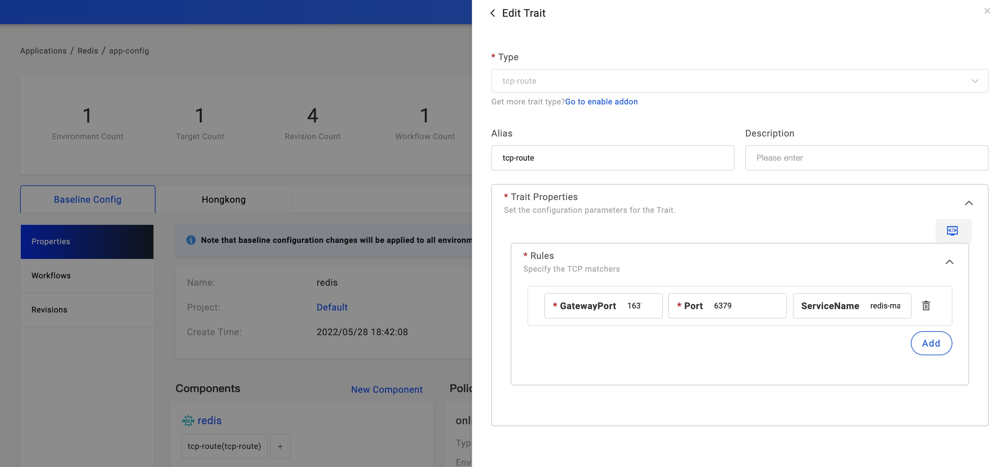

After deploying the application, the next station is publishing your service.

There are multiple ways to do this, for testing, such as Port Forward and Node Port. for production, such as LoadBalancer and via cluster gateway. This section focus on the production environment.

## Use LoadBalancer by Cloud Provider

This way is only suitable for the cloud environment, such as Aliyun, AWS, and Azure.

For the webservice component, you only need to set the `ExposeType` to `LoadBalancer`, it means this component will generate a Kubernetes Service with LoadBalancer type. After deployment, you could get the service endpoints.

For Example:

```yaml
apiVersion: core.oam.dev/v1beta1
kind: Application
metadata:
  name: webservice-app
spec:
  components:
    - name: frontend
      type: webservice
      properties:
        image: oamdev/testapp:v1
        cmd: ["node", "server.js"]
        ports:
          - port: 8080
            expose: true
        exposeType: LoadBalancer
```

For other components, similarly, only need to generate the Kubernetes Service with LoadBalancer type.

## Use HTTP Domain by Ingress Gateway

This way required installed the ingress controller in the cluster.

Users could bound the `gateway` trait for the component to generate the Ingress. for example:

```yaml
traits:
- type: gateway
  properties:
    domain: testsvc.example.com
    http:
        "/": 8000
        "/manage": 8090
```

This means accessing the component service by domain `testsvc.example.com`, there are two rules, the request path begins with `/manage` will request the component 8090 port. others request path request the component 8000 port.

In VelaUX, you can click the `Add Trait` button and select the `gateway` trait type. refer to follow configuration:



## Use Traefik

This way required installed the traefik addon firstly.

```bash
$ vela addon enable traefik
```

Get more info about this addon, refer to [Traefik Addon](../reference/addons/traefik.md)

This addon provides three traits, including [http-route](../reference/addons/traefik.md#http-routetrait), [https-route](../reference/addons/traefik.md#https-routetrait) and [tcp-route](../reference/addons/traefik.md#tcp-routetrait).

### HTTP/HTTPS

For HTTP, you can click the `Add Trait` button and select the `http-route` trait type. refer to follow configuration:



```yaml
traits:
- type: http-route
  properties:
    domains:
    - testsvc.example.com
    rules:
    - port: 80
    gatewayName: traefik-gateway
    listenerName: web
```

There must be one route rule. The port is the same as the service port, the route condition supports the Header and Request Path.

For HTTPS, you must create the TLS certificate firstly. In VelaUX, open the Integrations page, there is a `TLS Certificate` type. Click the New button, You need to provide the certificate public and private keys and encoded the content by base64.



This will generate the secret and distribute to managed clusters with the application.

Then open the application configuration page and click the `Add Trait` button and select the `https-route` trait type. refer to follow configuration:



```yaml
traits:
- type: https-route
  properties:
    domains:
    - testsvc.example.com
    TLSPort: 8443
    secrets:
    - name: kubevela
    rules:
    - port: 80
```

The secret name is the same as the name of the certificate configuration.

### TCP

This way is suitable for the service with the stream protocol, reusing the same public IP address.

You can click the `Add Trait` button and select the `tcp-route` trait type. refer to follow configuration:



```yaml
traits:
- type: https-route
  properties:
    rules:
    - gatewayPort: 16379
        port: 6379
        serviceName: redis-master
```
