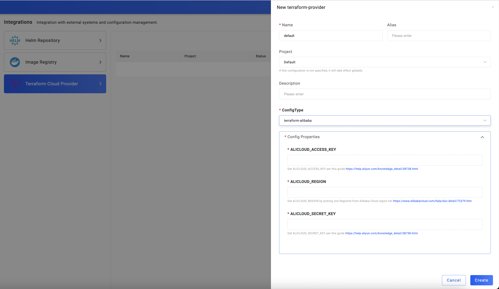
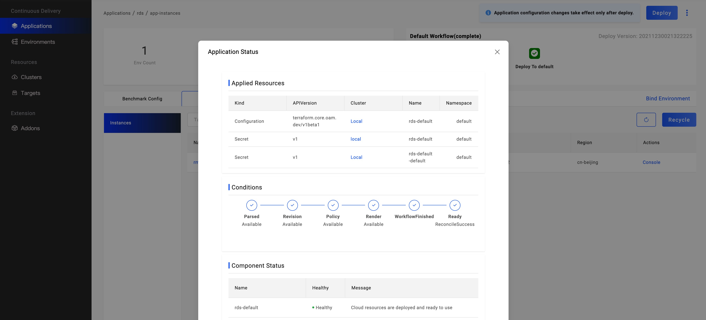

Cloud-oriented development is now becoming the norm, there is an urgent need to integrate cloud resources from different
sources and types. Whether it is the most basic object storage, cloud database, or load balancing, it is all faced with
the challenges of hybrid cloud, multi-cloud and other complex environments. KubeVela is perfect to satisfy the needs.

KubeVela efficiently and securely integrates different types of cloud resources through resource binding capabilities in
cloud resource Components and Traits. At present, you can directly use the default components of those cloud resources below.
At the same time, more new cloud resources will gradually become the default option under the support of the community in the future.
You can use cloud resources of various manufacturers in a standardized and unified way.

This tutorial will mainly focus on talking about how to provision cloud resources by [Terraform](https://github.com/kubevela/terraform-controller)
in CLI and VelaUX.
If you'd like to know how to deploy cloud resources by [Crossplane](https://crossplane.io/) instead, please refer to the guide
[Provision cloud resources by Crossplane](../end-user/components/cloud-services/provision-cloud-resources-by-crossplane).

# Provision cloud resources by vela CLI

## Prerequisites

Please ask platform engineers to enable cloud resources Terraform addon and authenticate the target cloud provider per the [instruction](../../../reference/addons/terraform).

Let's take Alibaba Cloud as an example.

## Familiar with cloud resources specification

All supported Terraform cloud resources can be seen in the [list](../end-user/components/cloud-services/cloud-resources-list). You can also filter them by
command by `vela components --label type=terraform`.

You can use any way to check the specification of a cloud resource.

- by command `vela show $RESOURCE_DEFINITION`

```yaml
$ vela show alibaba-oss
  ### Properties
  +----------------------------+-------------------------------------------------------------------------+-----------------------------------------------------------+----------+---------+
  |            NAME            |                               DESCRIPTION                               |                           TYPE                            | REQUIRED | DEFAULT |
  +----------------------------+-------------------------------------------------------------------------+-----------------------------------------------------------+----------+---------+
  | acl                        | OSS bucket ACL, supported 'private', 'public-read', 'public-read-write' | string                                                    | false    |         |
  | bucket                     | OSS bucket name                                                         | string                                                    | false    |         |
  | writeConnectionSecretToRef | The secret which the cloud resource connection will be written to       | [writeConnectionSecretToRef](#writeConnectionSecretToRef) | false    |         |
  +----------------------------+-------------------------------------------------------------------------+-----------------------------------------------------------+----------+---------+


  #### writeConnectionSecretToRef
  +-----------+-----------------------------------------------------------------------------+--------+----------+---------+
  |   NAME    |                                 DESCRIPTION                                 |  TYPE  | REQUIRED | DEFAULT |
  +-----------+-----------------------------------------------------------------------------+--------+----------+---------+
  | name      | The secret name which the cloud resource connection will be written to      | string | true     |         |
  | namespace | The secret namespace which the cloud resource connection will be written to | string | false    |         |
  +-----------+-----------------------------------------------------------------------------+--------+----------+---------+
```

You can also add flag `--web` to view the usage by a local browser.

- by official site http://kubevela.net/docs/end-user/components/cloud-services/cloud-resources-list

For example, you can check the specification for Alibaba OSS at http://kubevela.net/docs/end-user/components/cloud-services/terraform/alibaba-oss. 

## Provision cloud resources

Use the following Application to provision an OSS bucket:

```yaml
apiVersion: core.oam.dev/v1beta1
kind: Application
metadata:
  name: provision-cloud-resource-sample
spec:
  components:
    - name: sample-oss
      type: alibaba-oss
      properties:
        bucket: vela-website-0911
        acl: private
        writeConnectionSecretToRef:
          name: oss-conn
```

The above `alibaba-oss` component will create an OSS bucket named `vela-website-0911`, with `private` acl, with connection
information stored in a secreted named `oss-conn`.

Apply the above application, then check the status:

```shell
$ vela ls
APP                            	COMPONENT 	TYPE       	TRAITS	PHASE  	HEALTHY	STATUS                                       	CREATED-TIME
provision-cloud-resource-sample	sample-oss	alibaba-oss	      	running	healthy	Cloud resources are deployed and ready to use	2021-09-11 12:55:57 +0800 CST
```

After the phase becomes `running` and `healthy`, you can then check the OSS bucket in Alibaba Cloud console or by [ossutil](https://partners-intl.aliyun.com/help/doc-detail/50452.htm)
command.

```shell
$ ossutil ls oss://
CreationTime                                 Region    StorageClass    BucketName
2021-09-11 12:56:17 +0800 CST        oss-cn-beijing        Standard    oss://vela-website-0911
```


# Provision cloud resources by VelaUX

In this section, we introduce an example to show you how to deploy cloud services.

## Before starting

- Has a cloud vendor account with proper access to your target cloud resources

- Ensure your account has a sufficient balance

- Connect to a Kubernetes cluster on this cloud vendor for hosting your cloud services

## Enabling a cloud provider addon

First, visit VelaUX, switch to the tab `Addon`, and click up addon
`terraform-xxx`. `xxx` stands for the cloud provider name. We support the following Addons:

- terraform-alibaba
- terraform-aws
- terraform-azure
- terraform-tencent
- terraform-gcp
- terraform-baidu

We can provision cloud resources in Alibaba Cloud, AWS, Azure, Tencent Cloud, Google Cloud Platform and Baidu Cloud respectively.

Choose the specific version and enable an addon.


## Authenticating the cloud provider

Click the tab `Platform`, and then `Integrations`. Choose `Terraform Controller Provider` to authenticate a cloud provider.
Follow the instructions on all the properties to authenticate the provider for each cloud provider.

For example, for Alibaba Cloud, you need to set the following properties:

> Notice: KubeVela encrypts all the keys, hence no need to worry about its safety.



Then fill in your ALICLOUD_ACCESS_KEY, ALICLOUD_REGION, and ALICLOUD_SECRET_KEY to enable it。

The creating process of cloud services pulls configuration from GitHub. If your control plane
cluster that runs KubeVela is very hard to connect to GitHub, please open up the `GithubBlocked` option in `terraform`
addon.

All supported Terraform cloud resources can be seen in the [list](../end-user/components/cloud-services/cloud-resources-list).

## Creating your cloud service

First [create an application](../how-to/dashboard/application/create-application). Please choose the type of your cloud service,
which has a prefix of `aws-`, `azure`, `alibaba-` or `tencent-`.

For different vendors, these parameters update accordingly.

For example, `aws-s3` has the following parameters:


`azure-database-mariadb` has the following parameters:


`alibaba-rds` has the following parameters:


All cloud resources have some common parameters.

- DeleteResource: Whether to delete the corresponding cloud service when the app is deleted
- ProviderRef: The Provider which is referenced by a cloud service
- Region: Region is cloud provider's region. It will override `providerRef`.

Set the above parameters according to your needs to complete creating the application, and then [deploy the application](../how-to/dashboard/application/deploy-application).

## Viewing cloud resource creation status

- Check the cloud instance list

Like other apps, cloud service apps also need to switch to the corresponding environment page to view instance information.
By default, there are several targets in an environment, and the cloud service will generate a corresponding number of instances.


In the instance list, the instance name, status, resource type, and location are displayed. In the beginning, the name is empty,
because the cloud service instance generation takes a certain amount of time, and the name will appear when the instance is generated normally.

- View the cloud resource in the console of the cloud provider

You can visit the instance in the console of the cloud provider. For example, you can check the name or console to visit it.


For example, you can check Alibaba Cloud RDS instance in [https://console.aliyun.com](https://console.aliyun.com).


- Check details and status of the cloud instance

Click the `Check the detail` button to view the application details.



You will find that each instance generates a Secret resource, which generally records the service's access address and
key information. Secret resources will be distributed to the cluster and Namespace where the target is located while the
control cluster exists. Therefore, other applications in the same environment can directly use the resource in the
environment variable to obtain the access address and key.


In the last section `Component Status`, the health status and the message of the cloud service instance is displayed.

## FAQ

- The cloud service is always ProvisioningAndChecking and has no name

> The creation of cloud services generally takes a certain amount of time. Please wait or enter the cloud vendor console to view the creation progress.

# More

For more usages of cloud resources, like how to provision and consume cloud resources, please refer to [Scenarios of Cloud Resources Management](./../end-user/components/cloud-services/cloud-resource-scenarios).
