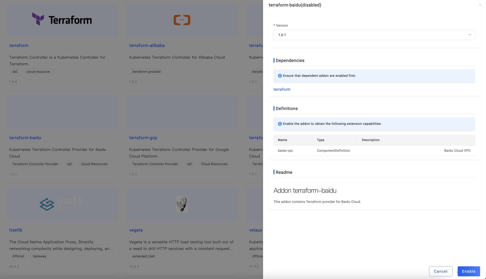

Integrating cloud service is the most frequent need in our daily development, varying from the Object storage, Cloud
database to LoadBalancer, Cache, or search engine. Faster to load them save more time, meanwhile, to orchestrate
different resources from multi-cloud is quite a pain point.

In this section, we introduce an example to show you how to deploy cloud services.

## Before starting

- Has a cloud vendor account with proper access to your target cloud resources

- Ensure your account has a sufficient balance

- Connect to a Kubernetes cluster on this cloud vendor for hosting your cloud services

## Enabling cloud vendor Addons

First, visit [VelaUX (KubeVela Dashboard)](../install#3-install-velaux), switch to the tab `Addon`, and click up addon
`terraform-xxx`. `xxx` stands for the cloud provider name. We support the following Addons:

- terraform-alibaba
- terraform-aws
- terraform-azure
- terraform-tencent  
- terraform-gcp  
- terraform-baidu  

We can provision cloud resources in Alibaba Cloud, AWS, Azure, Tencent Cloud, Google Cloud Platform and Baidu Cloud respectively.

Follow the instructions on all the properties of the addon for each cloud provider to set the addon and enable it.

For example, for Alibaba Cloud, you need to set the following properties:

> Notice: KubeVela encrypts all the keys, hence no need to worry about its safety.

Then fill in your ALICLOUD_ACCESS_KEY, ALICLOUD_REGION, and ALICLOUD_SECRET_KEY to enable it。

The creating process of cloud services pulls configuration from GitHub. If your control plane
cluster that runs KubeVela is very hard to connect to GitHub, please open up the `GithubBlocked` option in `terraform`
addon.

All supported Terraform cloud resources can be seen in the [list](../end-user/components/cloud-services/cloud-resources-list).

## Creating your cloud service

First [create an application](../how-to/dashboard/application/create-application). Please choose the type of your cloud service,
which has a prefix of `aws-`, `azure`, `alibaba-` or `tencent-`.

For different vendors, these parameters update accordingly. 

For example, `aws-s3` has the following parameters:

`azure-database-mariadb` has the following parameters:

`alibaba-rds` has the following parameters:

All cloud resources have some common parameters.

- DeleteResource: Whether to delete the corresponding cloud service when the app is deleted
- ProviderRef: The Provider which is referenced by a cloud service
- Region: Region is cloud provider's region. It will override `providerRef`.

Set the above parameters according to your needs to complete creating the application, and then [deploy the application](../how-to/dashboard/application/deploy-application).

## Viewing cloud resource creation status

- Check the cloud instance list

Like other apps, cloud service apps also need to switch to the corresponding environment page to view instance information.
By default, there are several targets in an environment, and the cloud service will generate a corresponding number of instances.

In the instance list, the instance name, status, resource type, and location are displayed. In the beginning, the name is empty,
because the cloud service instance generation takes a certain amount of time, and the name will appear when the instance is generated normally.

- View the cloud resource in the console of the cloud provider

You can visit the instance in the console of the cloud provider. For example, you can check the name or console to visit it.

For example, you can check Alibaba Cloud RDS instance in [https://console.aliyun.com](https://console.aliyun.com).

- Check details and status of the cloud instance

Click the `Check the detail` button to view the application details.

You will find that each instance generates a Secret resource, which generally records the service's access address and
key information. Secret resources will be distributed to the cluster and Namespace where the target is located while the
control cluster exists. Therefore, other applications in the same environment can directly use the resource in the
environment variable to obtain the access address and key.

In the last section `Component Status`, the health status and the message of the cloud service instance is displayed.

## FAQ

- The cloud service is always ProvisioningAndChecking and has no name

> The creation of cloud services generally takes a certain amount of time. Please wait or enter the cloud vendor console to view the creation progress.
