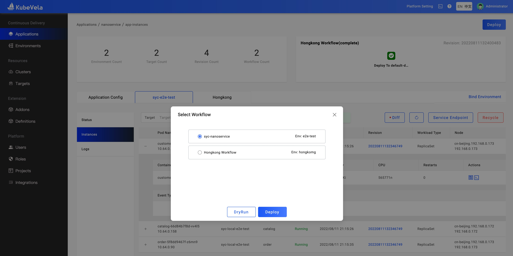
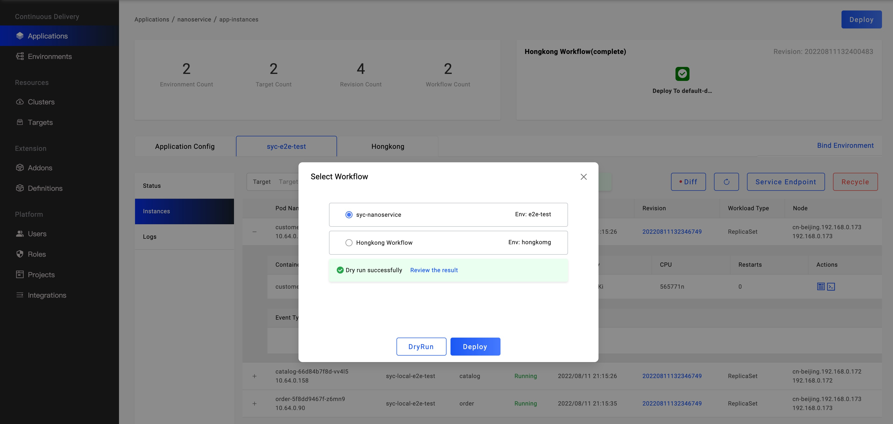

The dry run feature is a very useful way to check the correctness of the application configuration and definitions. It will render the application and print the output resources that checked on the service side. If the definitions(component, trait) is invalid, the dry run will print the error message.

When you do the following things, you'd better use `dry-run`.

* Create or update an application.
* Create or update the definition, and dry run some example applications.

## Dry run via CLI

There is a simple application:

```yaml
kind: Application
apiVersion: core.oam.dev/v1beta1
metadata:
  name: webservice-app
spec:
  components:
    - name: frontend
      type: webservice
      properties:
        image: oamdev/testapp:v1
        cmd: ["node", "server.js"]
        ports:
          - port: 8080
            expose: true
      traits:
        - type: scaler
          properties:
            replicas: 1
```

Copy it and write a file `app.yaml`, execute the following command, and then the resources will be printed.

```bash
vela dry-run app.yaml
```

<details>
<summary>expected output</summary>

```yaml
---
# Application(webservice-app) -- Component(frontend) 
---

apiVersion: apps/v1
kind: Deployment
metadata:
  annotations: {}
  labels:
    app.oam.dev/appRevision: ""
    app.oam.dev/component: frontend
    app.oam.dev/name: webservice-app
    app.oam.dev/namespace: default
    app.oam.dev/resourceType: WORKLOAD
    workload.oam.dev/type: webservice
  name: frontend
  namespace: default
spec:
  replicas: 1
  selector:
    matchLabels:
      app.oam.dev/component: frontend
  template:
    metadata:
      labels:
        app.oam.dev/component: frontend
        app.oam.dev/name: webservice-app
    spec:
      containers:
      - command:
        - node
        - server.js
        image: oamdev/testapp:v1
        name: frontend
        ports:
        - containerPort: 8080
          name: port-8080
          protocol: TCP

---
## From the auxiliary workload 
apiVersion: v1
kind: Service
metadata:
  annotations: {}
  labels:
    app.oam.dev/appRevision: ""
    app.oam.dev/component: frontend
    app.oam.dev/name: webservice-app
    app.oam.dev/namespace: default
    app.oam.dev/resourceType: TRAIT
    trait.oam.dev/resource: webserviceExpose
    trait.oam.dev/type: AuxiliaryWorkload
  name: frontend
  namespace: default
spec:
  ports:
  - name: port-8080
    port: 8080
    targetPort: 8080
  selector:
    app.oam.dev/component: frontend
  type: ClusterIP

---
```

</details>

If we set the expose field of the port as false, the output resources do not include the `Service`. If we set the replicas field as "1", the output will be an error message:

```bash
Error: validate application: ./app.yaml by dry-run: admission webhook "validating.core.oam.dev.v1beta1.applications" denied the request: field "schematic": Invalid value error encountered, cannot evaluate trait "scaler": invalid template of trait scaler after merge with parameter and context: parameter.replicas: conflicting values (*1 | int) and "1" (mismatched types int and string) (and 1 more errors). 
```

This means the replicas field is int type but we provide a string value, this application configuration is not valid.


### Dry run with policy and workflow via CLI

:::tip
Override/topology Policies and deploy workflow are supported in v1.7.0+ now. While there're still some limitation that `dry-run` with policy and workflow will only take `override`, `topology` policies and `deploy` workflow step into considerations. Other workflow steps will be ignored.
:::	

Let's take the following application as example, the application explicitly specify `override`, `topology` policies and `deploy` workflow step.

```yaml
apiVersion: core.oam.dev/v1beta1
kind: Application
metadata:
  name: first-vela-app
spec:
  components:
    - name: express-server
      type: webservice
      properties:
        image: oamdev/hello-world
        ports:
         - port: 8000
           expose: true
      traits:
        - type: scaler
          properties:
            replicas: 1
  policies:
    - name: target-default
      type: topology
      properties:
        clusters: ["local"]
        namespace: "default"
    - name: target-prod
      type: topology
      properties:
        clusters: ["local"]
        namespace: "prod"
    - name: deploy-ha
      type: override
      properties:
        components:
          - type: webservice
            traits:
              - type: scaler
                properties:
                  replicas: 5
  workflow:
    steps:
      - name: deploy2default
        type: deploy
        properties:
          policies: ["target-default"]
      - name: manual-approval
        type: suspend
      - name: deploy2prod
        type: deploy
        properties:
          policies: ["target-prod", "deploy-ha"]
```

Dry run will produce rendered results for both `deploy2default` and `deploy2prod` deploy steps as below:

<details>
<summary>expected output</summary>

```yaml
---
# Application(first-vela-app with topology target-default) -- Component(express-server) 
---

apiVersion: apps/v1
kind: Deployment
metadata:
  annotations: {}
  labels:
    app.oam.dev/appRevision: ""
    app.oam.dev/component: express-server
    app.oam.dev/name: first-vela-app
    app.oam.dev/namespace: default
    app.oam.dev/resourceType: WORKLOAD
    workload.oam.dev/type: webservice
  name: express-server
  namespace: default
spec:
  replicas: 1
  selector:
    matchLabels:
      app.oam.dev/component: express-server
  template:
    metadata:
      labels:
        app.oam.dev/component: express-server
        app.oam.dev/name: first-vela-app
    spec:
      containers:
      - image: oamdev/hello-world
        name: express-server
        ports:
        - containerPort: 8000
          name: port-8000
          protocol: TCP

---
## From the auxiliary workload 
apiVersion: v1
kind: Service
metadata:
  annotations: {}
  labels:
    app.oam.dev/appRevision: ""
    app.oam.dev/component: express-server
    app.oam.dev/name: first-vela-app
    app.oam.dev/namespace: default
    app.oam.dev/resourceType: TRAIT
    trait.oam.dev/resource: webserviceExpose
    trait.oam.dev/type: AuxiliaryWorkload
  name: express-server
  namespace: default
spec:
  ports:
  - name: port-8000
    port: 8000
    targetPort: 8000
  selector:
    app.oam.dev/component: express-server
  type: ClusterIP

---

---
# Application(first-vela-app with topology target-prod) -- Component(express-server) 
---

apiVersion: apps/v1
kind: Deployment
metadata:
  annotations: {}
  labels:
    app.oam.dev/appRevision: ""
    app.oam.dev/component: express-server
    app.oam.dev/name: first-vela-app
    app.oam.dev/namespace: default
    app.oam.dev/resourceType: WORKLOAD
    workload.oam.dev/type: webservice
  name: express-server
  namespace: default
spec:
  replicas: 5
  selector:
    matchLabels:
      app.oam.dev/component: express-server
  template:
    metadata:
      labels:
        app.oam.dev/component: express-server
        app.oam.dev/name: first-vela-app
    spec:
      containers:
      - image: oamdev/hello-world
        name: express-server
        ports:
        - containerPort: 8000
          name: port-8000
          protocol: TCP

---
## From the auxiliary workload 
apiVersion: v1
kind: Service
metadata:
  annotations: {}
  labels:
    app.oam.dev/appRevision: ""
    app.oam.dev/component: express-server
    app.oam.dev/name: first-vela-app
    app.oam.dev/namespace: default
    app.oam.dev/resourceType: TRAIT
    trait.oam.dev/resource: webserviceExpose
    trait.oam.dev/type: AuxiliaryWorkload
  name: express-server
  namespace: default
spec:
  ports:
  - name: port-8000
    port: 8000
    targetPort: 8000
  selector:
    app.oam.dev/component: express-server
  type: ClusterIP

---
```

</details>

Each deploy workflow step with topology policy will render individual result.

It can be a bit redundant for you as you may just need to dry run for one environment at a time. The, you can use the external workflow feature like below.

Firstly, define policy and workflow as below in individual files:

* The `target-prod.yaml` and `ha.yaml` corresponding to the `production` environment.
  ```yaml
  # target-prod.yaml
  apiVersion: core.oam.dev/v1alpha1
  kind: Policy
  metadata:
    name: target-prod
  type: topology
  properties:
    clusters: ["local"]
    namespace: "prod"
  ```

  ```yaml
  # ha.yaml
  apiVersion: core.oam.dev/v1alpha1
  kind: Policy
  metadata:
    name: ha
  type: override
  properties:
    components:
    - type: webservice
      traits:
      - type: scaler
        properties:
          replicas: 5
  ```

* The `prod-workflow.yaml` can glue them together.
  ```yaml
  # prod-workflow.yaml
  apiVersion: core.oam.dev/v1alpha1
  kind: Workflow
  metadata:
    name: deploy-prod
  steps:
    - type: deploy
      name: deploy-prod
      properties:
        policies: ["ha", "target-prod"]
  ```

* Then the application can reference the workflow as below.
  ```yaml
  apiVersion: core.oam.dev/v1beta1
  kind: Application
  metadata:
    name: first-vela-app
  spec:
    components:
      - name: express-server
        type: webservice
        properties:
          image: oamdev/hello-world
          ports:
          - port: 8000
            expose: true
        traits:
          - type: scaler
            properties:
              replicas: 1
    workflow:
      ref: deploy-prod
  ```

The dry run command can be:

```
vela dry-run -f app.yaml -f target-prod.yaml -f ha.yaml -f prod-workflow.yaml 
```

Then, the dry-run results will only contain resources in the `production` environment.

<details>
<summary>expected output</summary>

```yaml
---
# Application(first-vela-app with topology target-prod) -- Component(express-server) 
---

apiVersion: apps/v1
kind: Deployment
metadata:
  annotations: {}
  labels:
    app.oam.dev/appRevision: ""
    app.oam.dev/component: express-server
    app.oam.dev/name: first-vela-app
    app.oam.dev/namespace: default
    app.oam.dev/resourceType: WORKLOAD
    workload.oam.dev/type: webservice
  name: express-server
  namespace: default
spec:
  replicas: 5
  selector:
    matchLabels:
      app.oam.dev/component: express-server
  template:
    metadata:
      labels:
        app.oam.dev/component: express-server
        app.oam.dev/name: first-vela-app
    spec:
      containers:
      - image: oamdev/hello-world
        name: express-server
        ports:
        - containerPort: 8000
          name: port-8000
          protocol: TCP

---
## From the auxiliary workload 
apiVersion: v1
kind: Service
metadata:
  annotations: {}
  labels:
    app.oam.dev/appRevision: ""
    app.oam.dev/component: express-server
    app.oam.dev/name: first-vela-app
    app.oam.dev/namespace: default
    app.oam.dev/resourceType: TRAIT
    trait.oam.dev/resource: webserviceExpose
    trait.oam.dev/type: AuxiliaryWorkload
  name: express-server
  namespace: default
spec:
  ports:
  - name: port-8000
    port: 8000
    targetPort: 8000
  selector:
    app.oam.dev/component: express-server
  type: ClusterIP

---
```

</details>

Moreover, you can use `--merge` flag to merge external policies and workflow when application file is not reference to them.

For example, you can define the application as below, the only difference is there's no `workflow` field.

```yaml
# app.yaml
apiVersion: core.oam.dev/v1beta1
kind: Application
metadata:
  name: first-vela-app
spec:
  components:
    - name: express-server
      type: webservice
      properties:
        image: oamdev/hello-world
        ports:
         - port: 8000
           expose: true
      traits:
        - type: scaler
          properties:
            replicas: 1
```

<details>
<summary>the workflow and policy can be defined the same way</summary>

```yaml
# workflow.yaml
apiVersion: core.oam.dev/v1alpha1
kind: Workflow
metadata:
  name: deploy-demo
steps:
  - type: deploy
    name: deploy-prod
    properties:
      policies: ["target-prod"]
```
```yaml
# target-prod.yaml
apiVersion: core.oam.dev/v1alpha1
kind: Policy
metadata:
  name: target-prod
type: topology
properties:
  clusters: ["local"]
  namespace: "prod"
```

</details>

If you don't use `--merge` flag in this way, it will report warnings as below.

```
vela dry-run -f app.yaml -f target-prod.yaml -f workflow.yaml
```

<details>
<summary>result with warning messages</summary>

```yaml
WARNING: workflow deploy-demo not referenced by application

WARNING: policy target-prod not referenced by application

---
# Application(default) -- Component(express-server) 
---

apiVersion: apps/v1
kind: Deployment
metadata:
  annotations: {}
  labels:
    app.oam.dev/appRevision: ""
    app.oam.dev/component: express-server
    app.oam.dev/name: first-vela-app
    app.oam.dev/namespace: default
    app.oam.dev/resourceType: WORKLOAD
    workload.oam.dev/type: webservice
  name: express-server
  namespace: default
spec:
  replicas: 1
  selector:
    matchLabels:
      app.oam.dev/component: express-server
  template:
    metadata:
      labels:
        app.oam.dev/component: express-server
        app.oam.dev/name: first-vela-app
    spec:
      containers:
      - image: oamdev/hello-world
        name: express-server
        ports:
        - containerPort: 8000
          name: port-8000
          protocol: TCP

---
## From the auxiliary workload 
apiVersion: v1
kind: Service
metadata:
  annotations: {}
  labels:
    app.oam.dev/appRevision: ""
    app.oam.dev/component: express-server
    app.oam.dev/name: first-vela-app
    app.oam.dev/namespace: default
    app.oam.dev/resourceType: TRAIT
    trait.oam.dev/resource: webserviceExpose
    trait.oam.dev/type: AuxiliaryWorkload
  name: express-server
  namespace: default
spec:
  ports:
  - name: port-8000
    port: 8000
    targetPort: 8000
  selector:
    app.oam.dev/component: express-server
  type: ClusterIP

---

```

</details>

In this case, the policy and workflow do not take effect. Because those are not referenced by the application and being viewed as standalone files and ignored.  

So to make those external files work, please provide "--merge" flag as below:

```
vela dry-run -f app.yaml -f target-prod.yaml -f workflow.yaml --merge
```

Then the application will be glued with external policies and workflows even no reference exists.

<details>
<summary>expected ouput</summary>

```yaml
---
# Application(first-vela-app with topology target-prod) -- Component(express-server) 
---

apiVersion: apps/v1
kind: Deployment
metadata:
  annotations: {}
  labels:
    app.oam.dev/appRevision: ""
    app.oam.dev/component: express-server
    app.oam.dev/name: first-vela-app
    app.oam.dev/namespace: default
    app.oam.dev/resourceType: WORKLOAD
    workload.oam.dev/type: webservice
  name: express-server
  namespace: default
spec:
  replicas: 1
  selector:
    matchLabels:
      app.oam.dev/component: express-server
  template:
    metadata:
      labels:
        app.oam.dev/component: express-server
        app.oam.dev/name: first-vela-app
    spec:
      containers:
      - image: oamdev/hello-world
        name: express-server
        ports:
        - containerPort: 8000
          name: port-8000
          protocol: TCP

---
## From the auxiliary workload 
apiVersion: v1
kind: Service
metadata:
  annotations: {}
  labels:
    app.oam.dev/appRevision: ""
    app.oam.dev/component: express-server
    app.oam.dev/name: first-vela-app
    app.oam.dev/namespace: default
    app.oam.dev/resourceType: TRAIT
    trait.oam.dev/resource: webserviceExpose
    trait.oam.dev/type: AuxiliaryWorkload
  name: express-server
  namespace: default
spec:
  ports:
  - name: port-8000
    port: 8000
    targetPort: 8000
  selector:
    app.oam.dev/component: express-server
  type: ClusterIP

---
```

</details>

You can refer to the [Dry run command](../cli/vela_dry-run.md) for more command line use cases.

## Dry run via UI



Clicking the `Deploy` button to open the workflow selector dialog. You could select a workflow(every workflow corresponding to an environment) and click the `DryRun` button to execute a dry run. If passed, the result is like this



The result report is different from the CLI, there is a complete application configuration that is generated from the application metadata, you could check it. Different environments may have different application configurations.
