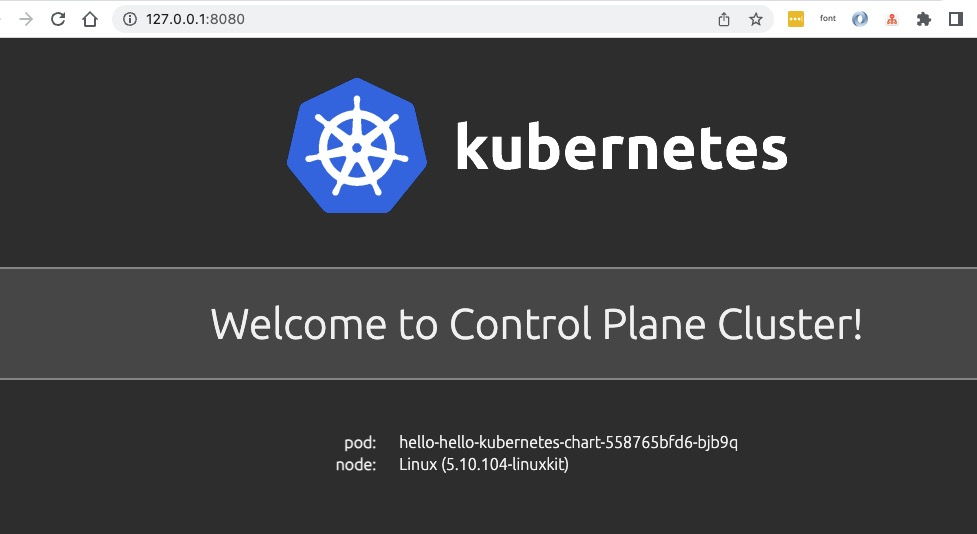

This section introduces how you deploy Helm Chart into multi-environments and clusters.
Before start, make sure you have learned the [basic helm chart delivery](./helm) along with all addon enabled.

## Prepare Clusters

> This section is preparation for multi-cluster, we will start from scratch for convenience. if you already have [multi-clusters joined](../platform-engineers/system-operation/managing-clusters), you can skip this section.

1. Install KubeVela control plane with [velad](https://github.com/kubevela/velad)

```shell
velad install
```

2. Export the KubeConfig for the newly created cluster

```
export KUBECONFIG=$(velad kubeconfig --name default --host)
```

3. Enable velaux addon for UI console

```shell
vela addon enable velaux
```

4. Create a cluster with velad named `foo`

```shell
velad install --name foo --cluster-only
```

5. Join the created cluster to control plane

```shell
vela cluster join $(velad kubeconfig --name foo --internal) --name foo
```

6. Enable fluxcd addon for helm component

```shell
vela addon enable fluxcd
```

If you have already enabled the `fluxcd` addon before you joined the new cluster, you should enable the addon for the newly joined cluster by:

```
vela addon enable fluxcd --clusters foo
```

Finally, we have finished all preparation, you can check the clusters joined:

```console
$ vela cluster ls
CLUSTER	ALIAS	TYPE           	ENDPOINT               	ACCEPTED	LABELS
local  	     	Internal       	-                      	true
foo    	     	X509Certificate	https://172.20.0.6:6443	true
```

One cluster named `local` is the KubeVela control plane, another one named `foo` is the cluster we just joined.

## Deploy across multi clusters

The basic mechanism for multi cluster delivery is almost the same with [deploy container image](../case-studies/multi-cluster#deliver-application-to-clusters).

We can use `topology` policy to specify the delivery topology for helm chart like the following command:

```shell
cat <<EOF | vela up -f -
apiVersion: core.oam.dev/v1beta1
kind: Application
metadata:
  name: helm-hello
spec:
  components:
    - name: hello
      type: helm
      properties:
        repoType: "helm"
        url: "https://jhidalgo3.github.io/helm-charts/"
        chart: "hello-kubernetes-chart"
        version: "3.0.0"
  policies:
    - name: foo-cluster-only
      type: topology
      properties:
        clusters: ["foo"]
EOF
```

The `clusters` field of topology policy is a slice, you can specify multiple cluster names here.
You can also use label selector or specify namespace with that, refer to the [reference docs](../end-user/policies/references#topology) for more details. 

After deployed, you can check the deployed application by:

```shell
vela status helm-hello
```

The expected output should be as follows if deployed successfully:

```console
About:

  Name:      	helm-hello
  Namespace: 	default
  Created at:	2022-06-09 19:14:57 +0800 CST
  Status:    	running

Workflow:

  mode: DAG
  finished: true
  Suspend: false
  Terminated: false
  Steps
  - id:vtahj5zrz4
    name:deploy-foo-cluster-only
    type:deploy
    phase:succeeded
    message:

Services:

  - Name: hello
    Cluster: foo  Namespace: default
    Type: helm
    Healthy Fetch repository successfully, Create helm release successfully
    No trait applied
```

You can check the deployed resource by:

```
$ vela status helm-hello --tree
CLUSTER       NAMESPACE     RESOURCE             STATUS
foo       ─── default   ─┬─ HelmRelease/hello    updated
                         └─ HelmRepository/hello updated
```

You can also check the deployed resource by VelaUX, it's already introduced in the [basic helm delivery docs](./helm#visualize-the-resources-created-by-helm-release).


## Deploy with override configurations

In some cases, we will deploy helm chart into different clusters with different values, then we can use the [override policy](../end-user/policies/references#override).

Below is a complex example that we will deploy one helm chart into two clusters and specify different values for each cluster. Let's deploy it:

```shell
cat <<EOF | vela up -f -
apiVersion: core.oam.dev/v1beta1
kind: Application
metadata:
  name: helm-hello
spec:
  components:
    - name: hello
      type: helm
      properties:
        repoType: "helm"
        url: "https://jhidalgo3.github.io/helm-charts/"
        chart: "hello-kubernetes-chart"
        version: "3.0.0"
  policies:
    - name: topology-local
      type: topology
      properties:
        clusters: ["local"]
    - name: topology-foo
      type: topology
      properties:
        clusters: ["foo"]
    - name: override-local
      type: override
      properties:
        components:
          - name: hello
            properties:
              values:
                configs:
                  MESSAGE: Welcome to Control Plane Cluster!
    - name: override-foo
      type: override
      properties:
        components:
          - name: hello
            properties:
              values:
                configs:
                  MESSAGE: Welcome to Your New Foo Cluster!
  workflow:
    steps:
      - name: deploy2local
        type: deploy
        properties:
          policies: ["topology-local", "override-local"]
      - name: manual-approval
        type: suspend
      - name: deploy2foo
        type: deploy
        properties:
          policies: ["topology-foo", "override-foo"]
EOF
```

The deploy process has three steps: 1) deploy to local cluster; 2) wait for manual approval; 3) deploy to foo cluster. So you will find it was suspended after the first step, just like follows:

```
$ vela status helm-hello
About:

  Name:      	helm-hello
  Namespace: 	default
  Created at:	2022-06-09 19:38:13 +0800 CST
  Status:    	workflowSuspending

Workflow:

  mode: StepByStep
  finished: false
  Suspend: true
  Terminated: false
  Steps
  - id:ww4cydlvee
    name:deploy2local
    type:deploy
    phase:succeeded
    message:
  - id:xj6hu97e1e
    name:manual-approval
    type:suspend
    phase:succeeded
    message:

Services:

  - Name: hello
    Cluster: local  Namespace: default
    Type: helm
    Healthy Fetch repository successfully, Create helm release successfully
    No trait applied
```

You can check the helm chart deployed in control plane with the value "Welcome to Control Plane Cluster!".

```
vela port-forward helm-hello
```

It will automatically prompt with your browser with the following page:



Let's continue the workflow as we have checked the deployment has succeeded.

```shell
vela workflow resume helm-hello
```

Then it will deploy to the foo cluster, you can check the resources with detailed information:

```console
$ vela status helm-hello --tree --detail
CLUSTER       NAMESPACE     RESOURCE             STATUS    APPLY_TIME          DETAIL
foo       ─── default   ─┬─ HelmRelease/hello    updated   2022-06-09 19:38:13 Ready: True  Status: Release reconciliation succeeded  Age: 64s
                         └─ HelmRepository/hello updated   2022-06-09 19:38:13 URL: https://jhidalgo3.github.io/helm-charts/  Age: 64s  Ready: True
                                                                               Status: stored artifact for revision 'ab876069f02d779cb4b63587af1266464818ba3790c0ccd50337e3cdead44803'
local     ─── default   ─┬─ HelmRelease/hello    updated   2022-06-09 19:38:13 Ready: True  Status: Release reconciliation succeeded  Age: 7m34s
                         └─ HelmRepository/hello updated   2022-06-09 19:38:13 URL: https://jhidalgo3.github.io/helm-charts/  Age: 7m34s  Ready: True
                                                                               Status: stored artifact for revision 'ab876069f02d779cb4b63587af1266464818ba3790c0ccd50337e3cdead44803'
```

