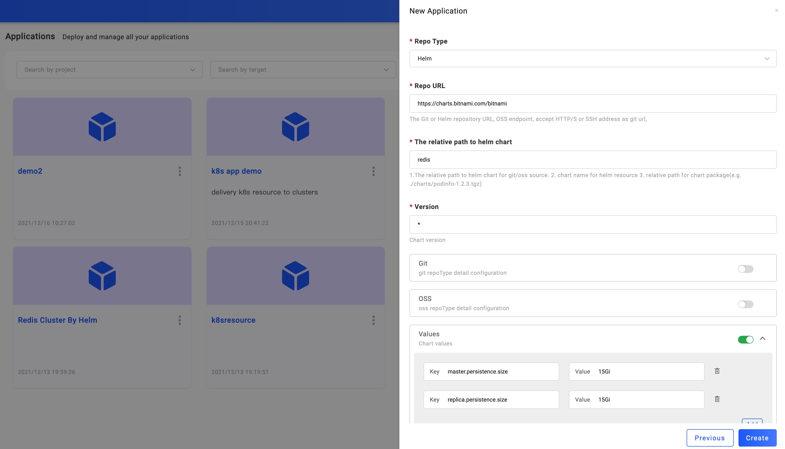
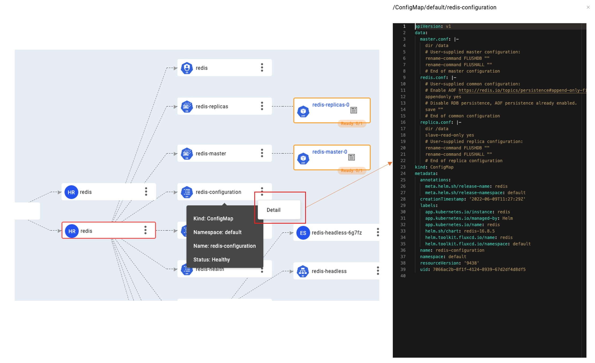

This section introduces how you deploy Helm Chart.

The typical usage of deploying Helm Chart is to integrate middleware, many from in [bitnami](https://github.com/bitnami/charts) or open-source application tools such as Gitlab, and Jenkins in [Helm Official Repo](https://hub.helm.sh/). KubeVela can help you easily deploy these applications to any managed cluster and manage them.

Starting from here, you will learn to use the KubeVela Addons to install plug-ins. The Helm Chart is currently supported by the FluxCD addon. In addition to the Helm Chart, FluxCD addon also supports Kustomize.

## Before starting

- Choose a Helm Chart you want to deploy. In the tutorial, we take [bitnami/redis](https://github.com/bitnami/charts/tree/master/bitnami/redis) as an example.
- Ensure that the cluster you deliver has a usable default StorageClass. Most of our delivery middleware requires data persistence, and the default StorageClass is needed to allocate PV.
- Enable the VelaUX addon for UI console. If you are only CLI users, you can skip to [Deploy via CLI](#deploy-via-cli)

## Enable fluxcd addon

Helm Chart delivery relies on addon in KubeVela, you need to enable `fluxcd` addon before start. You can refer to [addon management doc](../end-user/components/more) for more detail information about addon.

```shell
vela addon enable fluxcd
```

When the addon status become `enabled`, it means it's ready for helm chart delivery.

## Creating Redis application

After `fluxcd` addon enabled, there's a `helm` definition added, you can check the parameter details by:

```
vela show helm
```

You can also check the [fluxcd addon](../reference/addons/fluxcd) docs for details.

Let's take the `redis` chart as example, you can deploy by the following application:

```yaml
apiVersion: core.oam.dev/v1beta1
kind: Application
metadata:
  name: helm-redis
spec:
  components:
    - name: redis
      type: helm
      properties:
        repoType: "helm"
        url: "https://charts.bitnami.com/bitnami"
        chart: "redis"
        version: "16.8.5"
        values: 
          master:
            persistence:
              size: 16Gi
          replica:
            persistence:
              size: 16Gi
```

Deploy it by：

```shell
vela up -f https://kubevela.io/example/applications/app-with-chart-redis.yaml
```

Then check the deployment status of the application through `vela status helm-redis`

```
About:

  Name:      	helm-redis
  Namespace: 	default
  Created at:	2022-04-21 17:19:12 +0800 CST
  Status:    	running

Workflow:

  mode: DAG
  finished: true
  Suspend: false
  Terminated: false
  Steps
  - id:n1gxswwina
    name:redis
    type:apply-component
    phase:succeeded
    message:

Services:

  - Name: redis
    Cluster: local  Namespace: default
    Type: helm
    Healthy Fetch repository successfully, Create helm release successfully
    No trait applied
```

> You can also check the application on UI, application created by CLI will be synced automatically but readonly.

## Deploy Helm Chart from UI Console

The experience on UI console is quite the same with [container image delivery](../tutorials/webservice). When it comes to deploying Helm Chart, all you need is to select type as `helm`.

>The `helm` component type will automatically discovered after fluxcd addon enabled.

Then select the Target which has the default StorageClass that provides PV, and at last enter the deployment parameter configuration page.



As shown, you need to do the following configuration:

- Repo Type: Git and Helm are supported. In this example, we choose Helm.
- Repo URL: Fill in the repo address you needed. we type in: https://charts.bitnami.com/bitnami. If you have configured the helm repo in [Integration](../how-to/dashboard/config/helm-repo) you can choose the repo directly.
- Chart: After fill Helm repo URL, will list all available charts in this field. You can choose one from the list, here we choose: redis.
- Version: After choosing the helm chart, will list all available versions in this field. Choose one version of this chart, here we choose: 16.8.5.
- Values: After choosing the version, will list all parameters of this helm Chart. Since we are using ACK cluster in the example, PV has a minimum capacity requirement, 15Gi. In the same way, other parameters can also be configured according to your cluster's status.

After filling in the above parameters, click `Create` to complete the application creation and enter the application configuration page. The following steps will stay the same as you've learned in [Deploy First Application](../quick-start).

### Modify deployment parameters

Clicking the component name, you can open the component configuration page. For the Helm Chart component, we can set the Values configuration options to change the application deployment parameters. the Values configuration options are generated by `values.yaml`, you can set the custom value for every option.

In the VelaUX, the value key format like `replica.persistence.size=15Gi`. they will be converted to YAML value:

```yaml
values: 
    replica:
       persistence:
          size: 15Gi
```

After modifying the deployment parameters, the workflow of the environment must be executed to make the modified parameters take effect in the specified environment. Due to the existence of Revision, the configuration parameters will be saved in each historical version.

### Visualize the resources created by Helm Release

For a helm chart, users often don't know what resources they will create, making it difficult to troubleshoot. In VelaUX, users can visualize the resources created by Helm Release. via the resource graph, users could know the relationships between the resources and the status of all resources. Click the `Detail` action button could view the resource YAML.


You can hover your mouse on it to check the health status, by clicking the icon on the right, you can even get the yaml details for debug.



At this point, Helm Chart in KubeVela is no stranger to you, go ahead and try more!

## Specify different value file

You can change the default values file `values.yaml` with another value file present inside the Helm chart by set the `valuesFiles` field. eg:

We use the chart `hello-kubernetes-chart` as an example.This chart has two values files. You can pull this chart and have a look all contains files in it:

```yaml
$ tree ./hello-kubernetes-chart
./hello-kubernetes-chart
├── Chart.yaml
├── templates
│ ├── NOTES.txt
│ ├── _helpers.tpl
│ ├── config-map.yaml
│ ├── deployment.yaml
│ ├── hpa.yaml
│ ├── ingress.yaml
│ ├── service.yaml
│ ├── serviceaccount.yaml
│ └── tests
│ └── test-connection.yaml
├── values-production.yaml
└── values.yaml
```

As we can see, there are values files `values.yaml` `values-production.yaml` in this chart.If you not set the `valuesFiles` field, `values.yaml` will used by rendering the resources.

You can switch to use `values-production.yaml` by:
```yaml
cat <<EOF | vela up -f -
apiVersion: core.oam.dev/v1beta1
kind: Application
metadata:
  name: hello-kubernetes
spec:
  components:
    - name: hello-kubernetes
      type: helm
      properties:
        repoType: "helm"
        url: "https://wangyikewxgm.github.io/my-charts/"
        chart: "hello-kubernetes-chart"
        version: "0.1.0"
        valuesFiles:
          - "values-production.yaml"
  EOF
```

Files defined in field `valuesFiles` are merged in the order of this list with the last file overriding the first.

Example below `values-production.yaml` will override `values.yaml` if they have same value key.
```yaml
        valuesFiles:
          - "values.yaml"
          - "values-production.yaml"
```

## Specify OCI registry

If your chart is stored in [OCI registry](https://helm.sh/docs/topics/registries/), you can create the application like this:

```yaml
apiVersion: core.oam.dev/v1beta1
kind: Application
metadata:
  name: oci-app
  namespace: default
spec:
  components:
    - name: test-helm
      type: helm
      properties:
        repoType: "oci"
        url: oci://ghcr.io/stefanprodan/charts
        chart: podinfo
        version: '6.1.*'
```

> Notice: your fluxcd addon version must be `>=1.3.1`.

Now, you have learned the basic helm delivery. If you want to delivery Helm Chart into multi-clusters, you can refer to [this blog](https://kubevela.io/blog/2022/07/07/helm-multi-cluster).