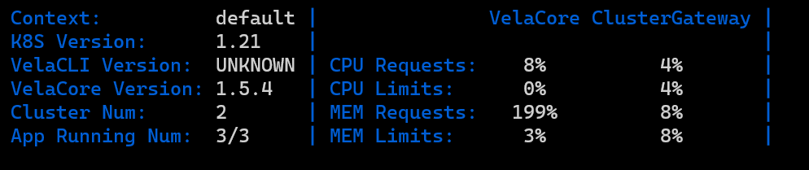

In this guide, we want to introduce you how to use the vela top tool in KubeVela. This tool is a UI based CLI tool provided in KubeVela. By using it, you can obtain the overview information of the platform and diagnose the resource status of the application.

At present, the tool has provided the following feature:
- Platform information overview
- Display of resource status information at Application, Managed Resource and Pod levels
- Application Resource Topology
- Resource YAML text display

### Launch tool

When launching the tool, we can specify the Namespace of the Application displayed in the Application view which is the home page.

- Default Namespace
    ```shell
  vela top
  ```

- Aimed Namespace
    ```shell
  vela top -n <namespace>
  ```

- All Namespace
  ```shell
  vela top -A
  ```

After starting the tool, we will enter the home page: Application view, as shown below:


The tool is divided into three parts as a whole, as shown in the figure, they are the Header part containing basic information, platform system information, menu and logo, the Body part where the resource view is located, and the Footer part where the breadcrumb component of the resource level is located.

### Platform Information Overview



This information panel component will display the performance information of the KubeVela system, including the version of Vela Core and Vela CLI, the proportion of applications running in the KubeVela system to all applications, and the performance information of the Vela controller (Vela Core) and the Vela gateway (Vela Cluster GateWay). The current usage of CPU and memory accounts for the proportion of the two set values of request and limit respectively).

The performance information for the Vela Controller and Vela Gateway here actually comes from the performance information of the Pod where they are located. It should be noted that to collect the performance information of the Pod, you need to install the [metrics server](https://github.com/kubernetes-sigs/metrics-server) in the cluster, otherwise the performance information of the Pod will not be obtained correctly.


### Multi-level resource status display

#### Application view


This view will display the status information of all Applications under the Namespace in the platform, including:
- Name
- Namespace
- Phase
- Workflow Mode
- Number of successful Workflows / Number of Workflows
- Number of Health Services / Number of Services
- CreateTime

In this view, you can reselect the Application of which Namespace to display by pressing the N button:


You can also press the button ↑ or ↓ to select an application and then press the button T to display the resource topology of the application.

If you want to do resource penetration for this Application to see what resources belong to it, you can enter the next resource level by pressing the ENTER key.

#### Managed Resource view


The Managed Resource view shows the next-level resources of the Application. The resource view shows the resources generated by the deployment of the target Application, including: Deployment, ConfigMap, Service, Helm Release, etc. We call these resources the resources managed by the application.

For Application-managed resources, we display the following information:

- Name
- Namespace
- Kind
- API Version
- In which cluster
- Of component
- Status

The resources managed by the application are very complex, so in this view, we provide some ways to filter the view. You can filter the resources according to the Namespace and the cluster where the resources are located. The corresponding keys are N and C, as shown below:


The title at the top of the view indicates that the Namespace and Cluster in which the resource is currently displayed.

In addition, in this view, you can also use the Q key to return to the previous Application view, and press the ENTER key after selecting a resource to enter the Pod view to display the Pod resources which belong to the resource.

#### Pod view


The deployment of Managed Resource results in the deployment of Pod resources, and the Pod view displays the Pod resources further generated by the target Managed Resource. For Pod resources, this view shows the following information about the Pod:

- Name
- Namespace
- Is it ready
- Status
- CPU usage
- memory usage
- CPU usage as a percentage of request
- CPU usage as a percentage of limit
- Memory usage as a percentage of request
- Memory usage as a percentage of limit
- IP address
- Node where it is located
- Age

In this view you can still use the Q key to go back to the previous view.

#### Resource level switch

We have introduced the three views above, and now we will show you how to switch between multiple views to get the resource status information you want.


### Application resource topology

Maybe you want to know how the complete resource topology of an application is. We have provided such a function in VelaUX. In fact, we also provide you with a similar function in vela top. In the Application view, you can select an Application and press the T key, it will display the resource topology of the Application in two forms:


The application delivery model behind KubeVela is [Open Application Model](https://kubevela.io/zh/docs/platform-engineers/oam/oam-model). Every application deployment plan can be composed by multiple components with attachable operational behaviors (traits), deployment policy and workflow. For the content of this part, please refer to [KubeVela Core Concepts](https://kubevela.io/zh/docs/getting-started/core-concept), so the first topology we show is to show the four components of the application, this topology is called the "App Topology".

In addition, these components will actually eventually be loaded as native resources or CRDs in Kubernetes, and these resources constitute another resource topology. As a user, you must want to know whether the sub-resources of the application are correctly deployed as required, you can get the answer from this topology, which we call the "Resource Topology".

### General functions
#### Resource YAML display


In the three resource views of Application, Managed Resource, and Pod, you can select a resource and press the Y key to view the YAML text corresponding to the resource, and the text will be highlighted.

#### Help View

In any interface, you can press the ? key to enter the help view, which will briefly introduce you to the related functions and usage of vela top.


