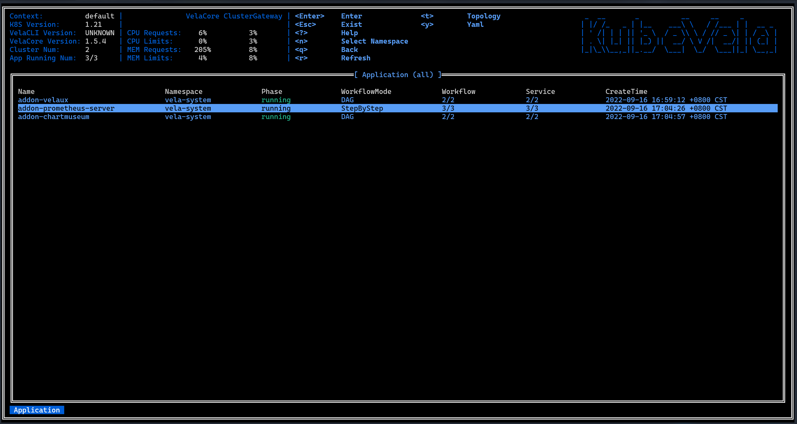

在这篇指南中，我们想向您介绍 KubeVela 中`vela top`工具的使用方法，该工具是 KubeVela 中提供的基于 UI 的 CLI 工具，通过使用它您可以获取平台的概览信息以及对应用程序的资源状态进行诊断。

目前在该工具已经为您提供了以下的功能：

- 平台信息概览
- Application、Managed Resource、Pod 三种层级资源状态信息的展示
- Appliation 资源拓扑
- 资源 YAML 文本展示

### 启动工具

在启动工具时我们可以指定首页：Application 视图中所展示 Application 所在的 Namespace。

- 默认 Namespace 

    `vela top`

- 指定 Namespace 

    `vela top -n <namespace>`

- 指定全部 Namespace

    `vela top -A`

启动工具后，我们会进入到首页：Application 视图，如下所示：

该工具整体分为三个部分，如图所示，分别为包含基础信息、平台系统信息、菜单与 Logo 的 Header 部分，资源视图所在的 Body 部分，指示资源层级的面包屑组件所在的 Footer 部分。

### 平台信息概览

这个信息面板组件会展示 KubeVela 系统的性能信息包括 Vela Core 与 Vela CLI 的版本、KubeVela 系统中运行 Application 占全部 Application 的比例、Vela 控制器（Vela Core）与 Vela 网关（Vela Cluster GateWay） 的性能信息（CPU 与 内存当前 usage 量分别占 request 与 limit 两个设定值的比例）。

这里对于 Vela 控制器与 Vela 网关的性能信息，实际来自于它们所在 Pod 的性能信息。 需要注意的是采集 Pod 的性能信息，需要在集群中安装 [metrics server](https://github.com/kubernetes-sigs/metrics-server)，否则会无法正确获取到 Pod 的性能信息。

### 多层级资源状态展示

#### Application 视图

这个视图会展示平台中所在 Namespace 下的全部 Application的状态信息，这些信息包括：
 
- 名称
- 名称空间
- 运行阶段
- 工作流模式
- 正常工作流数量 / 工作流数量
- 健康服务数量 / 服务数量

在这个视图可以通过按键 N，重新选择展示哪个Namespace的Application：

通过按键 ↑ 或者 ↓ 选中某一个 Application 后可以通过按键 T，展示该 Application 的资源拓扑。

#### Managed Resource 视图

#### Pod 视图

#### 资源层级切换

### Application 资源拓扑

### 资源 YAML 展示

